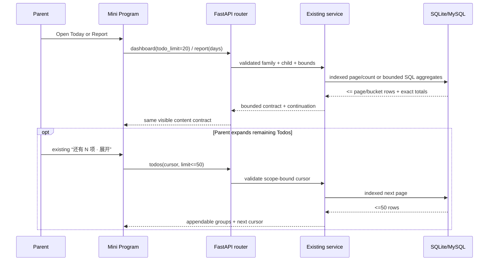
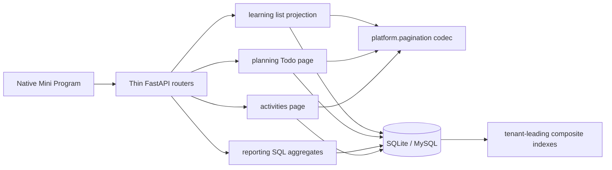

# BUG-018 — 历史、报表与看板读取必须有界

- Status: DONE（迁移前 `VERIFIED_LOCALLY / RELEASE_PENDING`；viewport `N/A`，闭环验证已跑真实 MySQL 8.0.45；仅发布为独立外部门禁；2026-09-12 移入 `specs/completed/`）
- Severity: `high — growing family history can make Today/Report slow or incomplete`
- Risk: `R3 — public read contracts, database indexes, migration and frontend data flow`
- Owner: `产品/架构负责人（用户）`
- Implementer: `Codex`
- Reviewer/Verifier: `独立只读 review completed; findings repaired and re-verified 2026-09-11`
- First observed: `2026-09-11 / local SQLite review and deterministic scale fixtures`
- Related review: `2026-09-11 current API performance review, findings CR-001..CR-006`
- Spec revision: `BUG-SPEC-20260911-PERF-01`
- Proposed architecture revision: `ARCH-20260911-READ-PERF-01`
- Proposed frontend engineering revision: `FEC-20260911-READ-PERF-01`
- User confirmation: `APPROVED 2026-09-11 — user replied “落地并修复” immediately after the explicit request to approve BUG-SPEC-20260911-PERF-01, ARCH-20260911-READ-PERF-01 and FEC-20260911-READ-PERF-01`
- Affected Feature IDs: `FEAT-001`
- Feature current-state document: `docs/domain/features/FEAT-001-push-kids-mvp.md`
- Feature baseline revision: `FEAT-STATE-20260911-SETTINGS-PROFILE-MANAGER-01-LOCAL`
- Feature sections affected: `Current invariants / Current contracts / Verification evidence / Current limitations / Change references`
- Feature merge owner: `Codex after verification; product owner approves final behavior`

## Frontend Design Impact and Figma Approval

- Frontend impact: `no — no new control, copy, layout, navigation, chart encoding or visible state is introduced`
- Frontend impact reason: `Today keeps the approved “还有 N 项 · 展开” interaction and Report keeps the same rows/charts; only their remote-data source becomes bounded and cursor-driven. If implementation needs different copy, a new loading surface, or a different interaction, it must stop for a new Design Revision.`
- Frontend engineering impact: `yes — remote state, pagination, stale response handling, performance and report data integrity change`
- Frontend engineering impact reason: `Today appends server pages behind the existing expand action; Report consumes server-owned activity aggregates and removes the raw-record request waterfall.`
- Affected UI IDs: `UI-001 (Today and Report surfaces)`
- UI current-state document: `docs/design/frontend/ui/UI-001-parent-miniapp.md`
- Frontend baseline revision: `FDB-20260906-03 (APPROVED)`
- Current frontend engineering constraint revision: `FEC-20260906-04 (APPROVED)`
- Proposed frontend engineering constraint revision: `FEC-20260911-READ-PERF-01; approval is requested together with this Spec`
- Affected quality dimensions: `remote state / performance / resource bounds / table-chart integrity / observability / security-privacy`
- Frontend quality requirements: `FEC-PERF-READ-001..004 proposed in §6.7`
- Frontend quality verification plan: `frontend state tests for first/next/stale/error pages; report contract tests; request-count assertions; 10k-row API scale tests; no visual snapshot because rendered controls and copy remain unchanged`
- Approved frontend engineering deviations: `none`
- Current Design Revisions reused: `DREV-20260911-TODAY-ACTIVITY-EMPTY-CTA-01; DREV-20260906-REPORT-01`
- Figma project/file URL: `N/A — no visible design or interaction contract changes`
- Figma node URLs: `N/A — existing approved nodes are reused without divergence`
- Proposed Design Revision: `N/A — internal data-flow change only`
- Required viewport/state exports: `N/A — no geometry/style/copy change; native smoke remains part of release validation if WXML/WXSS changes unexpectedly`
- Prototype status: `N/A`
- Approved Task Spec revision: `BUG-SPEC-20260911-PERF-01`
- Approved Design Revision: `existing revisions reused; no new revision`
- Design approval evidence: `N/A — no new Design Revision; Task/FEC revisions approved 2026-09-11`
- Snapshot manifest path: `N/A`
- Permitted implementation deviations: `none; visible divergence returns this Spec to DRAFT`
- UI current-state merge owner/evidence: `Codex / UI-STATE-20260911-READ-PERF-01-LOCAL`
- Frontend visual/a11y/resolution verification: `N/A unless implementation changes WXML/WXSS or visible states`
- Frontend engineering verification evidence: `bounded-read frontend state tests and full npm suite; see §7 and UI-001`
- Figma waiver: `none required because Frontend impact is no`

## 1. Symptom and impact

The API currently mixes bounded list contracts with several read paths whose work or payload grows with all
historical rows. This produces two observable classes of failure:

1. Today can materialize every overdue review before rendering only a few cards. A large backlog therefore increases
   database work, Python memory and response bytes without improving the first screen.
2. Report separately downloads at most 100 raw activity records and filters them in the client, while its overview
   counts the full selected range. At 101 records the same report can show two conflicting totals.

The same pattern exists in report trend computation, legacy submission listing and some calendar/day projections.
The impact is slow loading, high memory, avoidable request waterfalls, inconsistent totals and poor growth behavior.
No existing learning, review or activity rows are corrupt.

- Who/what is affected: `families with long history, large overdue review backlogs or >100 activity records`
- Frequency: `deterministic once data crosses the affected path's implicit scale`
- User-visible symptom: `slow Today/Report load; activity detail can undercount the overview`
- Business/data/security impact: `read inconsistency and availability risk; family isolation remains intact`
- First known good/bad version: `not version-bisected; the current authoritative implementations contain the pattern`
- Workaround: `none that preserves complete and consistent data`

## 2. Reproduction and baseline evidence

### Preconditions

- Environment: `current worktree, Python 3.11 virtual environment, in-memory SQLite, no network`
- Actor/tenant: `one authorized family and child`
- Data: `deterministic synthetic rows; no child content or production data`
- External dependencies: `none`

### Observed facts

| ID | Reproduction | Current result | Evidence |
|---|---|---|---|
| `F-001` | 10,000 active due learning Reviews, read Today Todos | all 10,000 rows are materialized before response | about `740 ms`, `34.6 MiB` peak and `1.8 MiB` JSON in the review fixture |
| `F-002` | 10,000 rows for each report metric | raw timestamps and ORM rows are loaded into Python | about `820 ms` and `19.5 MiB` peak in the review fixture |
| `F-003` | 101 activity records in the selected range | `/report.overview.activity_records=101`, raw activity endpoint returns 100 | deterministic integration reproduction |
| `F-004` | list 100 submissions | list calls the full detail projection per row | `302` SQL statements for 100 simple submissions; more with proposals |
| `F-005` | 50,000 confirmed history rows | first page is bounded but database sorts a larger candidate set | about `107 ms`; SQLite plan includes `USE TEMP B-TREE FOR ORDER BY` |
| `F-006` | inspect request boundary and tests | no route-template duration/size signal or scale/query-budget gate exists | `bootstrap/app.py` and current test strategy |

Focused correctness tests run during review (not proof of the future fix):

```text
25 Python tests passed for history/reports/boundaries.
26 frontend tests passed for history/report behavior.
The initial review did not run isolated MySQL. Closure verification subsequently ran a fresh MySQL 8.0.45
container through Alembic base-to-head (`20260911_0011`), `current`, `check`, all MySQL integration tests and
indexed `EXPLAIN` assertions.
```

### Expected result

Every collection or aggregate read must have a stable ordering, a server-enforced hard bound, work proportional to
page/range cardinality rather than total history, and an explicit continuation or truncation contract. Counts and
details shown together must use the same family, child, time range and aggregation source.

## 3. Triage and blast radius

### Confirmed causes

| Cause | Authoritative path |
|---|---|
| due Reviews use `.all()` before grouping | `planning/service.py::PlanningService.daily_todos` |
| report fetches raw event timestamps and Review ORM rows | `reporting/service.py::ReportingService.report` |
| activity list has an implicit fixed `LIMIT 100` but no continuation | `activities/service.py::ActivitiesService.list_records` |
| Report reconstructs activity summaries from that incomplete raw list | `apps/miniprogram/pages/reports/index.js::loadActivityDetail/activityRows` |
| submission list invokes full `get_view` per row | `learning/service.py::LearningService.list_views` |
| growth queries rely mainly on independent single-column indexes | `persistence/models.py` and current Alembic chain |
| performance failures are not observable or regression-tested | `bootstrap/app.py`, `docs/quality/TEST-STRATEGY.md` |

### Blast radius

- Entry points: `GET dashboard`, `GET todos`, `GET daily-summary`, `GET calendar`, `GET report`, `GET history`,
  `GET activity-records`, `GET submissions`.
- Callers: `Today`, `Report`, `Records` and compatibility clients.
- Data already affected: `none; this is read-path behavior and additive indexes`.
- Security boundary: `all queries remain family + child scoped; cursors are scope-bound and do not authorize data`.
- Same-pattern audit: `all current collection GET routes are classified in §5.6; business-capped lists retain their
  existing domain cap and do not receive redundant pagination`.

### Link/call graph

```text
Today page
  -> GET dashboard -> ReportingService -> PlanningService -> Review/Knowledge/Subject tables
  -> existing “expand” -> GET todos(cursor) -> PlanningService -> next bounded Review page

Report page
  -> GET report -> ReportingService -> SQL bucket/subject aggregates
  X  GET activity-records + GET subjects + client-side historical aggregation (deleted)

Records/compatibility callers
  -> GET history(cursor) -> LearningHistory -> indexed bounded projection
  -> GET submissions(cursor|offset) -> LearningService -> one bulk page projection

All routes -> FastAPI request boundary -> safe route-template duration/response-size event
```

## 4. Root cause

The original API contract stated that lists need a stable order and limit, but it did not define how embedded lists,
aggregations, compatibility endpoints, database query count, response bytes or query plans must be bounded. As a
result, some routers have an output limit while their service still materializes all candidate rows; other consumers
compute aggregates from a separately truncated list. Single-column indexes satisfy correctness but not the dominant
`family_id + child_id + filter/range + order` access paths.

Existing tests use small fixtures and assert values only. They do not fail when query count grows with page size,
when a payload silently truncates, when the database performs a temp sort, or when Python memory grows with history.

## 5. Fix contract

### 5.1 Required behavior and invariants

- All existing family/child authorization, no-write read semantics, Shanghai date boundaries and deterministic review
  policy remain unchanged.
- List responses have a stable total order and a hard server maximum. High-growth paths use scope-bound cursor
  pagination; offset is retained only where required for compatibility and cannot be combined with a cursor.
- Page metadata distinguishes `total`, `returned`, `remaining` and `next_cursor`; `items=[]` plus
  `next_cursor=null` means a real end, never a swallowed error.
- Aggregate endpoints execute counts/buckets in SQL and materialize only bounded aggregate rows. The client must not
  download raw history to recreate an aggregate already owned by the server.
- Query count for a page is constant with respect to returned row count. Per-row detail calls are forbidden in list
  projections unless a domain hard cap and an explicit Spec justify them.
- Dominant indexes begin with trusted tenant keys and continue with filter/order keys. Every new index has SQLite and
  MySQL migration/plan evidence.
- Pagination cursors are opaque transport state, versioned and bound to family, child, filters, order and snapshot.
  They never replace authorization; malformed, stale or cross-filter cursors return stable `400 invalid_input`.
- Logs use route templates rather than raw paths/query strings and never include child content, IDs from path values,
  search text, cursor payloads, tokens or model/media payloads.

### 5.2 Today Todo and dashboard contract

- `GET /children/{child_id}/dashboard` adds `todo_limit` (`default 20`, `1..50`) and optional
  `todo_cursor`. Existing fields remain.
- `todo_groups` contains at most `todo_limit` Review items in deterministic order:
  `(due_date, subject_name, review_method, review_id)`; grouping remains the existing deterministic policy.
- `todo_count`, `required_todo_count` and `estimated_minutes` describe the complete due set, not only the returned
  page. Additive fields are `todo_returned_count`, `todo_remaining_count` and `todo_next_cursor`.
- `GET /children/{child_id}/todos` accepts `limit` (`default 50`, `1..50`) and `cursor`, and returns the same totals,
  bounded groups and continuation metadata. Its existing top-level `day` and `groups` fields remain.
- Required/optional classification is computed against the full deterministic order using a database aggregate/window
  projection; page boundaries cannot reset the daily budget.
- Today initially stores/renders the dashboard page only. The existing “还有 N 项 · 展开” action fetches one next
  page at a time, merges matching groups by stable group ID, retains loaded content on failure and discards results for
  an old child/day/generation. It never auto-downloads the complete backlog.

### 5.3 Report, calendar and daily-summary contract

- Report retains `days in {7,30,100}`, seven overview trend buckets and `range_days` daily urgency/activity points.
- Learning, knowledge, feedback and activity overview/trends are produced by SQL conditional/group aggregation; raw
  event timestamps and Review ORM objects are not materialized merely to count them.
- Report adds `activity_subjects[]`: `subject_id`, `subject_name`, `records`, `minutes`, `last_occurred_on`. The array
  uses the exact selected range and stable order `(records desc, subject_name, subject_id)`.
- Report `subjects` and `activity_subjects` each have a hard maximum of 50. Additive metadata reports total distinct
  subject count, returned count and omitted occurrence/record totals so truncation is explicit and headline totals
  remain exact.
- Report frontend removes `GET subjects` + `GET activity-records` for report construction and renders the existing
  activity rows from `report.activity_subjects`. An absent field from an older server retains the existing “detail
  unavailable” degradation; it must not fabricate a partial count.
- Calendar month counts are grouped in SQL and materialize at most 31 day rows.
- Daily summary returns exact total `record_count`, but summary text projection is limited to the latest 50 records
  (`limit` default 20, max 50) and adds `returned_record_count`, `remaining_record_count`; dashboard uses 20. This
  prevents one pathological day from creating an unbounded response while preserving exact counts.

### 5.4 Activity-record and submission compatibility contracts

- `GET /children/{child_id}/activity-records` keeps its JSON array response for compatibility. It adds `limit`
  (`default 100`, `1..100`) and `cursor`; stable order is `(occurred_at desc, id desc)`. Continuation is returned in
  `X-Next-Cursor` and `X-Result-Limit`; absence of `X-Next-Cursor` means end.
- `GET /submissions` keeps its JSON array response, existing filters and `offset`. It adds `limit` (`default 100`,
  `1..100`) and `cursor`; cursor and non-zero offset are mutually exclusive. Stable order remains
  `(created_at desc, id desc)`. Offset is compatibility-only and documented deprecated for new consumers.
- Submission page projection loads submissions and all media/job/request/subject facts in a bounded set of bulk
  queries. It does not call `get_view` once per row. Single-item `GET /submissions/{id}` remains the detail authority.
- CORS exposure of continuation headers is added only if browser consumers require it; the native Mini Program does
  not rely on browser CORS.

### 5.5 History and search contract

- Existing History cursor defaults (20/max 50), scope binding, filters, response shape and legacy no-`view` limit 100
  remain unchanged.
- Composite indexes remove the temp sort for the common confirmed and pending first/next-page paths.
- Exact substring search semantics remain unchanged. B-tree indexes cannot accelerate leading-wildcard Chinese
  substring search; introducing dialect-specific FTS or incomplete recent-window search is rejected in this revision.
  Search therefore gets an explicit 50k-row comparable-run budget and slow-route observation. Reconsider an owned
  cross-dialect search index only if child history exceeds 200k rows or search p95 exceeds 250 ms for seven days.

### 5.6 Complete current collection audit

| Read surface | Growth bound after this revision |
|---|---|
| children / subjects | existing child/profile and active subject domain caps; tests prove caps |
| activity/travel schedules | existing combined active-item cap 20; no extra pagination |
| day schedule | bounded by active schedule/event contracts for one day |
| todos / dashboard embedded Todos | cursor page 20/50, exact totals |
| daily summary | exact count, summary detail max 50 |
| calendar | fixed month, SQL aggregate, max 31 rows |
| report | fixed max 100 days, seven trend buckets, subject arrays max 50 |
| history | existing cursor 20/max 50; legacy compatibility max 100 |
| history review detail | existing max 20 Reviews and four fetched feedback rows per Review, external page 3 |
| activity records | array-compatible cursor, max 100 |
| submissions | array-compatible cursor/offset, max 100, constant query count |
| family/member/invite/deletion lists | outside FEAT-001; current domain caps/administrative use remain, but new work must satisfy ARC-014 |

### 5.7 Governance revisions approved with this Spec

The following exact rules were approved on 2026-09-11 and are merged into the authoritative governance documents.

**Architecture — `ARC-014: Bounded read paths`**

1. Every collection/embedded-list API MUST declare stable order, default/max page size, continuation/end semantics,
   snapshot behavior and compatibility. A router `limit` is insufficient if service work remains unbounded.
2. Counts/reports MUST aggregate at the database owner boundary and return O(page size / bucket count) rows; loading
   O(total history) objects into application memory is forbidden without an approved measured exception.
3. List query count MUST be O(1) in page size; N+1 projections require a domain hard cap, evidence and approval.
4. Growing tenant queries MUST have tenant-leading composite indexes matching filter/range/order, plus migration,
   SQLite/MySQL plan evidence and rollback notes.
5. Each changed high-growth read MUST define comparable latency, memory/bytes, query-count and safe observability
   evidence in its Task Spec.

**Backend coding — `BE-PERF-READ-001..006`**

1. Do not call `.all()`/`list()` on a query whose cardinality grows with history unless SQL first groups it to a fixed
   range or an enforced limit exists.
2. Do not fetch timestamps/ORM rows solely to count, bucket, sum, min or max them in Python; use SQL aggregates and
   materialize the bounded result.
3. Cursor order MUST be total and immutable enough for the paging window; include a unique tie-breaker and bind the
   cursor to filters/snapshot. Reject cursor/filter mismatch.
4. Offset MAY remain for a compatibility endpoint, but new consumers use cursor pagination and the maximum page size
   is still enforced.
5. A new/changed list must include regression tests for max/default boundaries, empty/end, invalid cursor, tenant
   isolation, concurrent insertion/update semantics, SQL count and response bound.
6. Indexes are part of the read contract: verify actual SQLite and MySQL query plans; do not infer use from model
   declarations alone.

**Frontend engineering — `FEC-PERF-READ-001..004`**

1. A page MUST NOT download every historical row to build an aggregate or render the first screen; consume a server
   aggregate or cursor page.
2. Cursor state is remote state keyed by family/child/filter/range/generation. Child/range changes invalidate old
   pages; stale and duplicate responses cannot append.
3. Page state and native node count stay bounded. More rows load only after the approved user action; failure retains
   prior rows and exposes an existing recoverable error path.
4. Counts, units, time range and truncation metadata shown together must come from one server contract; the client
   must reject/degrade inconsistent or partial aggregate data rather than silently display it.

**Quality — `TEST-PERF-READ-001..005`**

1. Scale fixtures run separately from the fast correctness suite and record hardware/runtime/DB dialect.
2. Query-count tests prove O(1) page projection; scale tests prove bounded response items/bytes and application peak
   memory under comparable runs.
3. SQLite `EXPLAIN QUERY PLAN` and isolated MySQL `EXPLAIN` cover dominant history/Todo/report/list indexes.
4. API middleware tests prove safe route-template duration/response-size events and absence of raw path values/query.
5. Performance evidence is never claimed across incomparable environments; skipped MySQL/runtime checks retain an
   explicit release risk.

### Must not change

- AI remains an editable proposal; parent confirmation remains the only creator of formal learning/review facts.
- Review dates, feedback transitions, daily budget meaning, occurrence/creation times and activity/report inclusion
  semantics do not change.
- Existing family scope, viewer read permissions, error mapping and no-store history behavior remain.
- No cache, new service, search engine, background job, analytics SDK or production dependency is added.
- No existing data is deleted or rewritten.

### Non-goals

- Full-text/n-gram search infrastructure.
- Redis/materialized report caches or precomputed rollup tables.
- New charts, Todo copy/layout, infinite auto-scroll or frontend framework changes.
- Optimizing bounded detail paths not identified by the review unless a new failing budget proves need.

## 6. Fix design

### Selected change

- Modify the existing service/query paths; do not add V2 endpoints.
- Add one small `platform.pagination` value codec because Todo, activity and submission pages share the same stable
  opaque-cursor semantics. Owner is `platform`; consumers are fixed to these three services plus future reviewed
  collection APIs. It contains no business ordering or authorization rules.
- Keep business grouping in pure `planning/domain.py`; services own SQL paging/aggregation and routers only validate
  transport.
- Replace `reporting.trends` raw-event-list input with bounded bucket-count input so there is one trend authority.
- Add only composite indexes justified by the exact queries. Migration filename is expected to be
  `20260911_0011_read_path_indexes.py` with `down_revision=20260911_0010`; implementation MUST re-read the actual
  Alembic head and revise this Spec before coding if another migration wins that revision.
- Add request-boundary structured events using the matched route template, status, duration and response content
  length. Thresholds are `slow >= 500 ms` and `large >= 128 KiB`; values are governance/operational defaults, not a
  promise that every route completes below them on every machine.

### Proposed composite indexes

Exact column order must be validated by SQLite and isolated MySQL plans before closure:

| Table | Proposed index intent |
|---|---|
| `review_items` | `(family_id, child_id, active, due_date, id)` for due-page/count anchor |
| `review_feedback` | `(family_id, review_item_id, occurred_at)` for latest feedback and report range |
| `learning_submissions` | `(family_id, child_id, state, created_at, id)` and `(family_id, child_id, occurred_at, id)` for pending/compat/history paths |
| `learning_records` | `(family_id, child_id, occurred_at, id)` for day/report/history range |
| `knowledge_items` | `(family_id, child_id, created_at, id)` for report range |
| `knowledge_occurrences` | `(family_id, occurred_at, knowledge_item_id)` plus existing record lookup for report/history |
| `activity_records` | `(family_id, child_id, occurred_at, id)` for page/range/aggregate |

Redundant single-column indexes are not removed in the same migration unless both dialect plans prove replacement and
the Spec is revised; additive indexes make rollback safer but increase write/storage cost.

### Sequence diagram



### Pagination state machine

```text
idle
  -> loading_first
  -> loaded(has_more | complete)
loaded(has_more) --expand--> loading_next
loading_next --success/current generation--> loaded(has_more | complete)
loading_next --failure--> loaded(has_more, prior rows retained, retry available)
any loading --child/day/filter generation changes--> stale result discarded -> loading_first
malformed/cross-scope cursor -> 400 (never converted to empty success)
```

There are no persistent business-state transitions or writes in this fix.

### Architecture diagram



Dependency direction remains acyclic. `platform.pagination` has no imports from product modules. Reporting may call
existing learning/planning/activities public services but those modules do not import reporting.

### Trade-offs and alternatives rejected

| Alternative | Decision and revisit condition |
|---|---|
| return all rows but enable gzip/streaming | rejected: network bytes may shrink but DB work, client memory and native nodes remain unbounded |
| cache complete dashboard/report | rejected: hides inefficient ownership and adds invalidation/privacy/operational complexity; reconsider only after bounded SQL misses a measured SLO |
| add `/v2` list endpoints | rejected: creates parallel authorities; additive query/header fields preserve current arrays |
| silently cap Todos/activity details | rejected: exact totals and continuation/truncation metadata are required |
| auto-fetch all Todo pages | rejected: recreates unbounded work in the client |
| dialect-specific SQLite FTS/MySQL FULLTEXT | deferred: Chinese tokenization and dual-dialect behavior need a separate owned search Spec; current 50k search is within the proposed budget |
| remove old single-column indexes now | deferred: safer only after both dialect planners prove redundancy and write/storage impact is measured |

### Extensibility

- Cursor codec: `open` only for reviewed collection endpoints; compatibility, scope binding, size/error contract and
  codec tests are mandatory. It does not own per-domain order keys.
- Page sizes and slow/large thresholds: `closed` constants for this revision; changing them needs measured evidence
  and a Spec revision.
- Cache/search/index-provider variants: `deferred`; reopen on the measured conditions above.
- Database dialects: `closed` to supported SQLite local/test and MySQL cloud. No PostgreSQL assumptions are added.

### Expected file changes

| File/path | Action | Expected change | Why required |
|---|---|---|---|
| `apps/api/src/push_kids/platform/pagination.py` | add | versioned scope-bound cursor codec only | stable shared contract for three real consumers |
| `apps/api/src/push_kids/planning/domain.py` | modify | stable tie-break/order and page-aware budget grouping input | preserve pure deterministic classification |
| `apps/api/src/push_kids/planning/service.py` | modify | indexed Todo page, exact bounded totals/latest-feedback projection | remove unbounded `.all()` |
| `apps/api/src/push_kids/planning/router.py` | modify | validate limit/cursor and expose metadata | transport contract |
| `apps/api/src/push_kids/reporting/service.py` | modify | SQL report/calendar/day aggregates and bounded detail | remove raw history materialization |
| `apps/api/src/push_kids/reporting/router.py` | modify | bounded dashboard/day parameters | transport contract |
| `apps/api/src/push_kids/reporting/trends.py` | modify | accept bounded bucket counts | single trend authority |
| `apps/api/src/push_kids/activities/service.py` | modify | cursor activity page and range aggregate projection | complete bounded activity contract |
| `apps/api/src/push_kids/activities/router.py` | modify | page params and continuation headers | array compatibility |
| `apps/api/src/push_kids/learning/service.py` | modify | bulk submission page projection | remove N+1 |
| `apps/api/src/push_kids/learning/router.py` | modify | limit/cursor/header, retain offset | compatibility and bound |
| `apps/api/src/push_kids/learning/history.py` | modify | query/index alignment only; search semantics unchanged | remove avoidable temp sort |
| `apps/api/src/push_kids/persistence/models.py` | modify | composite index declarations | schema authority |
| `apps/api/migrations/versions/20260911_0011_read_path_indexes.py` | add | additive indexes and reversible downgrade | existing databases |
| `apps/api/src/push_kids/platform/database.py` | modify | expected cloud revision after actual head check | deployment schema gate |
| `apps/api/src/push_kids/bootstrap/app.py` | modify | safe route-template duration/size events | recurrence visibility |
| `apps/miniprogram/pages/today/index.js` | modify | bounded first page, cursor append, stale/error retention | prevent client full-load |
| `apps/miniprogram/pages/reports/index.js` | modify | consume `activity_subjects`, remove raw detail requests | consistent aggregate and fewer requests |
| `tests/unit/test_reporting_trends.py` | modify | bounded bucket input and invariants | pure aggregation regression |
| `tests/unit/test_pagination.py` | add | codec scope/version/malformed/size tests | shared contract |
| `tests/integration/test_read_api_performance.py` | add | limits, query counts, plans, bytes, scale fixtures | regression evidence |
| existing focused integration/contract/frontend tests | modify | additive contracts, compatibility and UI state | prevent behavior regression |
| `docs/architecture/ARCHITECTURE-CONSTRAINTS.md` | modify after approval | add `ARC-014` | architecture requirement requested by user |
| `docs/ai/CODING-CONSTRAINTS.md` | modify after approval | add `BE-PERF-READ-*` concrete backend rules | backend implementation requirement |
| `docs/design/frontend/FRONTEND-ENGINEERING-CONSTRAINTS.md` | modify after approval | approve `FEC-20260911-READ-PERF-01`, add rules | frontend engineering requirement |
| `docs/quality/TEST-STRATEGY.md` | modify after approval | add `TEST-PERF-READ-*` and commands | enforce rather than only document |
| `AGENTS.md` | modify after approval | short always-loaded bounded-read reminder | future backend API authoring guardrail |
| `docs/domain/features/FEAT-001-push-kids-mvp.md` | modify after verification | merge final current behavior/evidence/reference | current-state source of truth |
| `docs/design/frontend/ui/UI-001-parent-miniapp.md` | modify after verification | merge final remote-state/performance facts only | UI engineering current state |

No file is moved or deleted. The report frontend deletes obsolete functions/import paths inside the existing file.
Because several expected files currently contain unrelated user edits, implementation must re-read and patch only the
approved blocks; it must not overwrite or reformat unrelated work.

### Compatibility, rollout and rollback

- Deployment order: `run additive index migration -> deploy API -> deploy Mini Program`. Old API code works with the
  new indexes; new Report client against an old API degrades activity detail as it does today.
- Feature flag: `none; two authorities are not retained`.
- Migration/backfill: `indexes only; no row rewrite/backfill`. MySQL DDL duration/locking must be measured on an
  isolated/representative database before cloud release.
- Rollback: `roll back client/API first; indexes may remain safely. Alembic downgrade drops only named new indexes.`
- Success signals: `no report mismatch; bounded item/byte/query tests pass; slow/large route events stay below abort
  thresholds in staged representative data`.
- Abort signals: `migration lock exceeds operational window; query plan ignores a required index; report sums differ;
  cursor duplicates/skips in tested concurrent cases; p95 or memory exceeds §7 budgets`.

## 7. Acceptance criteria and regression verification

### Acceptance criteria

- `AC-001` — Given 10,000 due learning Reviews, when dashboard is requested without paging arguments, then exact
  total counts describe all 10,000, at most 20 Review items are returned, a next cursor exists, and the response is
  below 96 KiB; no activity Review appears.
- `AC-002` — Given several Todo pages and a daily budget crossing a page boundary, when pages are appended, then item
  order is stable, no Review is duplicated/skipped, and required/optional classification equals a one-shot pure-policy
  result over the complete ordered fixture.
- `AC-003` — Given 101 activity records in range, when Report loads, then overview and `activity_subjects` both account
  for 101 and the frontend sends no raw activity-record or extra subject request.
- `AC-004` — Given 10,000 rows per report metric, when 7/30/100-day reports are requested, then each trend sum equals
  overview, output cardinality stays fixed, SQL count is <=10 and Python does not materialize raw event collections.
- `AC-005` — Given 100 listed submissions, when the compatibility endpoint is read, then response shape remains an
  array, query count is <=8 and does not change between 1/10/100 rows.
- `AC-006` — Given activity/submission next cursors, when the same cursor is used with another family/child/filter or
  with non-zero offset, then the API returns 400/404 as appropriate and never exposes another tenant's row.
- `AC-007` — Given 50,000 history rows, when confirmed/pending pages are read, then current response/cursor semantics
  remain, common non-search plans avoid a temporary order sort, and the median warm local SQLite first-page run is
  <=200 ms. Substring search median is <=250 ms under the same fixture.
- `AC-008` — Given a response >=128 KiB or request duration >=500 ms, when middleware records it, then the event uses
  the matched route template and contains status/duration/bytes but no concrete child/resource IDs, query, cursor or
  content.
- `AC-009` — Given page-load failure or a child/range switch, when a late Todo/Report response arrives, then prior
  current-generation content is retained or replaced correctly and stale data is not appended.
- `AC-010` — Given an empty/end page, invalid limit/cursor and archived child reader, then empty/end/error/permission
  semantics remain distinct and every read remains family-scoped with zero writes.
- `AC-011` — Given the approved revision, when future agents inspect architecture/backend/frontend/test requirements,
  then `ARC-014`, `BE-PERF-READ-*`, `FEC-PERF-READ-*` and `TEST-PERF-READ-*` state the same enforceable policy.

### Required test points

| ID | Maps to | Level | Required proof |
|---|---|---|---|
| `TP-001` | AC-001/002/010 | unit + SQLite integration | Todo page limits/totals/order/budget, cursor invalidation, family isolation, zero writes |
| `TP-002` | AC-003/004/010 | reporting unit + SQLite integration | exact aggregate conservation for 0/1/101/10k and all ranges |
| `TP-003` | AC-005/006 | integration + API contract | bulk submission/activity pages, array/header compatibility, cursor/offset errors |
| `TP-004` | AC-007 | SQLite plan + repeatable benchmark | 50k history common/search path plan and median timing |
| `TP-005` | AC-001/004/005/008 | query-count/response instrumentation | fixed SQL counts, body bounds and redacted route events |
| `TP-006` | AC-009/003 | frontend | no report raw-detail requests; Todo first/next/stale/duplicate/error state |
| `TP-007` | AC-011 | static governance | exact rule IDs and architecture validation |
| `TP-008` | all database ACs | isolated MySQL 8 | migration upgrade/current/check/downgrade rehearsal, EXPLAIN, correctness and query budgets |
| `TP-009` | regression | full repo | unit/integration/contract, frontend, Ruff, format, Mypy, architecture and Mini Program validation |
| `TP-010` | rollout | operational | representative index-build time/lock and staged route signals before release |

### Planned commands

```bash
uv run pytest tests/unit/test_pagination.py tests/unit/test_reporting_trends.py \
  tests/integration/test_bounded_read_apis.py -q
uv run pytest tests/unit tests/integration tests/contract -q
uv run pytest tests/performance/test_read_paths.py -q
uv run ruff check .
uv run ruff format --check .
uv run mypy apps/api/src
npm test
npm run lint:miniapp
uv run python tools/check_architecture.py
uv run python tools/validate_miniprogram.py
```

Isolated MySQL gate (required before backend cloud release):

```bash
PUSH_KIDS_TEST_MYSQL_URL='<isolated secret from environment>' \
  uv run pytest tests/integration/test_mysql_runtime.py -q
```

Scale fixtures are implemented in `tests/performance/test_read_paths.py`; correctness, query-count, cursor boundary,
SQLite plan and MySQL plan coverage is split across the test paths listed above. Full release-gate results are
recorded in the Feature/UI current-state documents and the release record.

### Comparable-run budgets

| Path/fixture | Blocking budget |
|---|---|
| dashboard / 10k due | <=20 initial items, <=96 KiB, <=14 SQL, median <=250 ms, peak Python allocation <=8 MiB |
| report / 10k rows per metric | <=10 SQL, <=128 KiB, median <=400 ms, peak Python allocation <=8 MiB |
| submissions / 100 rows | <=8 SQL independent of 1/10/100 page size; response <=1 MiB |
| history / 50k rows | non-search first page median <=200 ms; substring search median <=250 ms; five warm runs |

Timing/memory budgets use the same fixture, interpreter, database and machine and record those facts. Query count,
cardinality, response size and total conservation remain blocking even when timing is skipped for an unsupported
environment.

### Verification results — 2026-09-11

- Fresh MySQL 8.0.45: base-to-`20260911_0011` migration, `current`, `check`, downgrade-to-`0010` and re-upgrade
  passed; all four MySQL integration tests and indexed-plan assertions passed.
- Python unit/integration/contract: `298 passed`; performance suite: `2 passed`.
- Comparable SQLite scale runs: dashboard 10k `137.5 ms`, `0.21 MiB`, 13 SQL, 5,327 bytes; report 10k
  `83.8/86.8/103.1 ms` for 7/30/100 days, 8 SQL and at most 14,020 bytes; history 50k first page `18.1 ms`,
  substring search `87.7 ms`.
- Frontend: `144 passed`; ESLint passed. Ruff check/format, Mypy (`81 source files`), architecture, Mini Program
  validation (`15 pages`, `632049 source bytes`), empty runtime database audit and diff whitespace check passed.
- `tools/gen_tabbar_icons.py --check` was not runnable in the current environment because optional `cairosvg` is
  not installed; checked-in icon assets were not changed and the authoritative Mini Program validator passed.

## 8. Review, closure and prevention

### Review checklist

- [x] User approved exactly `BUG-SPEC-20260911-PERF-01`, `ARCH-20260911-READ-PERF-01` and
      `FEC-20260911-READ-PERF-01`.
- [x] Actual Alembic head was re-read; `0011` follows the concurrent approved `0010` migration.
- [x] Every collection route is classified and no newly unbounded embedded list remains.
- [x] No service page calls a full detail method per row.
- [x] Aggregate totals and subject detail conserve the same range/family/child.
- [x] Cursor is a transport aid only; server authorization is still performed for every page.
- [x] SQLite and MySQL plans have regression evidence; production index lock timing remains TP-010 rollout evidence.
- [x] Logs contain no raw path IDs, query/search/cursor values or child content.
- [x] Existing report/Today visual contract is unchanged.
- [x] Required local and isolated-MySQL checks ran; the optional TabBar generator dependency and
      production/experience evidence are recorded explicitly.
- [x] Independent read-only review findings (stale docs, cursor boundaries, SQLite/MySQL plans) were repaired.
- [x] FEAT-001 and UI-001 current-state docs contain the locally verified behavior.

### Closure fields

- Changed behavior: `Todo/dashboard reads use bounded snapshot cursors and exact totals; report aggregation is SQL-owned; activity/submission compatibility lists have bounded continuation; history common paths use composite indexes.`
- Deleted workaround/logic: `report raw activity fetch/client aggregate and submission per-row detail loop`
- Data repaired: `N/A`
- Monitoring added: `route-template-only slow/large response events with status, duration and response bytes`
- Behavior catalog update: `BHV-008, BHV-010 and BHV-019 updated`
- Feature/UI current-state merge: `FEAT-STATE-20260911-READ-PERF-01-LOCAL and UI-STATE-20260911-READ-PERF-01-LOCAL`
- Architecture/test/process prevention: `ARC-014, BE-PERF-READ-001..006, FEC-PERF-READ-001..004 and TEST-PERF-READ-001..005 merged`
- Independent Review: `initial BLOCK due to closure/test-plan gaps; all findings repaired and covered by focused SQLite/performance and fresh MySQL 8 evidence`
- Residual risk: `cross-dialect Chinese substring search remains scan-based within explicit budget/revisit threshold`
- Follow-up owner/date: `release owner — production backup/index-build observation and staged route signals before promotion`

## 9. Revision history

| Revision | Date | Change | Approval |
|---|---|---|---|
| `BUG-SPEC-20260911-PERF-01` | 2026-09-11 | Evidence-backed repair and architecture/backend/frontend performance governance; locally implemented and verified | approved 2026-09-11 |
