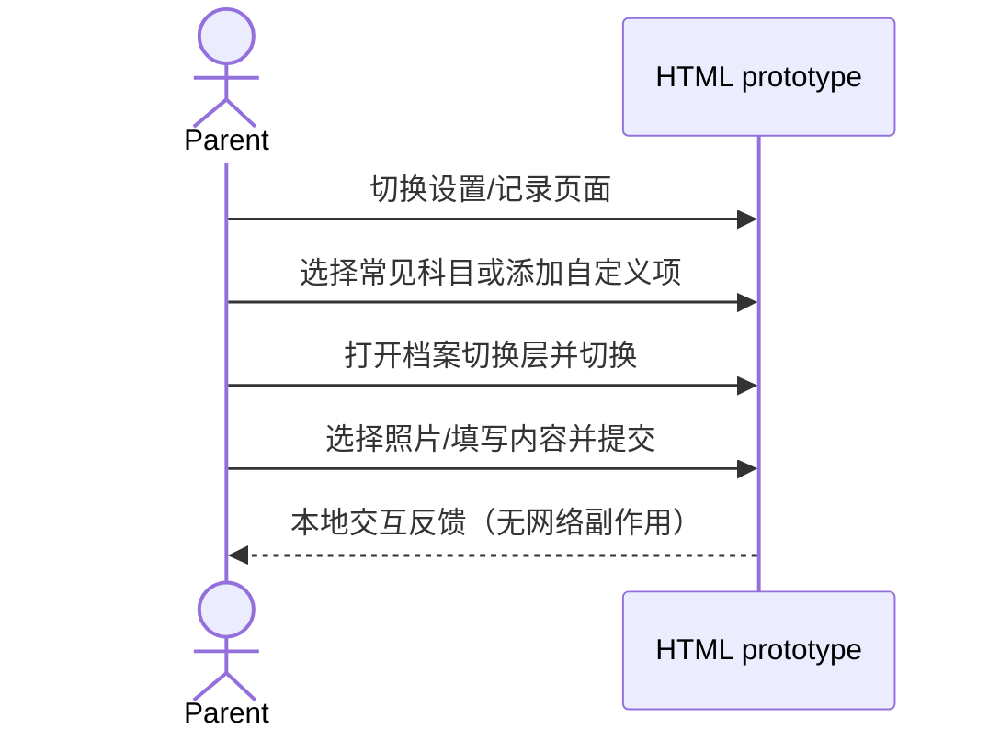

# DESIGN-001 — 家长端关键交互 HTML 重设计评审稿（Spec Lite）

- Status: STAGE_COMPLETE（已作为最终产品 Spec 的阶段性产物）
- Risk: R1
- Owner: 产品负责人（用户）
- Implementer: Codex
- Date: 2026-08-30
- Spec revision: `DESIGN-SPEC-20260830-34`
- User confirmation: 用户于 2026-08-30 明确要求先生成 HTML 版本供 review，确认后才转换成小程序；随后持续反馈今日、报表、设置和记录页，并要求核对每日复习时间是否存在消费者、把当前实现和最终语义写入 Spec
- Affected Feature IDs: `FEAT-001`
- Feature current-state documents: `docs/domain/features/FEAT-001-push-kids-mvp.md`
- Feature baseline revision: `FEAT-STATE-20260830-03`
- Feature merge owner: Codex（已于 2026-08-31 完成原生转换并合并 CURRENT）
- Feature current-state impact: 原型本身不参与运行；其批准交互已通过 `SPEC-20260831-08` 合并到 UI/FEAT-001 CURRENT

## Frontend design and engineering impact

- Frontend impact: yes
- Frontend impact reason: 重做设置、档案切换和学习记录的视觉层级与交互
- Frontend engineering impact: yes
- Frontend engineering impact reason: 独立静态 HTML/CSS/JS 原型改变原型组件、状态、响应和可访问性约束，但不连接 API 或修改小程序代码
- Affected UI IDs: `UI-001`
- UI current-state document: `docs/design/frontend/ui/UI-001-parent-miniapp.md`
- Frontend baseline: approved `FDB-20260830-01`
- Frontend engineering contract: approved `FEC-20260830-01`
- Staged design revision: `DREV-20260830-03`
- Visual direction: 编辑式学习手册；暖白纸张、墨绿主色、细分隔线、紧凑选项与克制圆角，减少大卡片和粗重按钮
- Affected quality dimensions: component/state/form, responsive, accessibility, motion, privacy
- Required viewports: 390×844 mobile; 1440×900 desktop review canvas
- Prototype approval artifact: local interactive HTML
- Figma node: N/A — 用户本次明确指定 HTML 先行评审；沿用 FEAT-001 已批准的 scoped waiver
- Design approval status: ACCEPTED_AS_INTERMEDIATE_SPEC_ARTIFACT
- Mini Program implementation: governed by `specs/completed/FEAT-001-PUSH-KIDS-FINAL-SPEC.md`; DREV-03 已转换为原生小程序，HTML 继续作为阶段性证据

## 1. Problem and intended outcome

当前今日、设置、学习记录与报表页面依赖大面积白卡、粗重输入框和宽按钮，科目创建要求
从空白输入，档案切换像静态信息行；活动建议混入非今日内容，多处解释性备注占用注意力。
用户要求先用 HTML 重新设计并 review。

评审稿必须做到：

1. 学业科目优先使用明确常见选项，缺少时再添加自定义项。
2. 移除设置页 AI 说明、历史补录说明和提交后的多余备注。
3. 档案切换采用明确、轻量、可预览选项的半屏层。
4. 学习记录页重排为更紧凑的孩子、时间、照片和补充内容流程。
5. 主按钮只写“提交”。
6. 今日活动只展示当天有固定安排或与当天直接相关的内容。
7. 报表保留数据与趋势，删除“这些数字……”免责声明式备注。
8. 设置页不得继续使用科目大卡片墙、活动标签云和内联频次控件堆叠，应改为可快速扫读的分组设置清单。
9. 复习时长不使用原生下拉框；孩子选择必须出现在入口附近；新增科目或活动先给出常用默认项，只有缺少时才展开自定义输入，且不再二次选择内容类型。
10. 记录页的日期时间不得以两个并排原生输入占据主流程；空照片状态不得展示大面积空白容器；补充文字框应保持次要且紧凑。
11. 活动提醒不得同时要求填写“每周次数”和“练习日”；练习日是唯一固定安排来源，并支持“时间不固定”。
12. 主导航增加独立日程表；家长可按周查看辅导班和活动，并能为选中日期新建一次性或每周重复日程。
13. 设置页的孩子切换入口必须与今日、记录和报表页使用同一视觉与交互组件，不得单独使用大号档案卡样式。
14. 报表页增加按学习日期聚合的复习紧迫度点阵：红色明度表示确定性计划产生的复习紧迫度，圆点面积表示待复习知识数量，绿色表示家长已标记复习通过；不得将其表述为掌握率、正确率或 AI 评分。
15. 报表页增加每日复习活跃度方格图：仅统计家长已记录的知识复习反馈，以 0、1–2、3–5、6–8、9+ 条五档绿色表达，颜色越深表示次数越多；视图必须跟随近 7/30/100 天范围分别重排为 7 天周视图、5 周日历和 15 周热力图；图表仅作每日次数概览，不在下方展示单日明细卡，方格不提供无后续结果的点击状态。
16. 记录页是底部主导航的一级 Tab，不显示返回按钮；页头必须与今日、设置和报表页使用相同的“轻量上下文 + 孩子切换”结构和排版，不保留页面专用标题或返回结构。
17. 日程页页头右侧使用与其他一级 Tab 相同的孩子切换入口；“新建日程”从页头移至右下角、底部导航上方的悬浮加号按钮，保持在日程页滚动时可直接操作。
18. 复习活跃度方格图不得为短范围保留大量灰色空格，也不得在右侧留下无意义空白；7 天和 30 天使用横向星期轴的 7 列日历布局，100 天使用纵向星期轴的 15 周布局；方格保持正方形，范围、月份与星期标签随布局对齐。
19. “添加其他科目”中的优先选项必须是物理、化学、生物、历史、地理、政治等学科，不使用美术、音乐、体育、劳动作为该入口的默认推荐；自定义名称仅在家长点击“以上都没有”后展开。
20. “添加活动”应覆盖主流儿童课外活动，并按运动与体能、艺术与表达、棋类与科技分组；长目录在选项区内部滚动，不能把“自定义活动”入口推离半屏层可见区域。
21. 设置页的复习时长、在学科目等页面级选项应在用户点击后即时更新，不再要求点击页面底部“保存设置”；单项活动的通常练习日继续在对应半屏层内确认，避免把不同作用域的操作混为一体。
22. 日程列表中的已有日程必须可点击查看详情，并可继续编辑名称、周内日期、开始结束时间、类型和每周重复状态；删除需经过明确的二次确认，编辑、移动日期或删除后日程列表和日期提示即时同步。
23. 活动提醒中的“时间不固定”不得作为日期选项下方的独立大块内容；它应位于“通常哪天练习？”标题右侧，作为与固定日期互斥的紧凑选择，选中后仍明确说明系统会参考上次练习时间给出建议。
24. 今日、日程、设置、记录与报表五个一级页面的孩子选择入口必须统一使用紧凑的“头像 + 当前姓名 + 下箭头”胶囊样式；控件高度收紧至 40px，并在展开时保持锚定、状态与可访问反馈一致。
25. 底部主导航已经明确当前 Tab 的页面含义，今日、日程、设置、记录和报表页头不得重复展示“今天要做的”“日程”“小旺的设置”“记录学习”“学习报表”等大标题；仅保留日期或当前数据范围等必要上下文，并通过页面可访问名称保留语义。
26. 今日页增加“今日学习”栏目，按家长已确认的上传结果汇总当天实际学过的科目、知识内容、发生时间和照片来源；“今日复习”“今日学习”“今日活动”三个栏目均可独立折叠，折叠只改变可见性，不清除 Todo 完成状态或活动操作。
27. 活动提醒选择固定星期后必须设置开始与结束时间；该“星期 + 时间段”是活动安排的唯一来源，保存后同步生成每周日程，并在匹配当天完整展示于今日活动。结束时间必须晚于开始时间。选择“时间不固定”时隐藏时间字段、移除固定日程，仅保留基于上次练习时间的建议。
28. 报表页不再重复提供“今天”，历史范围改为“近 7 天 / 近 30 天 / 近 100 天”；三个范围都是有效数据筛选，不得只改变按钮选中态。切换后必须同步更新概览指标、复习紧迫度日期、复习活跃度布局与有效区间和科目统计；删除“未来 7 天复习量”栏目。
29. 复习紧迫度在近 100 天范围下不得一次纵向展开 100 天；应按时间顺序拆成每屏最多 30 天的横向分页，默认定位最近 30 天，支持触摸左右滑动和可访问的上一屏/下一屏按钮，并显示当前屏序号与日期范围。
30. 今日三个折叠栏与五个孩子切换入口不得使用受系统字体影响的 `⌄` 文本字符；统一使用 12px 线性 SVG chevron，采用圆角端点和固定描边，并随 `aria-expanded` 状态平滑旋转。折叠栏与孩子入口保持各自触控面积，但箭头几何、粗细和垂直对齐必须一致。
31. 今日页不得显示“15 分钟，完成三件事”“1/3”等仅统计复习 Todo 的全局进度卡。今日已经同时承载复习、已确认学习和活动三类不同事实，不能用一个复习完成率冒充今日总体进度；日期/孩子入口后直接进入三个可折叠栏目。
32. 日程按照结束时间区分状态：`end_at <= now` 的条目使用灰色历史态，正在进行或尚未开始的条目保持正常强调；判断使用完整日期、结束时间和家庭时区，不得只比较开始时刻。相同状态同步用于今日活动，视觉变灰不禁用查看详情或补记练习。
33. 学习照片入口必须同时支持“拍摄一张”和“从相册选择”两条路径；相册路径允许一次选择一张或多张，两条路径都可在同一记录中反复追加并共享最多 9 张限制。超出剩余数量时只接收可用数量并明确提示；每张照片可单独删除。“补充一句”统一改为“补充内容”。
34. “每日复习时间”在最终小程序中统一命名为“每日建议复习时长”，只用于把全部到期内容分为“建议完成”和“有余力再做”；超出时长的内容仍显示且不改变复习日期。当前 HTML 原型点击后仅改变选中态并显示 Toast，不会重新计算今日数据，因此只能证明选项布局，不能证明业务消费链；原生实现必须保存当前孩子、刷新 Dashboard，并在失败时恢复原值。

## 2. Scope and non-goals

### In scope

- 独立可交互 HTML 原型：今日页、设置页、学习记录页、报表页、档案切换层、自定义科目层。
- 常见学业选项：语文、数学、英语、科学；支持自定义添加。
- 常见兴趣/运动选项与轻量频次设置。
- 移动端主视口与桌面评审画布。

### Non-goals

- 不修改 `apps/miniprogram`。
- 不调用后端、不保存真实家庭或儿童数据。
- 不改变 Child、Subject 或 Submission API/Schema。
- 不实现最终小程序兼容细节；用户批准后另建实现 revision。

### Known current-state gap — 每日建议复习时长

- 后端已有真实消费者：当前孩子的 `daily_budget_minutes` 进入确定性 Todo 分组，Dashboard 输出 required/optional 与建议分钟数。
- 当前小程序只在新建学习档案时写入该值，现有档案的设置页没有调用更新接口。
- 当前 HTML 原型只保存页面内选中态并显示 Toast，今日页仍使用固定模拟数据。
- 因此 TP-020 只证明“无需整页保存按钮”的视觉交互，不是预算持久化或 Dashboard 重算证据；这两项必须由最终 Feature Spec 的 contract + miniapp E2E 验证。

### Must not change

- 家长确认仍是正式学习记录与复习计划的唯一入口。
- 上传时只需要选择档案和实际时间；科目不成为强制字段。
- 手动记录和照片记录继续保持一等入口。

## 3. Impact map

```text
用户标注截图
→ DREV-20260830-03 HTML 阶段性原型
→ 用户 review / 修改意见
→ 新的已批准 Design Revision
→ 后续小程序实现 Spec（本任务不执行）
```

### Sequence diagram



### State machine

```text
screen: settings ↔ record
overlay: closed ↔ child-switcher | custom-subject
submission: idle → submitting → success → idle
```

### Architecture diagram

N/A: 独立静态评审原型，不改变应用或部署架构。

### Trade-offs

| Choice | Benefit | Cost/risk | Decision |
|---|---|---|---|
| 直接修改小程序 | 快 | 未经视觉确认，返工风险高 | rejected |
| 独立 HTML 评审稿 | 浏览快、可交互、易迭代 | 后续需转换 WXML/WXSS | selected |
| 所有科目自由输入 | 灵活 | 操作慢、易出现重复命名 | rejected |
| 常见选项 + 自定义 | 快且保留扩展 | 需维护推荐列表 | selected |

### Chart selection audit — 复习紧迫度

| Candidate | Fit | Decision |
|---|---|---|
| L4 Arc Matrix · `templates/lupi-gallery.html` | 可承载日期×科目，但弧形布局在 390px 下不利于按日期快速定位 | rejected |
| L9 Bubble Almanac · `templates/lupi-gallery.html` | 可承载日期、数量与状态，但适合长周期年鉴，当前 14 天数据会显得过度叙事 | rejected |
| F10 Dot Heat · `templates/basics-gallery.html` | 点位对应日期，面积可表达待复习数量，明度可表达紧迫度，适合手机端点击查看明细 | selected；沿用 Dot Heat 网格、面积编码和选中环，视觉 token 适配现有产品 |

### Chart selection audit — 复习活跃度

| Candidate | Fit | Decision |
|---|---|---|
| L3 Barcode Lollipop · `templates/lupi-gallery.html` | 可保持 84 天的连续顺序，但难以扫读星期周期，也不像用户指定的 Git 提交日历 | rejected |
| F3 Hairline Area · `templates/basics-gallery.html` | 适合看总体趋势，但连续面积会掩盖五档阈值和单日空缺 | rejected |
| F10 Dot Heat · `templates/basics-gallery.html` | 与日×强度数据匹配，但本页复习紧迫度已使用同一模板，重复会混淆红色风险与绿色活跃度 | rejected |
| G14 Single Axis small multiples · `templates/glance-gallery.html` | 星期作为行、周序作为有序轴，最接近 Git 式周×星期方格；符合家长快速扫读长期规律的目标 | selected；保留有序小倍数骨架，将点改为等大日期方格，以五档绿色编码次数并提供可访问说明 |

## 4. Expected file changes

| Path | Action | Reason |
|---|---|---|
| `docs/design/frontend/prototypes/DREV-20260830-03/index.html` | add | 独立可交互评审稿 |
| `specs/completed/DESIGN-001-HTML-REDESIGN.md` | completed | 固化范围、候选 revision 与验证 |

No existing product code is modified or deleted in this task.

## 5. Acceptance criteria

### AC-001 — 科目配置

- Given 家长打开设置页；
- When 查看和选择学业科目；
- Then 语文、数学、英语、科学以可选项呈现；
- And 可打开自定义科目层添加缺少的内容；
- And not 默认不出现空白“名称”输入框或知识/活动二选一大按钮。

### AC-002 — 档案切换

- Given 页面显示当前档案；
- When 点击档案切换控件；
- Then 出现包含多份档案摘要的半屏层；
- And 选中后当前页面即时更新并恢复焦点。

### AC-003 — 学习记录

- Given 家长进入学习记录页；
- When 选择照片或切换文字记录；
- Then 孩子、时间、照片和补充内容以清晰顺序呈现；
- And 主按钮文案为“提交”；
- And not 不出现 AI 说明、补录说明或提交后备注。

### AC-004 — 可评审性

- Given 桌面或手机浏览器；
- When 打开 HTML；
- Then 390px 移动布局无横向溢出，桌面显示清晰评审画布；
- And 键盘可操作选项、Tab、弹层关闭和提交。

### AC-005 — 今日相关性与报表文案

- Given 家长打开今日页；
- When 查看“今天的活动”；
- Then 只显示当天有安排的活动，不显示仅属于本周建议但与今天无关的游泳或乒乓球；
- Given 家长打开报表页；
- Then 显示学习记录、科目记录与未来复习量；
- And not 不出现“这些数字描述……”或“不代表掌握率/正确率”的备注。

### AC-006 — 设置页视觉与渐进配置

- Given 家长打开设置页；
- Then 每日复习时间、在学科目和活动安排形成三个清晰层级；
- And 常见科目使用纵向可勾选行，选中状态同时由勾选符号和样式表达；
- And 主页面只展示已添加活动及其摘要；
- When 点击活动；
- Then 在半屏层设置频次和练习日，不在主页面堆叠控件；
- And 自定义科目与活动仍可添加。

### AC-007 — 就地选择与默认项优先

- Given 家长设置每日复习时间；
- Then 10、15、20、30 分钟四档直接可见并可单选，不使用原生下拉框；
- When 点击当前孩子；
- Then 选择浮层锚定在入口下方且不超出手机视口；
- When 点击添加科目或活动；
- Then 默认先显示对应类型的常用项，已添加项明确标记；
- And 自定义名称输入默认隐藏，仅在点击“没有找到？自定义添加”后出现；
- And not 不再显示“学习科目/兴趣与运动”内容类型二选一。

### AC-008 — 轻量记录流程

- Given 家长进入拍照记录；
- Then 主页面用一条摘要显示实际发生时间，点击后在半屏层选择日期与具体时间；
- And 空照片状态只显示紧凑的添加入口，不显示大面积空白框；
- When 添加照片；
- Then 展开三列缩略图网格并保留继续添加入口；
- When 删除最后一张照片；
- Then 恢复紧凑的空照片状态；
- And 补充文字框高度明显低于旧版 112px。

### AC-009 — 单一活动提醒规则

- Given 家长点击一个已添加活动；
- Then 半屏层只询问“通常哪天练习”，不显示每周次数加减器或解释性提示块；
- When 选择一个或多个练习日；
- Then 所选日期直接决定该活动在哪些日期进入今日计划，主页面摘要同步显示固定日期；
- When 选择“时间不固定”；
- Then 固定日期被清除，系统仅参考上次练习时间给出非强制建议。

### AC-010 — 日程表

- Given 家长进入主导航；
- Then 可进入独立“日程”页，并在周日期条中看到有日程日期的提示；
- When 选择日期；
- Then 时间顺序展示当天的辅导班、课程和活动，空日期提供明确的新建入口；
- When 新建日程；
- Then 可填写名称、开始结束时间、类型和是否每周重复；
- And 无名称或结束时间不晚于开始时间时就地提示且保留输入；
- And 创建成功后日程立即出现在所选日期。

### AC-011 — 孩子入口一致性

- Given 家长在今日、设置、记录或报表页查看页头；
- Then 孩子切换入口均使用相同的圆形头像、姓名和下拉箭头胶囊样式；
- And 设置页继续复用同一锚定式孩子选择浮层。

### AC-012 — 复习紧迫度点阵

- Given 家长打开学习报表；
- Then 可查看近 14 天每个学习日期的复习紧迫度点阵；
- And 圆点大小、红色深浅、绿色通过态均有文字图例与可访问标签，不依赖颜色单独传达状态；
- When 点击某个日期；
- Then 显示该日已确认的知识内容、学习间隔和逐项复习反馈；
- When 家长逐项标记复习通过；
- Then 该日仍有待复习内容时红色降低一级，全部通过后切换为带“✓”的绿色；
- And not 页面不显示掌握率、正确率或模型评分。

### AC-013 — 每日复习活跃度

- Given 家长打开学习报表；
- Then 方格图根据当前范围显示 7、35 或 105 个日期位置，其中近 30 天和近 100 天分别以 5 个灰色日期对齐完整星期；
- And 每个方格以 0、1–2、3–5、6–8、9+ 条五档绿色展示当天已记录的知识复习反馈，绿色越深表示次数越多；
- And 每个日期均有包含日期、次数和档位描述的可访问标签，不只依赖颜色；
- And 图表下方不显示所选日期、总条数或科目构成明细卡；
- And 方格为非交互数据标记，不显示选中环或指针光标；
- And not 次数与颜色不表示掌握程度、正确率或 AI 评分。

### AC-014 — 记录页一级 Tab 页头

- Given 家长从底部主导航进入记录页；
- Then 页头不显示返回按钮，也不暗示返回设置页；
- And 页头采用与其他一级 Tab 相同的轻量上下文和右侧孩子切换结构；
- And 不重复显示“记录学习”大标题，不保留页面专用标题或返回样式覆盖。

### AC-015 — 日程页孩子入口与悬浮新建

- Given 家长进入日程页；
- Then 页头右侧显示与今日、记录、设置和报表页相同的孩子切换入口，左侧说明文字随当前孩子更新；
- And 页头不再显示“新建日程”文字按钮；
- When 家长点击底部导航上方右下角的圆形“＋”悬浮按钮；
- Then 打开原有新建日程层，焦点与关闭恢复行为不变；
- And 悬浮按钮具有“新建日程”可访问名称、至少 44px 触控尺寸，并不遮挡底部导航和当日日程内容。

### AC-016 — 复习活跃度自适应宽度

- Given 家长在桌面评审画布或 390px 移动视口查看复习活跃度；
- Then 近 7 天和近 30 天分别显示 1 行与 5 行、每行 7 列的日历布局，近 100 天显示 15 列、7 行的长期热力图；
- And 每个日期仍为正方形，星期标签与对应方格中心对齐；
- And 当前视图的 7、35 或 105 个日期位置、五档颜色和可访问标签保持完整；
- And 页面与手机容器均不产生横向溢出。

### AC-017 — 其他学科优先选择

- Given 家长从设置页打开“添加其他科目”；
- Then 首屏以两列选项展示物理、化学、生物、历史、地理、政治及其简短范围说明；
- And 首屏不展示美术、音乐、体育、劳动，也不直接展示名称输入框；
- When 点击一个学科选项；
- Then 该科目直接加入在学科目列表，并沿用选项中的范围说明；
- When 点击“以上都没有？自定义科目”；
- Then 才展开名称输入框和添加按钮；
- And 活动入口继续展示活动选项及“自定义活动”文案，不受学科文案影响。

### AC-018 — 主流活动目录

- Given 家长打开“添加活动”；
- Then 可看到运动与体能、艺术与表达、棋类与科技三个分组；
- And 目录包含游泳、乒乓球、篮球、足球、羽毛球、网球、跑步、跳绳、武术、跆拳道、钢琴、舞蹈、绘画、声乐、书法、围棋、象棋、国际象棋、乐高、编程共 20 项；
- And 已添加的游泳、乒乓球保持禁用态并显示“已添加”；
- When 活动目录超过可用高度；
- Then 仅目录区域滚动，标题、关闭按钮和“以上都没有？自定义活动”入口保持可见；
- When 点击任一可选活动；
- Then 活动直接加入设置列表，不产生重复条目；
- And 390×844 下半屏层与目录不产生横向溢出。

### AC-019 — 设置即时生效

- Given 家长进入设置页；
- Then 页面不显示“保存设置”按钮，也不保留保存中或整页待提交状态；
- When 点击复习时长或在学科目；
- Then 对应选中态、科目计数和必要的轻量反馈即时更新；
- And 活动的通常练习日仍在该活动自己的半屏层内确认；
- And 删除整页按钮后，最后一行设置与页面底部保持正常留白，不产生冗余空区或横向溢出。

### AC-020 — 已有日程详情与编辑

- Given 家长在日程页看到已有日程；
- When 点击日程条目；
- Then 打开详情半屏层，展示日期、名称、时间、类型和重复状态；
- When 点击“编辑日程”；
- Then 复用日程表单并预填全部现有值，可修改名称、周内日期、开始结束时间、类型和每周重复状态；
- And 保存后日程移动到所选日期并按时间重新排序，原日期与新日期的日程提示同步更新；
- When 点击删除；
- Then 先显示删除后不可恢复的二次确认，只有再次确认才删除日程；
- And 详情、编辑、删除均支持键盘焦点、关闭恢复和 390×844 移动端布局。

### AC-021 — 灵活时间入口位置

- Given 家长打开任一活动提醒层；
- Then “时间不固定”显示在“通常哪天练习？”标题右侧，不再占用星期按钮下方的完整内容块；
- When 选择“时间不固定”；
- Then 固定星期全部取消，入口显示选中状态，结果文字说明将参考上次练习时间；
- When 再选择任一星期；
- Then “时间不固定”自动取消，结果文字恢复为固定星期摘要；
- And 390×844 下标题、入口、七个星期按钮和结果文字不换位溢出。

### AC-022 — 统一孩子下拉字段

- Given 家长进入今日、日程、设置、记录或报表任一一级页面；
- Then 页头右侧使用相同的紧凑胶囊，展示孩子头像、当前姓名和下箭头；
- And 胶囊高度为 40px，比上一版字段更低但仍保持清晰的点击区域；
- When 点击孩子字段；
- Then 选择层锚定在字段下方并与字段右边缘对齐，字段同步进入展开状态且箭头向上；
- When 选择另一名孩子或关闭选择层；
- Then 五个页面的姓名与可访问名称同步更新，字段恢复收起状态并将焦点返回触发入口；
- And 390×844 下入口、选择层和页面均不产生横向溢出。

### AC-023 — 删除一级 Tab 重复标题

- Given 家长进入今日、日程、设置、记录或报表任一一级 Tab；
- Then 页头不重复显示该 Tab 的大标题；
- And 今日保留日期，日程保留当前孩子的课程与活动说明，设置、记录和报表保留各自轻量上下文；
- And 每个页面区域具有对应的可访问名称，不依赖被删除的可见标题表达语义；
- And 页头高度随内容收紧，不留下原大标题占位；
- And 五个页面的孩子下拉字段位置保持一致，390×844 下不产生横向溢出。

### AC-024 — 今日学习汇总与栏目折叠

- Given 家长进入今日页；
- Then 在今日复习与今日活动之外，可看到独立的“今日学习”栏目；
- And 栏目按科目展示家长已确认的当天学习内容、实际发生时间和上传照片来源，不将未确认的 AI 草稿作为正式记录；
- And 今日复习、今日学习、今日活动均以具有 `aria-expanded` 和 `aria-controls` 的栏目标题按钮呈现；
- When 家长折叠或展开任一栏目；
- Then 仅对应栏目内容隐藏或恢复，其余栏目状态、复习 Todo 完成状态和活动记录入口不受影响；
- And 折叠按钮支持键盘操作、可见焦点和约 44px 触控高度，390×844 下页面不产生横向溢出。

### AC-025 — 活动星期与时间同步

- Given 家长打开任一活动提醒；
- When 选择一个或多个固定星期；
- Then 显示“练习时间”的开始与结束字段，并明确说明完整时间段同步到日程与今日；
- And 提示摘要同时包含星期和开始—结束时间；
- When 保存提醒；
- Then 当结束时间不晚于开始时间时就地提示并保留输入与弹层；
- And 时间有效时设置列表摘要更新为“星期 · 开始—结束”，对应星期的日程页生成或更新该活动的每周重复日程；
- And 当对应星期为今天时，今日活动同步显示同一活动和完整时间段；
- When 改变时间后再次保存；
- Then 日程页、今日活动与设置摘要同时更新，不保留旧时间的重复条目；
- When 选择“时间不固定”；
- Then 时间字段隐藏，已有固定活动日程移除，今日页不再展示该固定安排；
- And 390×844 下星期、时间字段、摘要和保存操作不产生横向溢出。

### AC-026 — 报表范围真实联动

- Given 家长进入学习报表，默认选择“近 7 天”；
- When 点击“近 7 天”“近 30 天”或“近 100 天”；
- Then 选中态、概览的学习记录/新增知识点/复习反馈/活动练习四项数据同步切换；
- And 复习紧迫度仅渲染当前范围内的 7、30 或 100 个日期，并将明细切换到范围内日期；
- And 复习活跃度根据当前范围重排为 7 天、5 周或 15 周布局，只有当前范围内日期使用绿色次数编码，对齐星期所需的范围外日期显示为灰色且可访问标签说明“不在当前筛选范围”；
- And 科目学习记录的范围文字、次数和比例条同步切换；
- And 页面不再显示“未来 7 天复习量”及其柱状图；
- And 三种范围在桌面和 390×844 下均不产生横向溢出。

### AC-027 — 100 天紧迫度横向分页

- Given 家长在学习报表选择“近 100 天”；
- Then 复习紧迫度按时间顺序分为 4 屏，最早一屏为剩余 10 天，其余每屏 30 天；
- And 默认展示第 4 屏最近 30 天，分页摘要显示“4 / 4”及当前日期范围；
- When 家长向左滑动或点击“查看更早的 30 天”；
- Then 切换到前一屏并同步更新屏序号、日期范围和按钮禁用状态；
- When 家长在任一屏选择日期或标记复习通过；
- Then 当前屏位置保持不跳回最近一屏，日期明细和紧迫度状态正常更新；
- And 近 7 天和近 30 天继续保持单一网格，不显示分页控件；
- And 桌面与 390×844 下每屏宽度等于紧迫度视口宽度，不产生页面横向溢出。

### AC-028 — 下拉与折叠箭头统一

- Given 今日页三个折叠栏和任一一级页面的孩子切换入口处于收起状态；
- Then 箭头均由相同的 12px 线性 SVG path 渲染为向下 chevron，不出现字体字符 `⌄`；
- And 描边粗细、圆角端点、中心位置和颜色符合共享控件样式；
- When 展开折叠栏或孩子选择层；
- Then 对应 SVG 容器围绕中心旋转 180°，其余箭头状态不受影响；
- And 按钮的可访问名称、`aria-expanded`、焦点样式和原触控面积保持不变。

### AC-029 — 今日页删除错误总进度

- Given 家长打开今日页；
- Then 日期和孩子入口后直接出现今日复习、今日学习、今日活动三个栏目；
- And DOM、可访问树与视觉页面中均不存在“今日进度”“完成三件事”、复习完成环或跨类型 `1/3` 总进度；
- When 家长完成或恢复单项复习 Todo；
- Then 该 Todo 状态和反馈正常更新，但不生成或更新任何今日总进度卡；
- And 三个栏目原有折叠、学习摘要和活动操作保持不变。

### AC-030 — 已结束日程灰显

- Given 当前家庭时区时间为 8 月 30 日 20:18；
- When 日程结束时间早于或等于当前时间；
- Then 日程时间、内容背景、左侧状态线和文字使用可读的灰色历史态，并在可访问名称中包含“已结束”；
- And 相同活动在今日活动中使用一致的灰色状态和“已结束”说明；
- When 日程仍在进行或尚未开始；
- Then 保持正常活动/课程颜色，不提前灰显；
- And 灰显条目仍可查看、编辑、删除或补记练习。

### AC-031 — 单张与多张学习照片

- Given 家长点击“添加学习照片”；
- Then 半屏层提供“拍摄一张”和“从相册选择”，并显示当前还可添加数量；
- When 选择拍摄；
- Then 文件选择合同一次只接受 1 张图片；
- When 选择相册；
- Then 文件选择合同允许一次选择 1 张或多张图片；
- And 两条路径可交替、重复追加到同一记录，总数最多 9 张，每张可独立删除；
- And 选择数量超过剩余额度时仅接收剩余数量并提示，不清空已有照片；
- And 照片模式的选填文本字段显示“补充内容”，不出现“补充一句”。

## 6. Required test points

| Test point | AC | Level | Evidence |
|---|---|---|---|
| TP-001 | AC-001 | browser interaction | toggle common subjects; add custom subject |
| TP-002 | AC-002 | browser interaction | open, select and close child sheet |
| TP-003 | AC-003 | browser interaction | switch input mode, add mock photos, submit |
| TP-004 | AC-004 | rendered QA | desktop + 390×844 screenshots; console; keyboard |
| TP-005 | all | static | HTML validator / source scan for removed copy |
| TP-006 | AC-005 | browser interaction | verify today-only activity scope and removed report note |
| TP-007 | AC-006 | browser interaction + rendered QA | subject rows, activity plan sheet, custom additions, mobile layout |
| TP-008 | AC-007 | browser interaction + rendered QA | direct duration options, anchored child popover, preset-first add flow |
| TP-009 | AC-008 | browser interaction + rendered QA | time sheet, empty/filled photo states, compact textarea |
| TP-010 | AC-009 | browser interaction + rendered QA | single schedule question, multiple days/flexible choice, summary update |
| TP-011 | AC-010 | browser interaction + rendered QA | week navigation, empty day, event validation/create, five-item bottom navigation |
| TP-012 | AC-011 | browser interaction + rendered QA | identical child-trigger component and anchored child popover on settings page |
| TP-013 | AC-012 | browser interaction + rendered QA | heatmap semantics, date selection, partial/all-passed state change, accessible labels, mobile overflow |
| TP-014 | AC-013 | rendered QA + static source scan | adaptive 7/35/105-position grids, threshold distribution, no detail card/click state, accessible labels, mobile overflow |
| TP-015 | AC-014 | rendered QA + static source scan | no back action; shared compact header structure and alignment; no repeated title; desktop/mobile overflow |
| TP-016 | AC-015 | browser interaction + rendered QA | shared child trigger, dynamic child copy, FAB placement/accessibility, event sheet open/close, desktop/mobile overlap and overflow |
| TP-017 | AC-016 | rendered QA | responsive 7-day/5-week/15-week layouts, square cells, axis alignment and desktop/mobile overflow |
| TP-018 | AC-017 | browser interaction + rendered QA | six academic presets, direct-add metadata, hidden/revealed custom input, activity copy isolation, mobile overflow |
| TP-019 | AC-018 | browser interaction + rendered QA | 20 activity options, three groups, disabled existing items, internal scroll, direct add, persistent custom disclosure, mobile overflow |
| TP-020 | AC-019 | static source scan + browser interaction + rendered QA | no page save action, immediate subject/budget updates, scoped activity confirmation, bottom spacing, mobile overflow |
| TP-021 | AC-020 | browser interaction + rendered QA | open detail, prefilled edit, date move, type/repeat update, sort and markers, delete confirmation, focus, mobile overflow |
| TP-022 | AC-021 | browser interaction + rendered QA | flexible option in heading, mutual exclusion with weekdays, summary copy, touch target, mobile overflow |
| TP-023 | AC-022 | static source scan + browser interaction + rendered QA | five shared compact avatar triggers, anchored popover, expanded state, child sync, focus restore, desktop/mobile overflow |
| TP-024 | AC-023 | static source scan + rendered QA | no tab title h2, preserved context, accessible screen names, compact shared header, desktop/mobile overflow |
| TP-025 | AC-024 | browser interaction + rendered QA + static source scan | confirmed learning summary, three independent disclosures, state preservation, keyboard semantics, desktop/mobile overflow |
| TP-026 | AC-025 | browser interaction + rendered QA + static source scan | fixed-day start/end fields, invalid range preservation, settings summary, calendar synchronization, today synchronization, flexible removal, mobile overflow |
| TP-027 | AC-026 | browser interaction + rendered QA + static source scan | 7/30/100-day datasets, KPI synchronization, urgency day counts, adaptive contribution layout, subject bars, removed future plan, mobile overflow |
| TP-028 | AC-027 | browser interaction + rendered QA + static source scan | four memory pages, default latest page, swipe/buttons, range label, position preservation, mobile overflow |
| TP-029 | AC-028 | browser interaction + rendered QA + static source scan | shared SVG chevrons, no font glyph, collapsed/expanded rotation, alignment on today and child trigger |
| TP-030 | AC-029 | browser interaction + rendered QA + static source scan | no today summary/progress ring/counter, direct three-section flow, Todo feedback regression |
| TP-031 | AC-030 | browser interaction + rendered QA + unit/static source scan | end-time boundary, past/current/future states, shared calendar/today styling, accessible status, retained actions |
| TP-032 | AC-031 | browser interaction + rendered QA + static source scan | single/multiple file contracts, repeated append, nine-photo cap, overflow handling, individual removal, revised copy |

## 7. Verification

| Test point | Result | Evidence |
|---|---|---|
| TP-001 | passed | 浏览器切换“科学”后计数从 3 更新为 4；通过“其他科目”添加“书法”后更新为 5 |
| TP-002 | passed | 档案半屏层可打开；选择“小雨”后页面档案即时更新、弹层关闭、焦点恢复且容器滚动为 0 |
| TP-003 | passed | 拍照/文字模式可切换；文字计数更新；模拟照片计数到 2/9；按钮仅显示“提交”，提交中与成功状态可恢复 |
| TP-004 | passed | 桌面与 390×844 真实渲染检查通过；390px 无横向溢出；Escape、焦点恢复和弹层 Tab 循环通过；console error/warn 为 0 |
| TP-005 | passed | Python HTMLParser、Node 内联脚本语法检查通过；移除文案源码扫描无匹配 |
| TP-006 | passed | 今日页仅显示 18:30 围棋课，作用域内“游泳/乒乓球/本周有空”匹配为 0；报表备注匹配为 0；四页导航和 390×844 渲染通过 |
| TP-007 | passed | 科目勾选后计数 3→4；游泳安排半屏层可打开/保存；孩子切换更新标题；自定义“书法”和“围棋”可添加；390×844 无横向溢出，console error/warn 为 0 |
| TP-008 | passed | 20 分钟选项可直接选择；孩子浮层在入口下方 24px、右侧对齐误差 4px 且不溢出；常用科目/活动默认可见，自定义输入默认隐藏并可展开；旧类型二选一匹配为 0 |
| TP-009 | passed | 日期改为昨天、时间改为 19:30 后摘要正确更新；照片 0→2 时切换为缩略图网格，删除最后一张后恢复空状态；textarea min-height 从 112px 降为 70px；390×844 无横向溢出 |
| TP-010 | passed | 游泳默认选中周三、周六；可追加周一；选择“时间不固定”后固定日期全部清除并保存为列表摘要；乒乓球再次打开仅选中周日；旧频次控件与说明文案匹配为 0；390×844 无横向溢出 |
| TP-011 | passed | 主导航展示今日/日程/记录/报表/设置五项；周日期可切换并同步 8/9 月标题；空日期展示新建入口；名称与时间错误就地提示且保留输入；成功创建“数学思维课”后立即按 19:00 展示；重复开关与类型在再次新建时重置；Escape 关闭并恢复焦点；390×844 无横向溢出 |
| TP-012 | passed | 设置页已删除专用 `profile-switch` 样式与“当前孩子”二级文案，改为与其余页相同的 `child-trigger`；点击后锚定选择浮层可见，右侧距手机边缘 16px；390×844 无横向溢出 |
| TP-013 | passed | 近 14 天点阵渲染 14 个带完整 aria-label 的日期；8 月 27 日初始为 2 项/高紧迫度，标记一项后降为 1 项/较高，全部通过后切换为带“✓”绿色；8 月 17 日空记录与 8 月 25 日知识明细切换正确；图表日期与来源字号均为 10px；390×844 无横向溢出 |
| TP-014 | passed | 三档分别渲染 7/35/105 个非交互日期位置，有效格为 7/30/100，30 天与 100 天各以 5 个灰色格对齐完整星期；所有方格保留日期、次数、档位或范围外说明的可访问标签，浏览器 console 为 0。 |
| TP-015 | passed | 记录页返回按钮和 `record-header`/`record-title-wrap` 专用样式已从源码删除；记录页与其余一级 Tab 统一为“轻量上下文 + 孩子字段”的 44px 页头，不重复显示“记录学习”标题；390×844 下上下文左距 20px、孩子入口右距 20px，页面与手机容器均无横向溢出 |
| TP-016 | passed | 日程页页头已移除旧 `new-event-button` 并复用 `child-trigger`；切换小旺→小雨时左侧说明、头像和姓名同步更新，随后恢复小旺；悬浮按钮可访问名称为“新建日程”、尺寸 52×52px，桌面与 390×844 下均距导航 14px、右侧 20px且不遮挡日程；打开新建层后关闭可将焦点恢复到悬浮按钮；页面与手机容器均无横向溢出 |
| TP-017 | passed | 7 天为 7 列×1 行、30 天为 7 列×5 行，桌面方格 43.422px、390px 下 43.711px；100 天为 15 列×7 行，桌面方格 17.266px、390px 下 17.398px；宽高差均为 0，三档页面、手机和报表横向溢出均为 0。 |
| TP-018 | passed | 添加科目首屏按物理/化学/生物/历史/地理/政治顺序展示 6 个选项，美术/音乐/体育/劳动匹配为 0；自定义区域初始隐藏，点击后输入框获得焦点且占位为“例如：校本课程”；直接选择化学后科目计数 3→4并保留“物质与实验”说明；活动入口独立显示“选择正在练习的活动”和“自定义活动”；390×844 下选择层为 390×372px、无横向溢出 |
| TP-019 | passed | 活动目录展示运动与体能、艺术与表达、棋类与科技三组共 20 项，其中游泳、乒乓球 2 项为已添加禁用态；目录可视高度 394px、内容高度 722px，独立滚动且“以上都没有？自定义活动”始终处于半屏层内；从列表底部选择编程后活动计数 2→3并显示“时间不固定”；390×844 下半屏层为 390×585px，页面与手机容器均无横向溢出 |
| TP-020 | passed | 页面级 `data-save-settings`、保存按钮样式及保存中逻辑已从源码删除；设置页科目选择由 3→4 项即时更新，复习时长切换到 30 分钟后选中态与“每日复习时间已设为 30 分钟”提示即时出现；游泳仍通过单项“保存提醒”确认；设置页最后元素为活动设置组，桌面底部正常留白 55px；390×844 下页面、手机和设置屏幕横向溢出均为 0 |
| TP-021 | passed | 点击围棋课后详情层完整展示 8 月 30 日、18:30–20:00、活动与每周重复；编辑表单预填原值，改为“围棋进阶课”17:30–19:00、辅导班、不重复并移动到 9 月 1 日后，原日期提示消失、新日期提示出现且列表即时更新；删除确认可取消，确认后才移除条目与日期提示；同日新建 18:00 和 20:00 两项后按时间排序；390×844 下详情层 390×304px、编辑层 390×600px，7 个日期选项完整可见，页面、手机与弹层横向溢出均为 0；关闭详情后焦点恢复到原日程条目 |
| TP-022 | passed | “时间不固定”已成为“通常哪天练习？”标题右侧 102×40px 紧凑入口，日期下方只保留结果摘要；点击后固定星期 2→0、入口进入选中态并显示“系统会参考上次练习时间给出建议”；再选择周一后入口自动取消并恢复固定日期摘要；390×844 下标题行 316×40px、入口与标题垂直居中，7 个星期保持单行，页面、手机与弹层横向溢出均为 0 |
| TP-023 | passed | 今日、日程、设置、记录和报表共 5 个入口均恢复为同一“29px 头像 + 姓名 + 下箭头”胶囊，高度从 44px 收紧至 40px；设置页展开后字段 `aria-expanded=true`，选择层保持锚定，选择小雨后 5 个入口头像、姓名、可访问名称及日程页孩子上下文同步更新，全部恢复收起态且焦点回到原入口；390×844 下页面、手机和选择层横向溢出均为 0 |
| TP-024 | passed | 五个一级页面的 `screen-header` 内 `h2` 数量均为 0，分别保留日期、小旺的课程与活动、学习档案、记录已学内容、已确认的学习记录，并具有今日计划、日程表、设置与科目、记录学习、学习报表五个页面可访问名称；桌面五个页头均为 348×44px且孩子字段顶部位置一致；390×844 下今日页头为 350×44px，页面、手机和今日屏幕横向溢出均为 0 |
| TP-025 | passed | 今日页新增 3 条已确认学习汇总，逐条展示科目、知识内容、实际时间和照片来源；今日复习、今日学习、今日活动均为独立原生按钮，带 `aria-expanded`、`aria-controls`、48px 高触控区和可见焦点；折叠今日复习时其余两栏保持展开，三个栏目可分别折叠，重新展开后首项 Todo 仍保持已完成且进度仍为 2/3；桌面与 390×844 下三个栏目均完整渲染，页面、手机和今日屏幕横向溢出均为 0 |
| TP-026 | passed | 乒乓球提醒固定周日时同时展示开始 10:00、结束 11:00 与“完整时间段同步展示在日程与今日”；将结束改为 09:30 后保存会就地提示“结束时间需晚于开始时间”，弹层与输入保持不变；改为 10:15–11:45 后摘要即时更新，保存后设置列表、周日日程和今日活动均显示同一完整时间段，且日程中没有旧时间重复项；切换“时间不固定”后两个时间字段一起隐藏，保存后固定日程与今日活动同步移除。390×844 下时间段区域宽 316px，两个控件均为 143.5×42px，页面、手机和半屏层横向溢出均为 0。 |
| TP-027 | passed | 近 7/30/100 天切换继续同步概览、紧迫度与科目统计；复习活跃度同步切换为 7 天周视图、5 周日历和 15 周热力图，范围标签为“8 月 24–30 日”“8 月 1–30 日”和 5–8 月；源码和渲染均不存在“未来 7 天复习量”，390px 无溢出。 |
| TP-028 | passed | 近 100 天紧迫度渲染 10/30/30/30 天四屏，默认“4 / 4 · 8 月 1–30 日”；上一屏按钮和横向滚动均切换为“3 / 4 · 7 月 2–31 日”，下一屏可恢复；选择 7 月 2 日后仍停留第 3 屏且明细同步。桌面每屏 348px、390px 下每屏 350px，均等于紧迫度视口宽度；近 7/30 天分页隐藏，页面、手机和报表无横向溢出。 |
| TP-029 | passed | 今日 3 个折叠栏和 5 个孩子入口共渲染 8 个共享 SVG chevron，源码与 DOM 中 `⌄` 字体字符为 0；SVG 统一为 12×12px、1.75px 圆角描边。实际浏览器中收起态 transform 为 none，展开态为中心旋转 180°，孩子层与今日折叠交互正常，console error/warn 为 0。 |
| TP-030 | passed | 源码、DOM 与可访问树中今日进度卡/完成环/计数均为 0，日期和孩子入口后以 18px 间距直接进入今日复习；三栏顺序为复习、学习、活动。实际浏览器中首项 Todo false→true→false 完成/恢复正常，三个折叠栏保持原状态，console error/warn 为 0；静态检查和 17 项前端测试通过。 |
| TP-031 | passed | 原型时钟为 20:18：当天 10:00–11:00 与 18:30–20:00 两条均渲染 `is-past`，背景为 rgb(238,240,238)、标题为灰色且可访问名称包含“已结束”；对应今日活动同步灰显。明天 16:30–18:00 保持正常绿色且没有历史态；灰显按钮仍 enabled，console error/warn 为 0。结束时间 `<=` 边界、共享状态和样式由第 16 项前端单测覆盖，18 项测试全部通过。 |
| TP-032 | passed | 浏览器实际渲染照片来源半屏层，提供“拍摄一张”和“从相册选择”两项并显示“还可添加 9 张”；单张 input 为 `accept=image/* + capture=environment` 且无 `multiple`，相册 input 为 `accept=image/* + multiple`；记录页显示“补充内容”且“补充一句”为 0。第 17 项前端测试静态核对反复追加共享 9 张额度、超额截断、逐张删除与对象 URL 回收逻辑；19 项前端测试、ESLint、架构检查、小程序结构校验和 `git diff --check` 全部通过。受本地浏览器安全边界限制，本轮未自动操作系统相册面板或注入真实用户照片。 |

### Validation note

移动端回归中发现浏览器可能因恢复弹层输入框焦点而滚动手机外壳。候选稿已通过
`inert`、关闭态 visibility/pointer-events 和 `overflow: clip` 修正，并完成同路径回归。

## 8. Handoff gate

- Candidate may be shown for review after local validation.
- It is retained as the accepted intermediate interaction artifact and evidence for `SPEC-20260831-08`，但不作为 API、数据库或业务消费链证据。
- Mini Program conversion 已由最终 Feature Spec 的用户授权实施并完成；当前运行事实以 UI/Feature current-state 为准。
