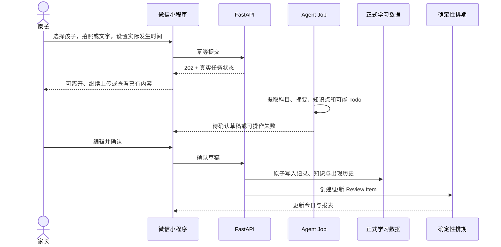
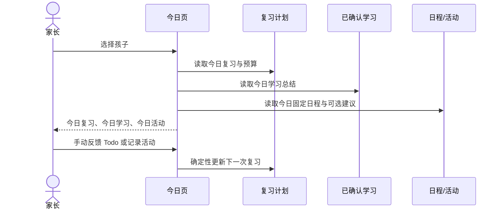
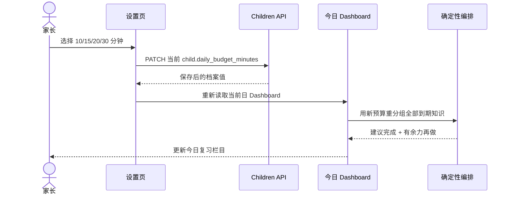
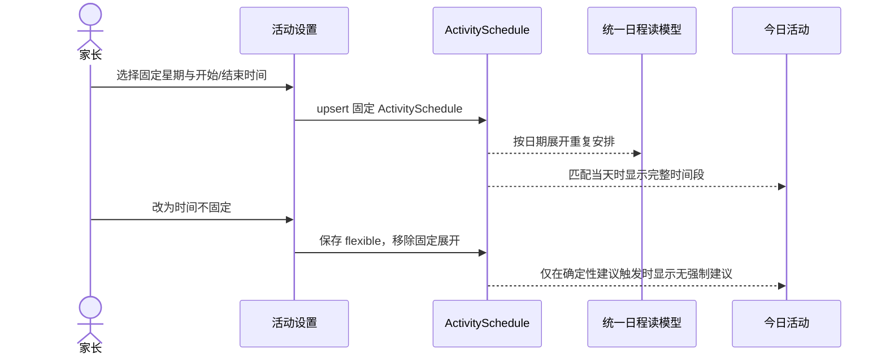
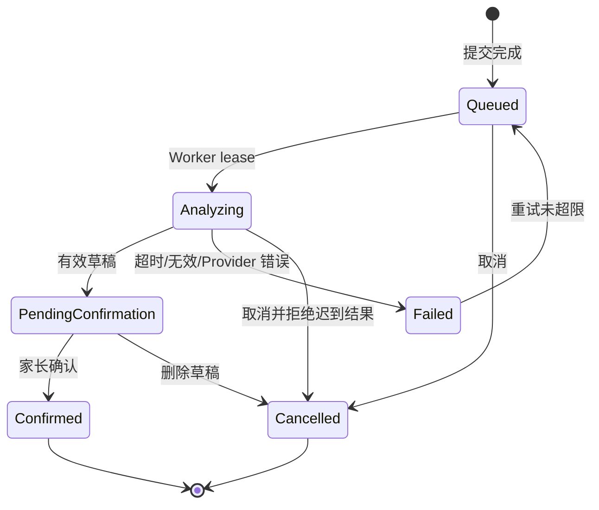
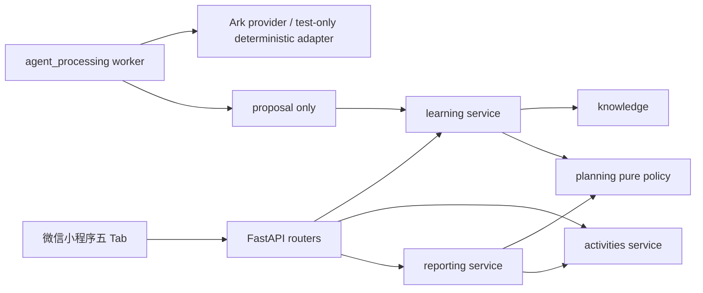

# FEAT-001 — 家庭学习持续跟进系统最终产品 Spec

- Status: `DONE_WITH_EXTERNAL_RELEASE_GATES`
- Risk: `R2`
- Spec owner: 产品负责人（用户）
- Implementer: Codex
- Reviewer: 独立只读 Review 已完成；P1/P2 发现均已修复并回归
- Verifier: 自动化测试 + 本地端到端 + 微信开发者工具 + 代表性真机
- Created: 2026-08-30
- Last updated: 2026-08-31
- Target release: 本地完整体验版；公开发布另受身份、隐私与生产基础设施门禁约束
- Spec revision: `SPEC-20260831-08`
- User confirmation: 用户于 2026-08-30 明确要求以当前最终 HTML 为阶段性设计事实，夜间无人值守转换为原生微信小程序、连接本地真实服务、删除运行时 mock 数据、使用豆包结合孩子近期学习上下文分析多张图片，并完成严格数据库与端到端验证；该指令视为对本 revision 的实施授权，不要求再次询问
- Additional R2 approval: `APPROVED — 产品负责人于 2026-08-30 明确授权实施 SPEC-20260830-07`
- Affected Feature IDs: existing `FEAT-001`
- Feature current-state documents: `docs/domain/features/FEAT-001-push-kids-mvp.md`
- Feature baseline revision: `FEAT-STATE-20260830-03`
- Feature merge owner: Codex；已在 2026-08-31 合并 CURRENT
- Feature current-state impact: 已替换为五 Tab、今日三栏、活动日程、7/30/100 报表、Agent 交互和验证事实
- Supersedes: `specs/completed/FEAT-001-PUSH-KIDS-MVP.md` 中被本 Spec 明确替换的目标产品与前端交互描述；旧 Spec 继续保留为首版实现历史

## Frontend Design Impact and staged artifact

- Frontend impact: yes
- Frontend impact reason: 五个一级 Tab、今日学习/复习/活动、日程 CRUD、活动提醒、记录流程、设置和报表均改变可见交互合同
- Frontend engineering impact: yes
- Frontend engineering impact reason: 原生小程序页面、全局 token、状态/表单、API 数据流、可访问性、热力图、包体和隐私验证均需要修改
- Affected UI IDs: `UI-001`（后续可在实现时按稳定 Surface 拆分 UI-ID）
- UI current-state documents: `docs/design/frontend/ui/UI-001-parent-miniapp.md`
- Frontend baseline revision: approved `FDB-20260830-01`
- Frontend engineering constraint revision: approved `FEC-20260830-01`
- Affected frontend quality dimensions: component/state/form, responsive, accessibility, i18n/time formatting, browser/device, performance, security/privacy, table-chart, motion-media-AI, observability
- Frontend quality budgets/requirements: 1.5 MiB 初始 Tab 包、接近/达到 44px 触控、320/390/430 三档手机视口、无图表框架、无敏感日志/本地存储、AI 草稿待确认
- Frontend quality verification plan: `npm test`、`npm run lint:miniapp`、小程序 validator、三档视口、微信开发者工具、代表性真机、隐私/存储/日志检查
- Approved frontend engineering deviations: FEAT-001 Figma Starter 配额 waiver；Owner repository owner；公开生产前到期；不免除原生小程序验证
- Required viewport/state exports: 320×568、390×844、430×932 的 happy/empty/error/long-content/keyboard/sheet/chart；1440×900 HTML 仅作评审证据
- Current production Design Revision: `DREV-20260830-03`
- Staged target Design Revision: `DREV-20260830-03`（已实现）
- Proposed Design Revision: `DREV-20260830-03`
- Staged artifact: `docs/design/frontend/prototypes/DREV-20260830-03/index.html`
- Staged artifact Spec/evidence: `specs/completed/DESIGN-001-HTML-REDESIGN.md` revision `DESIGN-SPEC-20260830-34`
- Staged artifact status: `ACCEPTED_AS_INTERMEDIATE_SPEC_ARTIFACT`；它定义目标信息架构与交互，不连接真实 API，不是最终小程序交付
- Figma project/file URL: https://www.figma.com/design/FAyfmjNrA3btWztwyxI6Zj
- Figma node URL(s): https://www.figma.com/design/FAyfmjNrA3btWztwyxI6Zj?node-id=0-1（waiver anchor；不代表已有 node-specific 可编辑原型）
- Figma waiver: 沿用 FEAT-001 已批准的限时 waiver；Owner 为 repository owner，公开生产发布前失效
- Prototype status: `IMPLEMENTED_IN_NATIVE_MINIPROGRAM`（HTML 阶段产物继续保留为设计历史，不参与运行）
- Approved Task Spec revision: `SPEC-20260830-07`
- Approved Design Revision: `DREV-20260830-03`
- Snapshot manifest path: 当前开发者工具截图位于 `docs/design/frontend/snapshots/FEAT-001-*.jpg`；真实 AppID 下的最终审批清单是公开发布门禁
- Permitted implementation deviation: 仅允许微信原生组件差异；任何改变信息层级、行为、数据语义或验收结果的偏离必须更新 Spec/Design Revision 并重新确认
- UI current-state merge owner: Codex
- UI current-state merge evidence: `docs/design/frontend/ui/UI-001-parent-miniapp.md` revision `UI-STATE-20260831-01`、22 个前端测试和小程序结构验证

## 0. 执行摘要

### 问题

家长需要持续管理孩子在学校、家庭作业、辅导班和自主学习中已经学过的内容。孩子
记得快也忘得快，而学习事项分散、数量多，家长难以长期回答三个问题：今天实际学了
什么、今天应该复习什么、哪些课程或活动需要安排与记录。

### 目标结果

家长每天打开微信小程序，先选择孩子，然后可以：

1. 看到按时间预算编排的今日复习 Todo；
2. 看到当天已经确认的学习内容总结；
3. 看到当天课程与活动安排，并记录实际练习；
4. 通过照片或文字补充新的真实学习内容；
5. 在日程中管理辅导班、课程和活动；
6. 在 7/30/100 天报表中查看可追溯的学习、复习和活动事实。

AI 在后台异步整理照片和文字，只生成可编辑草稿。家长确认后，系统才创建正式学习
记录、知识点和复习任务。复习日期由确定性记忆计划产生，AI 不自动判卷、不判断掌握
程度，也不预测孩子下一步应该学习什么。

### 为什么现在需要本 Spec

首版后端和小程序已经存在，但后续 HTML 评审重新确定了信息架构与交互。本文既是该轮
实现的批准意图，也是 2026-08-31 验证后的交付记录；了解当前长期行为时以 Feature/UI
current-state 为入口，本文用于追溯决策、验收与外部未运行门禁。

## 1. 已确认事实与产品决定

| ID | 最终决定 | 理由/边界 |
|---|---|---|
| D-001 | 第一版主要用户是家长 | 不建设孩子独立任务端或教师后台 |
| D-002 | 目标客户端是原生微信小程序 | 本地 HTML 只作阶段性设计与交互证据 |
| D-003 | 账号体系不在本次家长端范围 | 当前受控体验使用开发身份；公开发布接入微信身份，UI 不展示账号占位入口 |
| D-004 | 第一版聚焦小学阶段 | 科目选项可扩展，但系统不预测年级教材进度 |
| D-005 | 系统只关注真实学过的内容 | 新知识由家长上传或手动输入，不生成“下一课” |
| D-006 | 输入包含照片与手动文字 | 二者都是一等路径；Todo 也可手动完成，无需照片 |
| D-007 | 一天可多次上传并可补录 | 必须同时保存 `occurred_at` 与 `created_at` |
| D-008 | AI 只生成可编辑草稿 | 未确认草稿不进入正式记录、报表、复习或 Todo 完成状态 |
| D-009 | 第一版不自动批改 | 不输出正确率、掌握率、语音评分、手写评分或成绩 |
| D-010 | 科目分为知识学习与练习活动两类 | 课内英语等归属对应学科；校内/作业/辅导班/自主学习是来源，不单独建学科 |
| D-011 | 知识点去重但出现历史不丢失 | 同一知识保持唯一身份，每次出现独立留痕 |
| D-012 | 复习计划由确定性规则产生 | AI 可解释或生成练习材料，但不决定日期 |
| D-013 | “每日建议复习时长”只决定今日到期内容的优先分层 | 预算内进入“建议完成”，超出部分仍保留为“有余力再做”；不隐藏到期内容、不修改复习日期、不自动执行“稍后”，也不用于学习/活动或今日总进度 |
| D-014 | 活动不进入记忆曲线 | 只记录练习、固定日程和基于上次练习的温和建议 |
| D-015 | AI 推理异步执行 | 上传后可离开；已有今日、历史和报表不得等待模型 |
| D-016 | 主导航为今日、日程、记录、报表、设置五个 Tab | 每个一级页面使用统一孩子切换入口，不重复显示 Tab 大标题 |
| D-017 | 设置页常见选项优先 | 没有匹配项时才展开自定义输入；不出现全局“保存设置” |
| D-018 | 日程与活动提醒共享同一事实来源 | 固定星期和开始—结束时间在设置、日程和今日中一致 |
| D-019 | 报表范围为近 7/30/100 天 | 删除“今天”和未来 7 天负荷；范围切换必须真实更新全部数据 |
| D-020 | 报表风险色表达“复习紧迫度” | 红色不是遗忘百分比，绿色不是成绩；全部口径可追溯到确定性计划与家长反馈 |
| D-021 | 今日页不展示跨类型总进度卡 | 今日同时包含复习、学习和活动；不得用复习 Todo 数量或时间预算冒充今日总体完成度 |
| D-022 | 已结束日程使用灰色历史态 | 以完整 `end_at <= now` 判断；正在进行/未来保持正常，状态同步到今日活动且不禁用补记 |
| D-023 | 照片支持单张与一次多张 | 拍摄一次 1 张、相册一次 1 张或多张，可反复追加；同一记录最多 9 张并可逐张删除 |
| D-024 | 非测试运行时不提供 Fake/示例数据回退 | development/production 必须显式配置 Ark；缺少密钥时健康检查可用但分析提交进入可操作失败，不能用模拟结果伪装成功 |
| D-025 | 图片分析结合近期已确认上下文 | Worker 向 Provider 提供当前科目、近期已确认知识摘要和活跃复习候选；模型必须区分图片直接证据与上下文，只能从候选中匹配 Todo，不能把上下文内容冒充本次图片所学 |
| D-026 | 自动化测试允许显式 test-only Provider | deterministic provider 仅由 `PUSH_KIDS_ENV=test` 使用，用于状态机和数据一致性证据；不得成为开发或生产默认配置，不得向家长展示模拟结论 |

### 当前没有阻断产品问题

本 Spec 对本地完整体验的产品边界已经闭合。以下事项不阻断本地实现，但阻断公开生产
发布：微信身份与家庭权限、隐私删除闭环、托管数据库与对象存储、独立 Worker/队列、
真实 AppID 与 iOS/Android 真机、轮换后的 Ark 密钥和正式域名备案。

本地环境事实：用户指定的四张 `20260830-2304*.jpg` 在执行机提供的路径不存在，且
执行环境未注入 `ARK_API_KEY`。这不阻断代码、Provider 合同、测试图片和 test-only
端到端验证；它只使“指定四图 + 真实豆包”的付费外部回放成为本 revision 唯一允许的
`NOT_RUN` 验证项，部署时注入轮换后的密钥和原图后按 Runbook 补跑。

## 2. 当前行为与阶段性证据

### 当前实现

- FastAPI + SQLAlchemy + SQLite + 数据库任务行 + Ark Provider 已实现；开发/生产不存在
  Fake 回退，确定性 Provider 只在显式 test/e2e 环境注册。
- 原生小程序已实现今日、日程、记录、报表、设置五个 Tab 和 7 个页面；运行时不加载 HTML。
- `Child.daily_budget_minutes` 从设置页即时 PATCH，并由 Dashboard 将当天全部到期知识分为
  required/optional；预算不改变 Review 的阶段或 `due_date`。
- ActivitySchedule 使用星期与开始/结束时间作为单一事实，支持柔性建议、移除和日程投影；
  CalendarEvent 支持创建、读取、编辑、删除、每周重复与创建幂等。
- 报表只接受 7/30/100 天，概览、上海自然日紧迫度、复习反馈活跃度和科目统计使用同一范围。
- 照片支持单张、一次多张和多次追加；中断在 Job 创建前也可继续分析或取消，不会留下
  客户端无法恢复的提交。
- 复习反馈、学习提交和日程创建均有稳定幂等意图；练习材料只接收所选已确认 Review IDs。
- 业务数据库以空库交付；旧原型数据库只读归档在 `data/archive/20260830-pre-native/`。

### HTML 阶段性产物

`DREV-20260830-03/index.html` 已用于连续产品评审，覆盖今日、日程、设置、记录、报表和
主要半屏层。它已经通过 HTML/脚本检查、浏览器交互、桌面与 390×844 渲染验证，详见
`DESIGN-001-HTML-REDESIGN.md` 的 TP-001 至 TP-032。

HTML 产物的权威边界：

- 它是本 Spec 的目标交互证据；
- 它使用模拟数据，不证明 API、事务、家族隔离、持久化或小程序兼容；
- 它的交互和模拟数据只证明阶段设计；预算消费、日程同步、状态恢复与报表联动均以
  原生小程序、API、数据库及自动化证据为准；
- 它不能替代微信开发者工具、真机和真实端到端验证；
- 小程序实现不得机械复制桌面评审侧栏或手机外壳。

## 3. 目标用户流程

### 3.1 学习内容录入与确认



### 3.2 每日使用



### 3.2.1 每日建议复习时长变更



保存失败时设置页恢复原选中值并显示可重试错误；不得让选中态与服务端值长期不一致。
预算变化只触发当日展示分组重算，不写 ReviewFeedback，不改变 Review Item 的阶段、
`due_date` 或 active 状态。

### 3.3 日程与活动提醒



## 4. 产品范围与不变量

### 4.1 本次范围

1. 后端补齐本 Spec 所需的日程、活动时间段、100 天报表和今日聚合合同。
2. 原生微信小程序按 `DREV-20260830-03` 转换五 Tab 与相关半屏层。
3. 保留并接通现有照片/文字提交、异步分析、确认、知识去重和确定性复习闭环。
4. 补齐自动化、本地端到端、微信开发者工具和代表性设备验证。
5. 更新 Feature/UI current-state、部署文档和验证证据。

### 4.2 范围外

- 注册登录、家长邀请、角色权限和账号设置 UI。
- 预测教材进度、课程推荐和“下一步学习什么”。
- 自动判卷、在线答题、语音/手写评分、掌握率或排名。
- 孩子独立端、教师端、机构后台和家庭间社交。
- 微信订阅消息和推送自动化。
- 单次重复日程例外（“仅修改本次”）；MVP 编辑重复项时明确作用于整个系列。
- 微服务、自治多 Agent 平台或通用插件系统。

### 4.3 不变量

1. 所有服务端查询和写入都必须在 `family_id` 边界验证资源归属。
2. 未确认 AI 草稿不得改变正式学习、知识、复习、Todo 或报表。
3. `occurred_at` 与 `created_at` 分开保存；历史补录不制造过去 Todo 债务。
4. Review 日期只来自版本化确定性策略。
5. 活动日程不进入知识记忆曲线。
6. Todo 不因图片或模型推测自动完成；家长始终可手动反馈。
7. 首页、日程、历史和报表在 AI Provider 失败时仍可用。
8. 原始模型载荷、Token、孩子图片和完整学习文本不得进入日志或仓库。
9. 所有报表数字都可追溯到已确认记录或家长反馈。
10. 客户端不承担身份授权、复习算法或报表口径。

## 5. 信息架构与页面合同

### 5.1 共同框架

- 底部导航固定为：今日、日程、记录、报表、设置。
- 五个 Tab 页头右侧统一使用 40px 高“头像 + 当前孩子姓名 + 下箭头”胶囊。
- 孩子选择层锚定在入口下方，选择后五个页面同步更新并恢复焦点。
- Tab 已表达页面含义，页头不重复显示“今天要做的”“日程”“学习报表”等大标题。
- UI 文案使用“学习档案/资料”，不出现“添加孩子/保存孩子”；本阶段档案由后台配置。

### 5.2 今日

页面从上到下：日期/孩子、今日复习、今日学习、今日活动。三个栏目之外不显示“今日进度”或跨类型完成率卡。

- 今日复习：按建议顺序展示合并 Todo；支持完成、需要巩固、部分完成、稍后。
- 今日学习：只汇总当天已确认记录，展示科目、知识摘要、实际时间和照片/文字来源。
- 今日活动：展示当天固定日程的完整时间段；柔性活动只有在建议规则触发时以“建议”出现，
  无固定时间且不计入强制 Todo。
- 三个栏目可独立折叠；折叠不清空数据、Todo 状态或操作。
- 页面不等待 Agent 推理；待确认、失败等状态以非阻塞提示进入相应处理流。

### 5.3 日程

- 周日期条显示当前周和有日程日期；选择日期后按开始时间排序。
- 右下角、底部导航上方使用可访问的悬浮加号创建日程。
- 日程字段：名称、日期、开始时间、结束时间、类型（辅导班/活动/其他）、是否每周重复。
- 结束时间必须晚于开始时间；无效时就地提示并保留输入。
- 点击已有日程可查看详情、编辑或二次确认删除。
- 日程根据家庭时区和完整结束时间计算状态；已结束条目灰显并包含“已结束”可访问说明，正在进行和未来条目不灰显。
- 编辑重复日程作用于整个系列；UI 必须明确说明范围。单次例外延期。
- 活动设置产生的固定 ActivitySchedule 作为日程读模型的一种来源，不复制第二份业务事实。
- 从日程编辑活动来源的系列时，更新同一个 ActivitySchedule；时间同步回设置与今日。

### 5.4 记录

- 记录是一级 Tab，无返回按钮和重复大标题。
- 支持“拍照记录/文字记录”切换；主按钮统一为“提交”。
- 实际发生时间以一条紧凑摘要呈现，点击后在半屏层修改日期和时间。
- 单次最多 9 张 JPEG/PNG/WebP，单图最大 10 MiB；空状态使用紧凑上传入口。
- 照片入口提供“拍摄一张”和“从相册选择”；相册允许一次选择一张或多张，两条路径可反复追加并共享最多 9 张限制。
- 有图片时展示缩略图网格并保留继续添加；照片可逐张删除，超过剩余数量时只接受可用数量并提示。
- 选填字段统一命名为“补充内容”，保持次要、紧凑；纯文字路径不要求照片。
- 一天允许多次独立提交；选择过去时间时按 `occurred_at` 归档。

### 5.5 报表

- 范围只提供近 7 天、近 30 天、近 100 天；默认近 7 天。
- 范围切换同步更新：学习记录、新增知识点、复习反馈、活动练习、复习紧迫度、
  复习活跃度、科目统计。
- 删除“今天”和“未来 7 天复习量”。
- 复习紧迫度：按学习日期聚合；圆点面积表示待复习知识数；红色分级表示确定性计划
  产生的复习紧迫度；家长将当日全部内容标记通过后显示带“✓”绿色。
- 紧迫度阈值：到期当天或逾期 1 天为较低，逾期 2–3 天为较高，逾期 4 天以上或
  最近反馈为“需要巩固”为优先复习；无活动 Review Item 的日期显示已通过/无待复习。
- 100 天紧迫度按 10/30/30/30 天四屏横向分页，默认最近 30 天；支持滑动与可访问按钮。
- 复习活跃度：仅统计每日 ReviewFeedback 条数，使用 0、1–2、3–5、6–8、9+ 五档绿色。
- 活跃度布局：7 天为 7×1，30 天为 7×5，100 天为 15 周×7 日；只作概览，不点击。
- 不展示掌握率、正确率、排名、AI 评分或需要免责声明才能成立的推测数据。

### 5.6 设置与科目

- 页面级设置即时保存，不显示全局“保存设置”。
- 用户可见名称统一为“每日建议复习时长”，提供 10/15/20/30 分钟直接选择，不使用原生下拉框。
- 辅助说明为“用于安排今日复习优先级，超出部分仍会显示”；不得称为学习时间、今日总时长或完成目标。
- 选择后更新当前孩子的 `daily_budget_minutes`，成功后重新读取今日 Dashboard；保存失败恢复原值并允许重试。
- 在学科目使用可扫读列表；常见小学科目直接选择。
- “添加其他科目”优先展示物理、化学、生物、历史、地理、政治；仅点击“以上都没有”
  后展开自定义名称。
- 活动目录按运动与体能、艺术与表达、棋类与科技分组，至少覆盖 HTML 阶段已验证的
  20 个主流选项；已添加项不可重复。
- 单项活动提醒层只配置“固定星期 + 开始/结束时间”或“时间不固定”，不再同时配置
  每周建议次数。
- 固定日期与“时间不固定”互斥；固定安排保存后同步日程和今日。
- 时间不固定时不生成固定日程；系统可依据上次练习时间给出无强制副作用的建议。

### 5.7 待确认与练习材料

- Agent 草稿按科目分组，展示摘要、知识点、新/旧/可能重复和可能匹配的 Todo。
- 低置信或不确定合并不默认静默确认；保存失败保留全部编辑。
- 家长可从已确认知识主动请求听写、默写、填空、同类计算或口头回顾清单。
- 练习材料不得引入未确认的新知识，不自动批改或生成成绩。

## 6. Agent 触发、输出与交互

| Job/能力 | 触发 | 预期输出 | 正式副作用/确认 |
|---|---|---|---|
| LearningAnalysis | 照片或文字提交成功 | 科目建议、学习摘要、知识点、复习方式、低置信项 | 无；必须家长确认 |
| KnowledgeNormalization | 草稿生成/确认前验证 | 新知识、已存在、确定重复、可能重复 | 确定重复可复用；不确定合并由家长确认 |
| TodoMatching | 分析已有知识与当前 Todo | 可能匹配的 Todo 建议 | 不自动完成；家长勾选后才反馈 |
| DailySummaryNarration | 正式记录确认、编辑或日期变化 | 基于结构化事实的简短日总结 | 不改底层事实；可重新生成 |
| PracticeGeneration | 家长主动请求 | 基于已确认知识的练习清单 | 无成绩、无自动批改 |
| ActivitySuggestion | 活动记录或日期变化 | 对确定性资格结果的自然语言说明 | 资格由规则计算；建议非强制 |

确定性服务负责：复习日期、紧迫度阈值、时间预算、Todo 分组、反馈状态、重复日程
展开、报表数值、活动建议资格和日期归档。

图片分析的可复用提示与结构化质量合同已沉淀为个人 Skill：
`/Users/bytedance/.agents/skills/analyze-child-learning-images/SKILL.md`。Skill 要求分别输出
图片直接证据与近期上下文、只引用服务端给出的 Todo ID，并禁止评分、掌握判断和下一课预测；
运行时仍由 `AnalysisProvider` 合同校验模型 JSON，Skill 文档本身不绕过服务端信任边界。

### 长推理交互

1. 提交成功即返回 `202` 和可恢复任务 ID，不等待模型。
2. 客户端展示上传中、等待分析、正在分析、待确认、失败、已取消、已确认，不显示伪百分比。
3. 多批任务并行且互不阻塞；离开/重进后通过服务端状态恢复。
4. 失败保留照片和文字，提供重试与手动记录；重试使用同一幂等意图，不重复正式记录。
5. 取消后 Worker 必须拒绝迟到结果；失败最多自动重试三次。
6. 首页使用已确认数据和确定性读模型，Agent 延迟不影响已有内容。

## 7. 复习策略与每日计划

### 7.1 确定性记忆间隔

版本 `review-policy-v1` 的冷启动间隔为 1、3、7、14、30、60 天。

| 家长反馈 | 计划变化 |
|---|---|
| 完成 | 前进到下一间隔；完成最后阶段后 Review Item 结束 |
| 部分完成 | 前进一级但使用该间隔的一半，最少 1 天 |
| 需要巩固 | 回退一级并于次日复习 |
| 稍后 | 阶段不变，顺延 1 天 |

旧内容补录时，首次日期为 `max(学习日 + 1 天, 今天)`，不追建历史节点。

### 7.2 每日编排

- 候选知识按到期日、逾期程度、最近巩固反馈、科目与复习方式稳定排序。
- 同科目、同复习方式合并为一个前台 Todo，后台仍保留知识级 Review Item。
- 累计预计分钟不超过“每日建议复习时长”的为“建议完成”，首次超过预算及其后的较低优先项为“有余力再做”。
- 两组都来自同一天全部到期知识；预算只影响分组，不隐藏项目、不改变 `due_date`、不写反馈，也不自动把项目顺延到下一天。
- 家长显式选择“稍后”时才按反馈状态机顺延 1 天；改变预算不能等价于“稍后”。
- 每个 Todo 显示来源原因，例如“三天前学习”“上次需要巩固”。
- 家长反馈只更新适用知识；已完成 Todo 不因重新排期自动打开。

## 8. 领域与数据设计

### 8.1 关键实体

| 实体 | Owner | 关键语义 |
|---|---|---|
| ChildProfile | children | 学习数据归属，不等于账号；本阶段由后台配置，前端只切换 |
| Subject | children | `learning` 或 `activity`；按 child 隔离 |
| LearningSubmission / AgentJob | learning / agent_processing | 原始输入与异步生命周期 |
| LearningRecord | learning | 家长确认后的真实学习，保留 occurred/created 时间 |
| KnowledgeItem / Occurrence | knowledge | 唯一知识身份与每次出现证据 |
| ReviewItem / ReviewFeedback | planning | 当前复习阶段、到期日和家长反馈历史 |
| ActivitySchedule | activities | 活动科目的 fixed/flexible 提醒配置 |
| CalendarEvent | activities | 手动辅导班、活动或其他一次/每周重复日程 |
| ActivityRecord | activities | 一次真实练习，不等于日程 |
| ScheduleEntry | reporting read model | ActivitySchedule 展开与 CalendarEvent 的统一日期视图 |

### 8.2 ActivitySchedule 目标 Schema

- `mode` 由字段组合确定，不另存重复状态：`weekdays` 非空为 fixed，为空为 flexible
- `weekdays`: 0–6 去重排序；flexible 时必须为空
- `start_time`, `end_time`: fixed 时同时必填且 end > start；flexible 时同时为空
- `subject_id`: 必须指向同 child 的 activity Subject
- 同 family/child/subject 只返回一个 active reminder；移除时软停用提醒及该活动科目
- 旧 `target_per_week`、`time_text` 只保留数据库兼容列，小程序和当前 API 消费链不写入产品含义

### 8.3 CalendarEvent 目标 Schema

- `name`, `kind: class | activity | other`
- `event_date`, `start_time`, `end_time`，且 end > start
- `repeat_weekly: boolean`；为 true 时以 `event_date` 的星期作为系列锚点
- `active`, `created_at`, `updated_at`
- `CalendarEventRequest` 保存 family-scoped 幂等键、请求指纹和事件 ID，网络重试返回同一事件
- MVP 不保存单次 recurrence exception；系列编辑/删除作用于整个系列

### 8.4 数据迁移

1. 迁移前备份本地 SQLite。
2. 旧原型数据库完整归档到 `data/archive/20260830-pre-native/`，不导入本地真实业务库。
3. 新业务库由 `create_all` 建立空 Schema；真实档案只经后台配置工具显式创建。
4. 若未来迁移旧用户数据，只有同时具备有效 weekdays、start/end 的记录才可成为 fixed，
   缺失信息不得推测为一小时课程，应进入人工确认或 flexible。
5. 报表不回填推测数据；历史 feedback 先转为 Asia/Shanghai 自然日再聚合。

### 8.5 状态机



## 9. API 与错误合同

所有请求仍以 `/api/v1` 为前缀，并在服务端边界验证 `X-Family-ID`。公开版本必须用
已验证微信身份替换该开发合同。

| Contract | 目标变化 | 幂等/错误 |
|---|---|---|
| `POST /submissions`、`POST /submissions/upload`、`POST /submissions/{id}/media`、`POST /submissions/{id}/finalize` | 照片/文字、occurred_at、延迟多图批次与异步状态 | Idempotency-Key；当前媒体类型/大小错误统一稳定 400；不打印原始内容 |
| `POST /submissions/{id}/confirm` | 保持家长确认后原子写正式数据 | 重复确认返回同一结果或明确 conflict，不双写 |
| `PATCH /children/{id}` | 更新当前档案的 `daily_budget_minutes`；UI 只提交 10/15/20/30，成功后客户端重取 Dashboard | 后端保留现有 5–120 兼容范围；跨 family/child 404；无效值 422；失败不保留虚假选中态 |
| `GET /children/{id}/dashboard?day=` | 返回今日复习、今日学习、今日活动及异步计数 | child/family 不匹配返回 404 |
| `GET /children/{id}/report?days=` | `days` 只接受 7/30/100；返回 overview、review_urgency、review_activity、subjects | 非法范围稳定 400；Asia/Shanghai 日期 |
| `GET /children/{id}/schedule?day=` | 返回 CalendarEvent 与 ActivitySchedule 的统一当天投影，按开始时间排序 | child/family 不匹配 404；上海自然日边界稳定 |
| `POST /calendar-events`、`PATCH/DELETE /calendar-events/{id}` | 手动日程 CRUD；重复项作用整个系列 | 创建使用 Idempotency-Key 与请求指纹；无效时间 422；不存在/越权 404 |
| `POST /activity-schedules`、`PATCH /activity-schedules/{id}` | 新建或修改 fixed/flexible 活动提醒 | 同 child/subject 当前提醒复用；无效星期/时间 422 |
| `DELETE /activity-schedules/{id}` | 软停用提醒及活动科目，不删除历史活动记录 | family-scoped；重复调用保持无额外副作用 |
| `POST /reviews/{id}/feedback` | 保持四种反馈并记录 ReviewFeedback | 重复 UI 提交不得双推进 |
| `GET /children/{id}/practice-materials?review_ids=` | 只从所选且属于该 child/family 的已确认 Review 生成带练提示 | 非法/跨家庭引用 404；不写成绩或新知识 |

合同必须区分 absent、null 和 empty；时间使用 ISO 8601/HH:MM 明确字段，展示时区为
Asia/Shanghai；列表必须有稳定排序与上限；错误返回稳定错误码和家长可理解文案。

## 10. 安全、隐私与信任

- 每次访问先解析可信 family，再按 family + child/resource 查询；跨家庭资源统一返回 404。
- 图片只保存在私有媒体存储，禁止公共 URL、base64 本地缓存和日志输出。
- Ark 请求只传完成分析所需最少内容；API Key 仅来自环境变量。
- Model output 与所有外部文本都是不可信输入，必须做 Schema、长度、枚举和引用校验。
- 日志只记录安全 correlation ID、任务状态、错误码与耗时；不记录孩子姓名、图片、原始文字、模型原文或 Token。
- 公开发布前必须补齐微信授权、家庭角色、删除/保留/备份语义、隐私政策、域名备案和真实 AppID 验证。

## 11. 架构与实现边界

### 11.1 选定方案

保持原生微信小程序 + FastAPI 模块化单体。日程能力归 `activities`，统一日程查询归
`reporting` 读模型；记忆策略保持在纯 `planning/domain.py`，Agent Provider 继续通过
`agent_processing/providers` 适配。



### 11.2 模块职责

| 模块 | 本次责任 | 禁止事项 |
|---|---|---|
| children | 后台配置档案、科目、预算与 family-scoped 读取 | 账号授权、复习算法 |
| learning | 提交、确认、实际时间、正式记录事务 | 直接决定复习日期 |
| knowledge | 归一化、唯一身份、出现历史 | Provider 调用 |
| planning | v1 间隔、反馈、紧迫度、Todo 分组 | FastAPI、SQLAlchemy、Settings、Provider import |
| activities | ActivitySchedule、CalendarEvent、ActivityRecord | 记忆曲线与学习评分 |
| reporting | 今日、日程、报表的只读聚合 | 改写正式学习或排期事实 |
| agent_processing | 任务状态、Provider、重试、结构化草稿 | 直接写正式学习/Review/Todo |
| media | 私有文件验证与保存 | 学习语义判断 |

依赖方向保持 routers → services → domain policy；跨模块只走 service/contract，不直接
写其他模块表。`tools/check_architecture.py` 必须继续验证 DAG。

### 11.3 方案取舍

| 方案 | 结论 | 原因/重审条件 |
|---|---|---|
| AI 直接决定复习日期 | rejected | 不稳定、不可解释、不可确定测试 |
| ActivitySchedule 与 CalendarEvent 完全复制 | rejected | 会造成设置、日程、今日三份时间漂移 |
| 日程读模型展开 ActivitySchedule | selected | 单一事实来源且保留手动日程 CRUD |
| 直接复制 HTML 到小程序 WebView | rejected | 不符合原生微信交互、性能和部署边界 |
| 本次改成跨平台框架 | rejected | 无当前消费者，增加包体和迁移风险 |
| 100 天图一次纵向展示 | rejected | 手机端不可扫读；使用 30 天横向分页 |

### 11.4 扩展策略

| 变化轴 | 状态 | 合同/重审条件 |
|---|---|---|
| AI Provider | open | `AnalysisProvider`、超时/资源限制、契约测试、日志脱敏 |
| Media store | open | `MediaStore`、类型/大小/路径隔离测试 |
| Review policy | closed | 变更需新 revision、迁移与确定性回归测试 |
| Calendar event types | closed for MVP | 仅辅导班/活动/其他；新增类型需产品证据 |
| WeChat identity | deferred but release-blocking | FEAT-002/新架构 revision 后开放 |
| 自动批改 | closed | 重新开放需独立数据、风险与教学有效性 Spec |

Architecture revision: 沿用 `ARCH-20260830-01` 的部署与依赖边界；新增 CalendarEvent
属于 activities 内部能力，不改变部署拓扑。若实现引入独立队列、托管存储或新的共享
模块，必须先创建新 Architecture revision。

## 12. 预期文件变化与替换计划

| Path | Action | 必要变化/权威关系 |
|---|---|---|
| `apps/api/src/push_kids/persistence/models.py` | completed | ActivitySchedule、CalendarEvent 及反馈/日程幂等请求表 |
| `apps/api/src/push_kids/activities/{schemas,service,router}.py` | completed | 活动提醒、日程 CRUD、family scope、时间验证与历史日期建议 |
| `apps/api/src/push_kids/planning/domain.py` | retained pure | 确定性记忆策略保持无框架/ORM/Provider 依赖 |
| `apps/api/src/push_kids/reporting/{service,router}.py` | completed | 今日、统一日程、上海自然日和 7/30/100 报表读模型 |
| `apps/miniprogram/app.{json,wxss}` | completed | 五 Tab 与 DREV-03 原生 token |
| `apps/miniprogram/pages/today/*` | completed | 三个可折叠事实栏目、反馈幂等、带练提示和活动建议 |
| `apps/miniprogram/pages/calendar/*` | completed | 周日程、悬浮新建、详情、编辑、删除和已结束灰态 |
| `apps/miniprogram/pages/records/*` | completed | 单/多照片、实际时间、可恢复批次与异步状态 |
| `apps/miniprogram/pages/reports/*` | completed | 7/30/100 联动、紧迫度与复习活跃度 |
| `apps/miniprogram/pages/settings/*` | completed | 预算即时保存、默认目录、活动时间段与移除 |
| `tests/unit|integration|contract|e2e` | completed | 34 + 1 项后端与全链路证据 |
| `tests/frontend` | completed | 22 项原生小程序状态与防回归扫描 |
| `docs/design/frontend/ui/UI-001-parent-miniapp.md` | merged | DREV-03 当前小程序事实 |
| `docs/domain/features/FEAT-001-push-kids-mvp.md` | merged | 五 Tab、报表、Agent、恢复与验证事实 |
| `specs/completed/DESIGN-001-HTML-REDESIGN.md` | retained stage evidence | 不作为小程序运行依赖或 API/数据证据 |

临时共存：HTML 原型长期保留为阶段证据；它不被小程序运行时引用。旧活动字段只允许在
受控迁移窗口读取，所有消费者迁移后必须删除，不能永久双写。

## 13. 非功能要求

| ID | 要求 | 目标/验证 |
|---|---|---|
| NFR-001 | AI 故障隔离 | Provider 失败时今日、日程、历史和报表仍可读取 |
| NFR-002 | 幂等 | 重试不产生重复提交、正式记录、Review 推进或日程系列 |
| NFR-003 | 时间正确 | Asia/Shanghai 跨日、补录、周重复与 7/30/100 边界测试 |
| NFR-004 | 移动可用 | 320×568、390×844、430×932 无关键操作裁切或横向溢出 |
| NFR-005 | 可访问性 | 关键触控接近/达到 44px，颜色非唯一编码，焦点/关闭恢复明确 |
| NFR-006 | 包体与性能 | 初始 Tab 包不超过 1.5 MiB；不引入图表框架；列表有上限/分页 |
| NFR-007 | 隐私 | 日志、本地存储、分享载荷不含图片、Token、原始模型内容或完整儿童数据 |
| NFR-008 | 可追溯 | Todo、紧迫度、活跃度和汇总能定位到正式记录/ReviewFeedback |

## 14. 验收标准

### AC-001 — 真实学习录入与确认

- Given 家长选择了后台配置的孩子档案；
- When 通过照片或文字提交一次实际学习并可选择历史时间；
- And 照片可通过单张拍摄或相册一次多选加入，可反复追加、逐张删除且总数不超过 9 张；
- Then 立即获得可恢复异步状态，允许离开和继续上传；
- And 分析完成后获得可编辑草稿；
- And 只有家长确认才写正式记录、知识、出现历史和 Review Item。

### AC-002 — 确定性复习与手动反馈

- Given 已确认知识进入 v1 记忆计划；
- When 家长选择完成、需要巩固、部分完成或稍后；
- Then 只按确定性规则更新适用知识的下次日期；
- And 不要求照片、不自动批改、不产生 AI 掌握判断。

### AC-003 — 今日三类信息

- Given 家长打开今日页；
- Then 日期与孩子入口后直接展示今日复习、今日学习、今日活动，不显示只统计复习 Todo 的全局进度卡；
- Then 可分别折叠今日复习、今日学习、今日活动；
- And 今日学习只包含已确认记录；
- And 今日固定活动显示与日程一致的完整时间段；
- And 折叠不改变 Todo、学习或活动状态。

### AC-004 — 日程 CRUD 与活动单一来源

- Given 家长在日程创建、编辑或删除一次/每周日程；
- Then 日期提示、排序、详情和今日同步更新；
- And `end_at <= now` 的日程与今日活动灰显并标注已结束，正在进行和未来日程保持正常且所有操作仍可用；
- Given 家长从设置修改活动固定星期和时间段；
- Then 日程与今日读取同一个 ActivitySchedule 投影，不产生重复；
- And 无效结束时间保留输入并提示，时间不固定不生成固定日程。

### AC-005 — 设置即时生效

- Given 家长进入设置；
- Then 看到“每日建议复习时长”和“用于安排今日复习优先级，超出部分仍会显示”，不出现把它描述为今日总进度或学习时长的文案；
- When 将当前孩子的时长从 15 分钟改为 20 分钟；
- Then 客户端立即 `PATCH` 当前 child，成功后重新获取 Dashboard，无全局保存按钮；
- And 新预算内的到期内容进入“建议完成”，超出的到期内容仍显示在“有余力再做”；
- And 所有 Review Item 的 `due_date`、阶段与反馈历史保持不变；
- When 保存失败；
- Then 恢复原选中值、保留当前页面并提供可重试错误，不展示虚假的已保存状态；
- When 修改在学科目；
- Then 同样按该设置自身合同即时保存并更新状态；
- And 常见科目/活动优先，自定义仅在缺少时展开；
- And 家长端不出现账号、API 地址、添加孩子或保存孩子操作。

### AC-006 — 7/30/100 报表真实联动

- Given 家长切换任一范围；
- Then 概览、紧迫度、活跃度和科目统计使用同一范围数据；
- And 100 天紧迫度默认最近 30 天并可横向分页；
- And 活跃度使用五档绿色和对应自适应布局；
- And 不出现今天范围、未来 7 天负荷、掌握率、正确率或 AI 评分。

### AC-007 — 异步失败与恢复

- Given 上传失败、Provider 超时、无效模型输出或任务取消；
- Then 输入被保留并提供重试/手动路径；
- And 取消拒绝迟到结果；
- And 已有今日、日程、历史和报表保持可用。

### AC-008 — Family 隔离与隐私

- Given 请求携带一个 family 身份；
- When 访问另一个 family 的 child/submission/review/schedule；
- Then 返回 404 且无副作用；
- And 日志、客户端存储和错误文案不泄露敏感内容。

### AC-009 — 小程序视觉与交互一致性

- Given 五个一级页面和相关半屏层；
- Then 原生小程序保持 DREV-03 的信息层级、统一孩子入口、操作范围和错误恢复；
- And 320/390/430 三档视口可完成核心流程；
- And HTML 桌面评审外壳不进入生产小程序。

### AC-010 — 基于已确认知识的练习材料

- Given 家长主动选择已确认知识；
- When 请求生成听写、默写、填空或同类计算清单；
- Then 输出只覆盖所选知识；
- And 不引入未学概念、不自动批改、不生成成绩。

## 15. 验证计划

| TP | 覆盖 | 层级 | 必须证明 |
|---|---|---|---|
| TP-001 | AC-001/007 | integration + E2E | 照片/文字、多批、补录、任务恢复、失败/重试/取消 |
| TP-002 | AC-001/002 | transaction + unit | 确认原子性、知识去重、Review v1、未确认无副作用 |
| TP-003 | AC-002/005 | unit + property | 四反馈转换、预算 required/optional 边界、预算变化不改 due_date/反馈、旧补录不制造历史债务 |
| TP-004 | AC-003 | API + miniapp E2E | 今日三类数据、折叠状态、完整活动时间段 |
| TP-005 | AC-004 | integration + contract | CalendarEvent CRUD、重复系列、ActivitySchedule 投影、无重复 |
| TP-006 | AC-004 | migration | 旧 time_text/target_per_week 迁移、备份、重复执行安全 |
| TP-007 | AC-005 | contract + miniapp E2E | PATCH 当前孩子预算、成功后 Dashboard 重分组、超额项仍可见、失败回滚、预设优先、自定义、无账号/API/孩子保存文案 |
| TP-008 | AC-006 | query + unit | 7/30/100 口径、紧迫度阈值、五档计数、100 天分页 |
| TP-009 | AC-006/009 | visual + a11y | 两种图、非颜色提示、滑动/按钮、三档手机视口 |
| TP-010 | AC-007 | provider contract | Ark / test-only adapter 结构、超时、三次重试、迟到取消、错误脱敏 |
| TP-011 | AC-008 | integration + bundle audit | 所有新增/修改 API cross-family 404；日志/存储无敏感数据 |
| TP-012 | AC-009 | DevTools + device | 五 Tab 编译、导航、安全区、键盘、焦点、长中文、无溢出 |
| TP-013 | AC-010 | contract + adversarial | 练习材料不越过已确认知识边界且无评分 |
| TP-014 | regression | full suite | 当前提交、确认、Todo、活动记录和报表基本能力不回退 |
| TP-015 | deployment | local full E2E | 本地 API + Worker + SQLite + Mini Program 完整用户链路 |

实现后必须运行并记录：

```bash
uv run pytest tests/unit tests/integration tests/contract -q
uv run ruff check .
uv run ruff format --check .
uv run mypy apps/api/src
npm test
npm run lint:miniapp
uv run python tools/check_architecture.py
uv run python tools/validate_miniprogram.py
uv run python tools/audit_database.py data/push_kids.db --require-empty
```

已执行 test-only 全链路 E2E、本地服务健康检查和空业务库审计。微信开发者工具项目已打开，
但 `touristappid` 无法预览/上传；真实 Ark smoke 因未注入 `ARK_API_KEY` 且用户指定四图路径
不存在而记录为 `NOT_RUN`。真实 AppID 下 iOS/Android、320×568/390×844/430×932 视觉证据
与真实 Ark 四图回放是公开体验/生产前门禁，不得以测试适配器冒充通过。

## 16. 发布、迁移与回滚

### 本地发布顺序

1. 备份 SQLite 与媒体目录。
2. 运行可重复的数据迁移并验证旧 ActivitySchedule。
3. 发布后端兼容合同；旧小程序在兼容窗口仍可读基本数据。
4. 发布五 Tab 小程序并执行本地 E2E。
5. 观察错误、重复日程、任务失败和 report days=100 查询。
6. 所有消费者迁移后删除 target_per_week/time_text 兼容读取。

### 回滚

- 小程序可回滚到上一构建；后端在兼容窗口不得立即删除旧列。
- 数据迁移前备份可恢复 SQLite；新 CalendarEvent 在回滚时保留但旧客户端不可见。
- 若发现日程重复或时间漂移，停止小程序发布，恢复备份并保留只读诊断证据。
- 未经身份与隐私门禁，不允许把本地受控版本直接暴露到公网。

## 17. 实施切片

### Slice 1 — 后端时间与日程合同

- ActivitySchedule fixed/flexible 与开始/结束时间；
- CalendarEvent CRUD 与统一 ScheduleEntry；
- 迁移、family scope、幂等和时间验证。

### Slice 2 — 今日与报表读模型

- 今日三类聚合；
- 7/30/100 报表、紧迫度纯策略、活跃度计数；
- 删除 future_load 和旧 notice 合同。

### Slice 3 — 原生五 Tab 框架与设置/日程

- 从 DREV-03 转换全局 token、统一页头、五 Tab；
- “每日建议复习时长”PATCH 当前孩子、失败回滚并驱动 Dashboard 重分组；
- 其余设置即时保存、科目/活动目录、活动提醒；
- 日程周视图、FAB、详情、编辑与删除。

### Slice 4 — 记录、今日与报表界面

- 照片/文字、实际时间、异步状态；
- 今日折叠栏目与 Todo 反馈；
- 报表范围、紧迫度分页与活跃度布局。

### Slice 5 — 完整验证与文档合并

- 自动化、本地 E2E、DevTools、代表性真机/视口；
- 独立只读 Review；
- 语义合并 FEAT-001/UI-001 CURRENT；
- 部署文档、证据与遗留删除。

## 18. Review 与完成门禁

实现前：

- [x] 产品负责人明确授权 `SPEC-20260830-07` 夜间无人值守实施。
- [x] `DREV-20260830-03` 作为小程序转换目标并由连续浏览器评审确认。
- [x] 本 Feature 继续使用已批准、公开生产前到期的 Figma Starter waiver。

实现完成后：

- [x] 所有 AC 有自动化/本地证据或明确 `NOT_RUN` 外部门禁。
- [x] 后端、前端、架构、空库、隐私静态检查和归档检查完成。
- [x] 独立只读 Review 覆盖正确性、幂等、时间、恢复和 Spec 漂移；全部 P1/P2 已修复。
- [x] 旧四 Tab、future_load/notice、活动频次输入和隐含一小时逻辑已从当前产品消费链移除。
- [x] `docs/domain/features/FEAT-001-push-kids-mvp.md` 合并最终事实。
- [x] `docs/design/frontend/ui/UI-001-parent-miniapp.md` 合并 DREV-03 最终小程序事实。
- [x] Spec 移至 `specs/completed/`；HTML 继续作为阶段性证据而非运行依赖。

Final status: `DONE_WITH_EXTERNAL_RELEASE_GATES — 本地实现、回归和空库交付完成；真实 Ark 四图、真实 AppID 预览/上传及 iOS/Android 真机仅因外部凭据/文件缺失未运行`

## 19. Revision history

| Date | Revision | Change | Approval |
|---|---|---|---|
| 2026-08-30 | `SPEC-20260830-02` | 汇总完整对话、旧 MVP、DREV-03 HTML 评审和当前实现差距，形成后续后端补齐与小程序转换的最终产品 Spec | pending explicit review |
| 2026-08-30 | `SPEC-20260830-03` | 删除把复习 Todo 数量冒充今日总体完成度的进度卡；今日页以复习、学习、活动三类独立事实直接开始 | pending explicit review |
| 2026-08-30 | `SPEC-20260830-04` | 增加基于完整结束时间的日程历史态：已结束灰显，正在进行和未来保持正常，并同步今日活动 | pending explicit review |
| 2026-08-30 | `SPEC-20260830-05` | 学习照片增加单张拍摄与相册一次多选，保留反复追加/逐张删除/9 张上限；文案改为“补充内容” | pending explicit review |
| 2026-08-30 | `SPEC-20260830-06` | 明确“每日建议复习时长”的唯一消费者与语义：只将全部到期内容分为建议完成/有余力再做，不改变复习日期；记录后端已有消费、小程序更新缺口、HTML 仅视觉反馈，并补充 PATCH、刷新、失败回滚与测试门禁 | pending explicit review |
| 2026-08-30 | `SPEC-20260830-07` | 用户授权将最终 HTML 转换为原生小程序、删除运行时 mock、连接本地真实服务、增加上下文图片分析 Skill 并严格验证 | approved by product owner |
| 2026-08-31 | `SPEC-20260831-08` | 合并当前实现与只读 Review 修复：中断多图恢复、待确认草稿删除、反馈/日程幂等、上海自然日、历史活动日期、活动移除、所选知识练习材料；记录 34+1+22 测试、空库审计和外部 NOT_RUN 门禁 | done |
