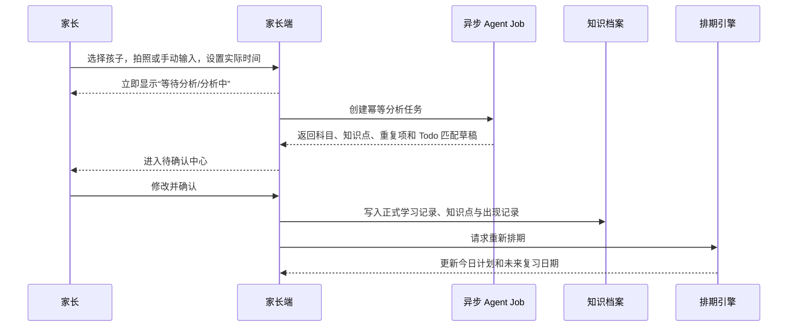
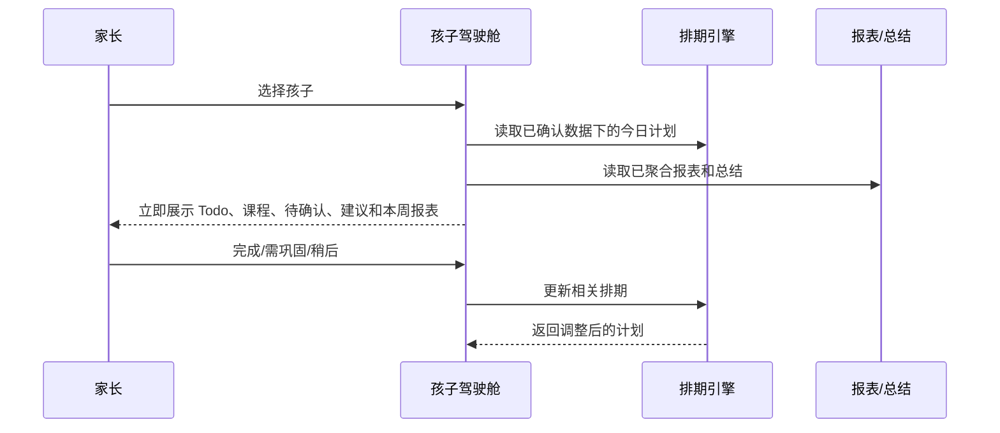
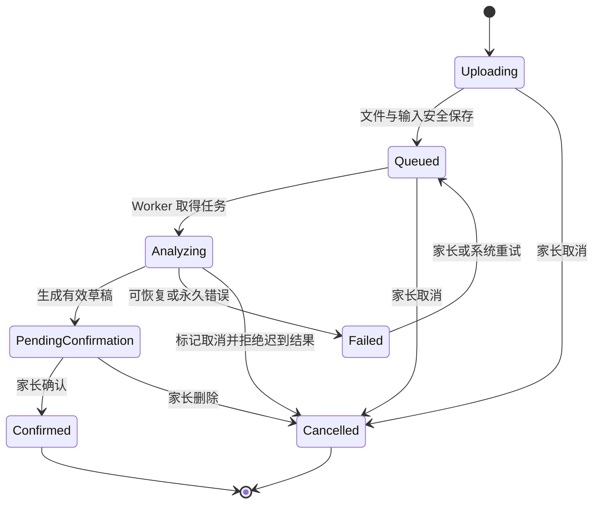
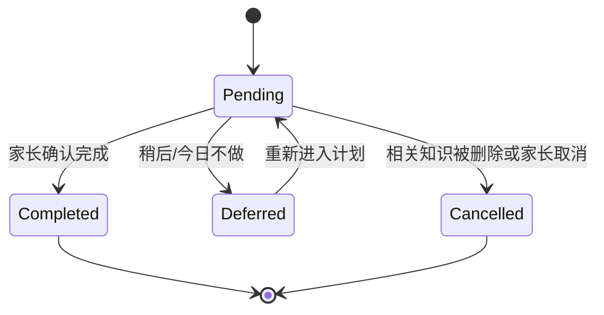
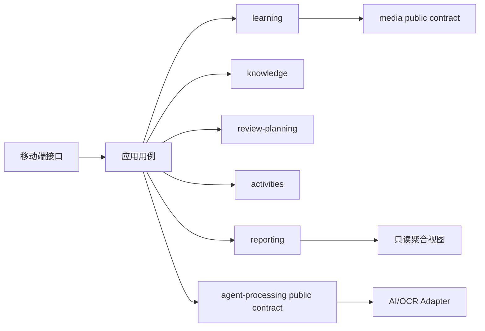

# FEAT-001 — 家庭学习持续跟进系统 MVP

- Status: COMPLETED
- Risk: R2
- Spec owner: 产品负责人（用户）
- Implementer: Codex
- Reviewer: Codex（本地只读交付审计）
- Verifier: automated test suite + WeChat DevTools
- Created: 2026-08-30
- Last updated: 2026-08-30
- Target release: controlled-experience MVP；公开发布需完成身份与隐私门禁
- Spec revision: SPEC-20260830-01
- User confirmation: 2026-08-30 用户明确要求完整实现并授权采用推荐技术与交互方案
- Additional R2 approval: 2026-08-30 产品负责人已确认
- Affected Feature IDs: new `FEAT-001`
- Feature current-state documents: `docs/domain/features/FEAT-001-push-kids-mvp.md`
- Feature baseline revision: N/A，新功能
- Feature merge owner: 产品负责人（用户）
- Feature current-state impact: 创建 FEAT-001 当前行为、合同、架构映射、质量证据与变更引用

## Frontend Design Impact and Figma Approval

- Frontend impact: yes
- Frontend impact reason: 新建家长端原生微信小程序及完整可见交互
- Frontend engineering impact: yes
- Frontend engineering impact reason: 新增小程序组件、远程状态、表单、响应式、可访问性、性能和隐私实现
- Affected UI IDs: proposed `UI-001` 至 `UI-008`，见“界面范围”
- UI current-state documents: `docs/design/frontend/ui/UI-001-parent-miniapp.md`
- Frontend baseline revision: approved `FDB-20260830-01`
- Frontend engineering constraint revision: `FEC-20260830-01`
- Affected frontend quality dimensions: component/state/form, responsive, accessibility, browser/device, performance, security/privacy, motion/media/AI
- Frontend quality budgets/requirements: 1.5 MiB 初始 Tab 包、44px 触控目标、三档手机视口、无儿童图片或 Token 日志、AI 草稿待确认
- Frontend quality verification plan: Node tests、ESLint、小程序 validator、架构检查、微信开发者工具编译与代表页面截图
- Approved frontend engineering deviations: FEAT-001 Figma Starter 配额 waiver；Owner repository owner；公开生产前到期
- Current Design Revision: `DREV-20260830-01`
- Proposed Design Revision: `DREV-20260830-01`
- Figma project/file URL: https://www.figma.com/design/FAyfmjNrA3btWztwyxI6Zj
- Figma node URL(s): `https://www.figma.com/design/FAyfmjNrA3btWztwyxI6Zj?node-id=0-1`（文件根节点 waiver anchor，不代表已有可编辑原型）
- Prototype status: APPROVED
- Prototype approval note: 依据批准的文本基线和限时 Figma waiver 实施；Starter 配额在节点创建前耗尽
- Required viewport/state exports: 手机竖屏基线、加载、空、失败、分析中、待确认、成功、离线/重试状态
- Approved Task Spec revision: `SPEC-20260830-01`
- Approved Design Revision: `DREV-20260830-01`
- Design approval evidence: 产品负责人于 2026-08-30 批准推荐设计；文本基线与 DevTools 截图按限时 waiver 作为交付证据
- Snapshot manifest path: `docs/design/frontend/snapshots/UI-001/DREV-20260830-01/APPROVAL.md`
- UI current-state merge owner: Codex
- UI current-state merge evidence: `docs/design/frontend/ui/UI-001-parent-miniapp.md` 包含 DREV-20260830-01/02、FEC 和 Change References
- Frontend visual/a11y/resolution verification: 微信开发者工具 iPhone 12/13 Pro 视口、Today/Report/Settings 截图、Issues 0；真实 iOS/Android 为公开发布门禁
- Frontend engineering verification evidence: `npm test`、`npm run lint:miniapp`、`uv run python tools/validate_miniprogram.py` 与微信开发者工具 Issues 0；截图位于 `docs/design/frontend/snapshots/`
- Figma waiver: scoped to FEAT-001, owner repository owner, expires before public production release

### Feature merge verification and Change Reference

- Change Reference: `docs/domain/features/FEAT-001-push-kids-mvp.md` 的 Change References 指向本 Spec。
- Verification: 自动化命令和微信开发者工具证据记录于本 Spec 完成记录及 `docs/quality/`。

> 用户已要求过程中不再提问并授权按推荐方案实施。架构 revision 为
> `ARCH-20260830-01`；Figma 受套餐限额影响，按上述限时 waiver 执行。

## 0. 执行摘要

### 问题

家长每天需要管理孩子来自学校、家庭作业和辅导课程的大量学习内容。孩子学得快、
忘得也快，家长很难长期记住“学过什么、什么时候该复习、哪些还没有跟进”。普通
打卡工具只记录完成，没有把真实学习内容转化为可持续的复习行动。

### 目标结果

家长通过拍照或手动文字记录孩子实际学过的内容。系统异步分析并生成草稿，经家长
确认后形成可追溯的知识档案、每日总结和复习计划。家长每天选择孩子即可看到今日
Todo、课程、活动建议和周期报表，并能手动完成、巩固或推迟任务。

### 产品原则

1. 只围绕家长确认过的真实学习内容，不预测课程或教材进度。
2. AI 只提出建议；正式入库、Todo 完成和不确定合并均由家长确认。
3. 第一版不自动批改，不以 AI 判断孩子是否掌握。
4. 首页和今日计划不等待 AI；耗时推理全部异步处理。
5. 复习排期由确定性规则引擎负责，AI 不直接决定日期。
6. 每日计划受时间预算约束，不制造无限积压。
7. 报表不展示无法证明的“掌握率”或“正确率”。

## 1. 已确认事实、决策与开放问题

### 已确认事实与决策

| ID | 内容 | 依据 |
|---|---|---|
| D-001 | 第一版主要用户是家长，不建设账号体系 | 2026-08-30 对话确认 |
| D-002 | 未来可能迁移或扩展为微信小程序，当前领域不依赖账号实现 | 2026-08-30 对话确认 |
| D-003 | 第一版以小学学习内容为主 | 2026-08-30 对话确认 |
| D-004 | 学习内容以家长上传或手动输入为唯一知识边界 | 2026-08-30 对话确认 |
| D-005 | 不依赖年级、学期、教材版本预测学习内容 | 2026-08-30 对话确认 |
| D-006 | AI 草稿经家长确认后才进入正式档案和计划 | 2026-08-30 对话确认 |
| D-007 | 科目分为知识学习型与练习活动型 | 2026-08-30 对话确认 |
| D-008 | 校内、作业、辅导班、自主学习是科目下的可选来源，不独立建科目 | 2026-08-30 对话确认 |
| D-009 | 同一知识点保持唯一，每次出现形成独立留痕 | 2026-08-30 对话确认 |
| D-010 | 上传时只需选择孩子；AI 提议科目、知识点与 Todo 匹配，家长确认 | 2026-08-30 对话确认 |
| D-011 | 支持照片与手动文字两种学习输入 | 2026-08-30 对话确认 |
| D-012 | 支持手动标记 Todo，无照片也可完成 | 2026-08-30 对话确认 |
| D-013 | 一天可多次上传，并支持选择实际发生时间和历史补录 | 2026-08-30 对话确认 |
| D-014 | 历史补录更新实际日期的总结；较旧内容不追补所有历史 Todo | 2026-08-30 对话确认 |
| D-015 | 后台按知识点计算，前台按科目和复习方式合并为少量 Todo | 2026-08-30 对话确认 |
| D-016 | 每日计划按可用时间生成，并允许每个孩子调整时间预算 | 2026-08-30 对话确认 |
| D-017 | 活动型科目支持重复课程、实际练习记录和可选频率目标 | 2026-08-30 对话确认 |
| D-018 | 第一版不做自动判卷、语音评分或精细手写评分 | 2026-08-30 对话确认 |
| D-019 | AI 推理异步执行，上传后可离开，完成后进入待确认中心 | 2026-08-30 对话确认 |
| D-020 | 选择孩子后可看到今日行动与周期学习报表 | 2026-08-30 需求 |

### 已关闭问题

| ID | 最终决定 | 状态 |
|---|---|---|
| Q-001 | 直接交付原生微信小程序，后端 API 保持客户端无关 | closed |
| Q-002 | 本地可运行、可部署的单实例受控体验 MVP | closed |
| Q-003 | 完整保留/删除与派生数据语义延后到身份体系；属于公开发布阻断项 | closed for MVP |
| Q-004 | 第一版仅应用内提醒，不接微信订阅消息 | closed |
| Q-005 | 纳入基于已确认知识的轻量练习清单，不做在线答题或批改 | closed |
| Q-006 | Todo 采用完成、需加强、部分完成、稍后四种反馈 | closed |
| Q-007 | 报表默认近 7 天，支持今天和近 30 天 | closed |
| Q-008 | 采用已批准 FDB/FEC；Figma Starter 限额使用有期限 waiver 与 DevTools 截图证据 | closed for MVP |
| Q-009 | 生产适配火山方舟 Ark Responses API；自动测试使用确定性 Fake Provider | closed |

## 2. 当前状态

- FastAPI 模块化单体、数据库持久化任务、Ark/Fake Provider 与原生微信小程序已实现。
- 7 个小程序页面、4 个一级 Tab、异步确认闭环、确定性复习、活动记录和报表已完成。
- 自动测试、静态检查、架构检查、小程序结构检查与微信开发者工具渲染均已通过。
- 当前交付定位为本地/单实例受控体验；真实微信身份、隐私删除闭环和多实例基础设施仍是公开发布前置项。

## 3. 目标用户流程

### 学习内容录入与确认

### 每日使用

## 4. 产品范围

### MVP 范围内

1. 无账号前提下创建、编辑和选择多个孩子。
2. 创建知识学习型或练习活动型科目；支持常用模板和自定义。
3. 照片多选上传、一天多批上传、实际时间选择、历史补录。
4. 自然语言手动录入与直接添加/编辑知识点。
5. 异步 Agent 状态：上传中、排队、分析中、待确认、已确认、失败、取消。
6. AI 提取科目、摘要、知识点、建议复习方式、重复项和可能匹配的 Todo。
7. 家长确认后才正式入库。
8. 知识点归一化、去重和每次出现的历史留痕。
9. 确定性间隔复习与每日时间预算排程。
10. 合并型 Todo、手动完成、需要巩固、部分完成、稍后处理。
11. 每日总结、历史日期详情和学习日历。
12. 孩子驾驶舱：今日行动、本周概览、科目报表、未来 7 天负荷、活动情况。
13. 重复课程日程、活动练习记录、目标频率与非强制建议。
14. 轻量练习材料生成，若 Q-005 确认纳入。
15. 编辑与删除学习记录后，重新计算受影响的总结和计划。

### MVP 范围外

- 注册、登录、家庭成员邀请、角色和权限体系。
- 微信授权和微信订阅消息。
- 年级、学期、教材版本和课程预测。
- 自动判卷、自动正确率、语音评分和手写评分。
- 孩子独立账号或独立任务端。
- 教师、教培机构或学校后台。
- 孩子之间的比较、排名和竞赛。
- 无家长确认的全自动学习档案写入或 Todo 完成。
- 通用自治多 Agent 平台、插件系统或微服务拆分。

### 不变量

1. 未确认的 AI 草稿不得影响正式知识档案、总结和复习计划。
2. 实际学习时间与记录创建时间必须分别保存。
3. 同一天允许任意多条独立学习记录。
4. 补录按实际日期归档，不制造错过日期的 Todo 洪水。
5. 生成内容只能使用已确认的知识边界。
6. Agent 不自动判断正确率或掌握度。
7. Todo 不得在没有家长确认时自动完成。
8. 已完成 Todo 不因后续重新排期被自动重新打开。
9. 每项报表数据可追溯到确认后的记录；无法证明的数据不展示为事实。
10. Agent 延迟或失败不得阻塞首页、今日计划和已有历史数据。

## 5. 领域模型

### 核心术语

| 术语 | 定义 | 不等同于 |
|---|---|---|
| 孩子 | 所有学习与计划数据的归属对象 | 登录账号 |
| 科目 | 语文、数学、英语、游泳等长期分类 | 某一次课程 |
| 学习提交 | 一次照片批次或手动输入及其异步处理生命周期 | 正式学习记录 |
| 学习记录 | 家长确认后，按实际时间保存的一次真实学习 | 知识点本身 |
| 知识点 | 可跨多次学习记录复用的归一化内容 | 一张照片或一次上传 |
| 知识出现 | 某知识点在某次学习记录中出现的证据 | 新建知识点 |
| Review Item | 某知识点需要在未来被复习的排期状态 | 前端 Todo |
| Todo | 面向家长和孩子的一组可执行复习活动 | 单个后台知识点 |
| 活动记录 | 游泳等一次真实练习 | 计划课程 |
| 每日总结 | 按实际发生日期聚合的确认数据 | AI 自由推测的评价 |

### 主要实体

| 实体 | 身份 | 生命周期/关键规则 | 敏感数据 |
|---|---|---|---|
| ChildProfile | child_id | 创建、编辑、归档；无账号依赖 | 姓名/昵称、头像 |
| Subject | subject_id | learning 或 activity；归属孩子 | 无 |
| LearningSubmission | submission_id | 异步状态机；可重试/取消 | 原始照片、手动文字 |
| LearningRecord | record_id | 仅从确认提交创建；可编辑/删除 | 学习内容、照片引用 |
| KnowledgeItem | knowledge_id | 在孩子和科目范围内归一化唯一 | 无直接 PII |
| KnowledgeOccurrence | occurrence_id | 连接知识点与学习记录 | 时间、来源 |
| ReviewItem | review_item_id | 维护下一次复习时间和反馈历史 | 无 |
| Todo | todo_id | pending/completed/deferred/cancelled | 无 |
| ActivitySchedule | schedule_id | 一次或重复课程 | 时间和备注 |
| ActivityRecord | activity_record_id | 实际练习记录 | 时间、备注、照片可选 |
| DailySummary | child_id + local_date | 由确认数据可重复计算 | 学习摘要 |
| AgentJob | job_id | queued/running/succeeded/failed/cancelled | 安全输入引用、错误信息 |

### 学习提交状态机

### Todo 状态

“需要巩固”是完成反馈，不伪装为自动批改结果；它会缩短相关 Review Item 的下一次
间隔。部分完成时，只更新被家长选中的知识项。

## 6. Agent 触发与结果

| Agent Job | 触发 | 输出 | 家长确认要求 |
|---|---|---|---|
| LearningAnalysis | 照片或手动输入提交 | 科目、摘要、知识点、建议方式、低置信项 | 必须确认后入库 |
| KnowledgeNormalization | 确认草稿 | 新知识、已存在知识、可能重复项 | 不确定合并必须确认 |
| TodoMatching | 新提交分析完成 | 可能匹配的今日 Todo | 必须确认完成 |
| DailySummaryNarration | 确认记录或状态变化 | 基于结构化事实的自然语言摘要 | 不改变底层事实 |
| PracticeGeneration | 家长主动请求 | 听写、默写、填空、同类计算清单 | 不自动批改 |
| ActivitySuggestion | 活动记录或日计划变化 | 基于时间和频率的非强制建议 | 无强制副作用 |

确定性服务而非 Agent 负责：复习日期、每日时间预算、Todo 分组、重复课程展开、
状态转换、报表数值和日期归档。

## 7. 排期与每日计划规则

1. 新确认知识使用保守冷启动间隔；具体参数在实现 Spec 中版本化。
2. 正常完成延长下次间隔；“需要巩固”缩短间隔；未完成进入后续优先级计算。
3. 候选项按遗忘风险近似、逾期时间、巩固反馈、家长重点和预计耗时排序。
4. 根据孩子的工作日/周末时间预算选取任务。
5. 同科目、同复习方式的知识项合并为少量 Todo。
6. 计划分为“建议完成”和“有余力再做”。低优先级内容自动顺延。
7. 较旧补录内容只产生一次当前复习建议，不追建所有历史节点。
8. 每次排期保存版本和原因，例如“3 天前学习”“上次需要巩固”。

## 8. 孩子驾驶舱与报表

### 报表回答的问题

- 最近学了什么？
- 是否按计划复习？
- 哪些内容被家长标记为需要巩固？
- 未来几天需要做什么？

### 默认区块

1. 今日待复习、预计分钟、待确认记录和今日课程。
2. 本周学习记录、新知识、再次出现的旧知识、计划复习、已完成、需巩固。
3. 基于确认数据的 AI 周期摘要和最多三条行动建议。
4. 语文、数学、英语等科目卡片。
5. 未来 7 天复习量预测。
6. 游泳、乒乓球等实际练习与目标频率。
7. 可点击的学习日历和单日时间线。

### 报表禁止项

- 无自动批改依据的掌握率或正确率。
- 孩子间排名或比较。
- 将待确认 AI 草稿计入正式统计。
- 无法追溯到学习记录的 AI 推测。

## 9. 界面范围

| UI ID | 界面 | 关键状态 |
|---|---|---|
| UI-001 | 孩子选择与孩子驾驶舱 | 首次空、正常、有待确认、有逾期、报表加载失败 |
| UI-002 | 今日计划 | 空计划、建议完成、有余力、已完成、时间预算调整 |
| UI-003 | 上传与手动录入 | 上传、进度、失败、取消、时间补录、多批提交 |
| UI-004 | 待处理/待确认中心 | 排队、分析中、待确认、失败、批量确认 |
| UI-005 | 学习草稿确认 | 混合科目、重复知识、低置信、Todo 匹配、编辑 |
| UI-006 | 历史日历与每日详情 | 空日期、多次记录、补录、已删除资源 |
| UI-007 | 科目与知识详情 | 新知识、重复出现、未来复习、原始证据 |
| UI-008 | 活动日程与练习记录 | 重复课程、未练习、目标达成、非强制建议 |

## 10. 已实现架构边界（Architecture Revision `ARCH-20260830-01`）

### 推荐方案

采用模块化单体作为业务核心，原生微信小程序通过稳定 API 调用；AI 图片分析由
数据库持久化任务和进程内 Worker 异步执行。当前单实例部署保持简单，未来可在不改变
领域契约的前提下替换为托管数据库、对象存储与独立队列 Worker。

### 能力模块

| 模块 | 责任 | 不得拥有 |
|---|---|---|
| children | 孩子档案和当前选择 | 账号登录 |
| learning | 学习提交、正式记录和实际时间 | 排期算法 |
| knowledge | 知识归一化、去重和出现历史 | 图片模型调用 |
| review-planning | Review Item、时间预算、Todo 和排期原因 | AI 内容识别 |
| activities | 活动课程、实际练习和频率建议事实 | 知识遗忘曲线 |
| reporting | 每日聚合、周期报表和可追溯查询 | 改写学习事实 |
| agent-processing | Agent Job、模型适配、重试、草稿输出 | 正式确认和排期规则 |
| media | 照片上传、引用、保留与删除 | 业务知识判断 |

### 依赖方向

跨模块只能通过公共用例、事件或查询视图，不允许 Agent Worker 直接修改正式知识和
Todo 状态。排期模块不得依赖具体 AI Provider。

### 扩展策略

| 变化轴 | 状态 | 说明 |
|---|---|---|
| 图片/语言模型 Provider | open | 使用窄 Port/Adapter；需超时、成本、重试和契约测试 |
| 输入方式：照片、文字 | open | 当前两种；语音输入 deferred |
| 客户端：微信小程序 | implemented | 原生 WXML/WXSS/CommonJS；API 保持客户端无关 |
| 账号与微信身份 | deferred | 第一版不创建空账号模块 |
| 自动批改 | closed for MVP | 重新开放需新 Spec 和数据风险评估 |
| 科目类型 | closed for MVP | 仅 learning/activity；混合型满足真实案例后重审 |
| 自治多 Agent/插件平台 | closed | 没有当前消费者，不建设通用框架 |

### 被拒绝的方案

| 方案 | 好处 | 拒绝原因 | 重审条件 |
|---|---|---|---|
| 大模型直接决定复习日期 | 实现表面简单 | 不稳定、不可解释、难测试 | 不重审；自然语言说明可使用 AI |
| 固定第 1/3/7/14/30 天且永不调整 | 容易实现 | 无法响应完成、巩固和时间预算 | 仅作为冷启动参数 |
| 第一版微服务/自治 Agent 平台 | 隔离看似清楚 | 过度设计、增加部署和一致性成本 | 有独立团队或容量边界后 |
| 直接按教材和年级生成计划 | 可提前规划 | 违背“只关注真实学过内容”的产品边界 | 用户明确增加课程规划能力后 |

## 11. 异步与可靠性交互要求

1. 文件安全上传并创建提交后，家长可立即离开页面。
2. 关闭页面不取消服务端任务；重新进入可恢复最新状态。
3. 不展示虚假百分比，只展示上传、排队、分析、待确认等真实阶段。
4. 每次提交和每个 Job 有幂等标识；客户端重试不产生重复正式记录。
5. Agent 失败保留原始输入，支持自动重试、手动重试和手动录入。
6. 取消或删除后拒绝迟到的 Agent 结果。
7. 多批上传独立处理，互不阻塞。
8. 首页从已确认数据读取，不等待模型推理。

## 12. 安全与隐私

第一版虽然不含账号，但包含未成年人学习照片和家长输入，仍按敏感家庭数据处理。

- 文件上传必须验证类型、大小和内容边界。
- 原图不得进入公开 URL、客户端日志、分析日志或报表导出中的隐式外链。
- Agent 请求只传递完成任务所需的最少内容。
- 日志不得记录完整图片、孩子姓名或原始学习文本。
- 删除、保留、备份恢复和派生数据语义须在公开发布前与真实身份体系一起补全。
- 公网部署前必须补充真实身份与资源归属控制；无账号原型不得暴露到不可信公网。
- 分析任务需有限次重试、速率限制、成本计量和关联 ID。

## 13. 非功能要求

| ID | 要求 | 目标 | 验证方式 |
|---|---|---|---|
| NFR-001 | 首页可用性 | AI Provider 失败时仍能查看已有计划、历史和报表 | Provider 故障集成测试 |
| NFR-002 | 提交可靠性 | 上传成功后的输入不会因 Agent 失败丢失 | Job 重试/失败测试 |
| NFR-003 | 幂等性 | 重复提交或重试不重复入库 | API/Job 幂等测试 |
| NFR-004 | 可解释性 | 每个 Todo 能显示出现原因和原始学习证据 | E2E 与人工检查 |
| NFR-005 | 时间正确性 | 实际时间、创建时间和本地日期分别保存并正确归档 | 时区和补录测试 |
| NFR-006 | 移动交互 | 首版批准视口内完成核心操作，无横向溢出，触控目标符合 FEC | 视口与可访问性验证 |
| NFR-007 | AI 安全边界 | 未确认草稿不产生正式副作用 | 集成与架构测试 |

精确延迟、文件大小、并发、成本和性能预算需在技术 Spike 后写入，不以模板数字冒充
已确认事实。

## 14. 验收标准

### AC-001 — 照片异步录入

- Given 家长已选择孩子；
- When 上传一批照片并设置实际时间；
- Then 立即看到独立的分析任务状态并可离开；
- And 分析完成后在待确认中心看到可编辑草稿；
- And not 未确认草稿不得改变正式计划。

### AC-002 — 手动学习录入

- Given 家长无法或不希望拍照；
- When 输入自然语言或直接添加知识点；
- Then 能进入同样的确认、归档和排期流程。

### AC-003 — 多批次与补录

- Given 同一孩子一天有多次学习；
- When 分批上传并补录过去日期；
- Then 每次形成独立记录并按实际时间排序；
- And 过去日期总结被更新；
- And not 不生成所有错过的历史 Todo。

### AC-004 — 知识去重与留痕

- Given 新记录包含已存在知识；
- When 家长确认；
- Then 复用同一知识点并新增一次出现记录；
- And 不确定合并需要家长确认。

### AC-005 — 时间预算计划

- Given 存在超过今日预算的到期知识；
- When 生成今日计划；
- Then 优先项被合并为少量 Todo；
- And 低优先级项进入“有余力”或顺延；
- And not 不把全部积压强制堆入今天。

### AC-006 — 手动 Todo 反馈

- Given 今日有一个包含多个知识点的 Todo；
- When 家长选择完成、需要巩固、部分完成或稍后；
- Then 只更新适用知识项的下一次排期；
- And 不要求照片或自动批改。

### AC-007 — Todo 语义匹配

- Given 新上传内容可能覆盖今日 Todo；
- When Agent 分析完成；
- Then 只提示可能匹配项；
- And not 未经家长确认不自动完成。

### AC-008 — 每日总结

- Given 当天存在多条确认记录；
- When 家长查看当日详情；
- Then 按实际时间展示新学、再次出现、已复习和活动记录；
- And 每项可追溯到原始记录。

### AC-009 — 孩子驾驶舱

- Given 家长选择一个孩子；
- When 进入孩子首页；
- Then 无需等待 AI 即可看到今日行动、待确认、本周概览、科目状态、未来负荷和活动情况；
- And not 不展示未经证实的掌握率或正确率。

### AC-010 — 活动型科目

- Given 孩子有重复游泳课程和练习目标；
- When 查看今日计划或新增实际练习；
- Then 展示课程、距离上次练习时间和非强制建议；
- And not 不使用知识遗忘曲线评价活动。

### AC-011 — Agent 失败恢复

- Given 模型超时或返回无效结果；
- When 任务失败；
- Then 原始输入仍可查看并允许重试或手动录入；
- And 已有首页和计划保持可用。

### AC-012 — 练习材料边界

- Given 家长从已确认知识请求练习；
- When Agent 生成材料；
- Then 只围绕已确认内容生成家长带练清单；
- And not 不生成自动成绩或引入未学概念。

## 15. 验证计划

| Test Point | 覆盖 | 层级 | 必须证明 |
|---|---|---|---|
| TP-001 | AC-001/AC-011 | integration + E2E | 异步生命周期、失败重试、取消和迟到结果 |
| TP-002 | AC-002/AC-003 | integration | 手动输入、多批次、实际时间和历史补录 |
| TP-003 | AC-004 | unit + integration | 归一化、确定重复与不确定合并边界 |
| TP-004 | AC-005/AC-006 | unit + property tests | 时间预算、排序、分组、反馈与不制造积压 |
| TP-005 | AC-007 | integration | 匹配只产生建议，不自动完成 |
| TP-006 | AC-008/AC-009 | query + E2E | 聚合口径、可追溯性、首页不依赖模型 |
| TP-007 | AC-010 | unit + E2E | 重复课程、实际练习和建议边界 |
| TP-008 | AC-012 | contract + adversarial | 生成内容不越过确认知识边界 |
| TP-009 | NFR-003 | integration | API 和 Job 重试幂等 |
| TP-010 | NFR-005 | unit + integration | 时区、跨日、补录和夏令时边界 |
| TP-011 | UI-001 至 UI-008 | visual/a11y/device | 批准视口和完整异步状态 |

2026-08-30 已运行：21 个 Python 测试和 7 个小程序逻辑测试全部通过；总覆盖率 85%；
Ruff、格式检查、Mypy（40 个源文件）、ESLint、架构校验和小程序结构校验全部通过。
微信开发者工具 Stable 2.01.2510290 成功打开并编译，Issues 面板为 0，今日与报表页已留存截图。
Fake Provider 的 `/health` 返回 200。因未在环境中配置轮换后的密钥，未执行真实 Ark smoke；
因本机 Docker daemon 不可用，未执行镜像构建，这两项作为部署环境验证项保留。

## 16. 推荐实施切片

### Slice 1 — 可确认的学习记录

- 孩子和科目；
- 照片/文字提交；
- 异步任务状态；
- AI 草稿；
- 家长确认；
- 正式学习记录和知识去重；
- 不包含完整报表和练习生成。

### Slice 2 — 确定性复习闭环

- Review Item；
- 时间预算；
- 今日 Todo；
- 完成/巩固/部分/稍后；
- 补录与重新排期。

### Slice 3 — 总结、历史与孩子驾驶舱

- 每日总结；
- 日历；
- 科目详情；
- 周期报表；
- 未来 7 天负荷。

### Slice 4 — 活动日程与练习

- 重复课程；
- 实际记录；
- 频率目标；
- 非强制建议。

### Slice 5 — 轻量练习材料

- 已纳入并基于已确认知识生成家长带练清单；
- 不包含在线答题和自动批改。

本次为单一 MVP 交付，五个 Slice 共享已批准的 `SPEC-20260830-01`、`DREV-20260830-01`
和统一验证证据；后续扩展继续使用独立 Spec revision。

## 17. 完成门禁

- [x] 所有 Blocking Open Questions 已关闭。
- [x] 用户明确确认 `SPEC-20260830-01` 或后续 revision。
- [x] Architecture revision 已确认。
- [x] FDB、FEC 和首个 UI Design Revision 已批准（Figma 节点使用限时 waiver）。
- [x] 每个实施 Slice 有可验证验收和具体文件计划。
- [x] 所有 required test points 已运行或记录未运行风险。
- [x] 只读交付审计覆盖正确性、设计合理性、修改必要性和文件放置。
- [x] 验证后的最终事实合并到 `FEAT-001` current-state 文档。
- [x] 没有未确认 AI 草稿影响正式数据的路径。
- [x] 不存在与 MVP 无关的账号、自动批改或通用 Agent 平台代码。

Final status: COMPLETE — controlled-experience MVP

## 18. Revision history

| Date | Revision | Change | Approved by |
|---|---|---|---|
| 2026-08-30 | SPEC-20260830-01 | 根据需求澄清创建首版产品与行为 Spec，并按授权完成实现与验证 | 产品负责人（用户） |
