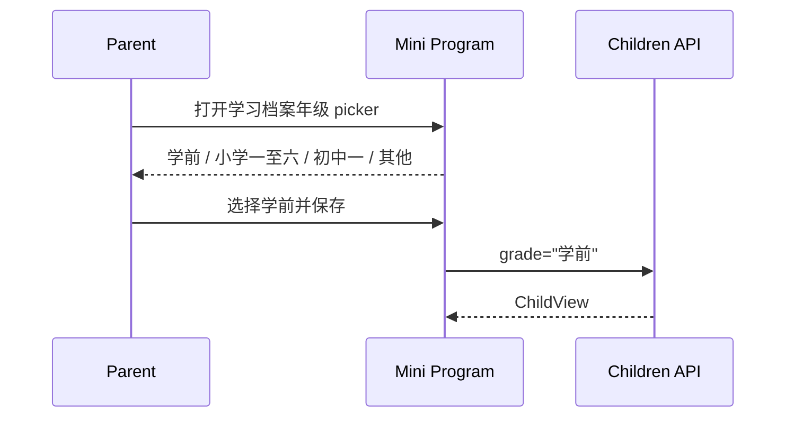
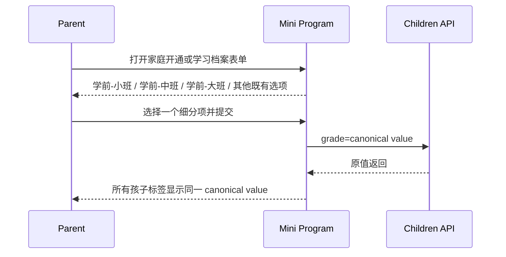
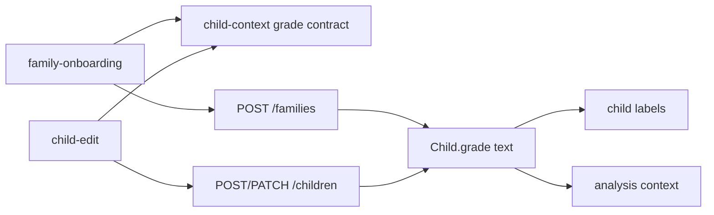
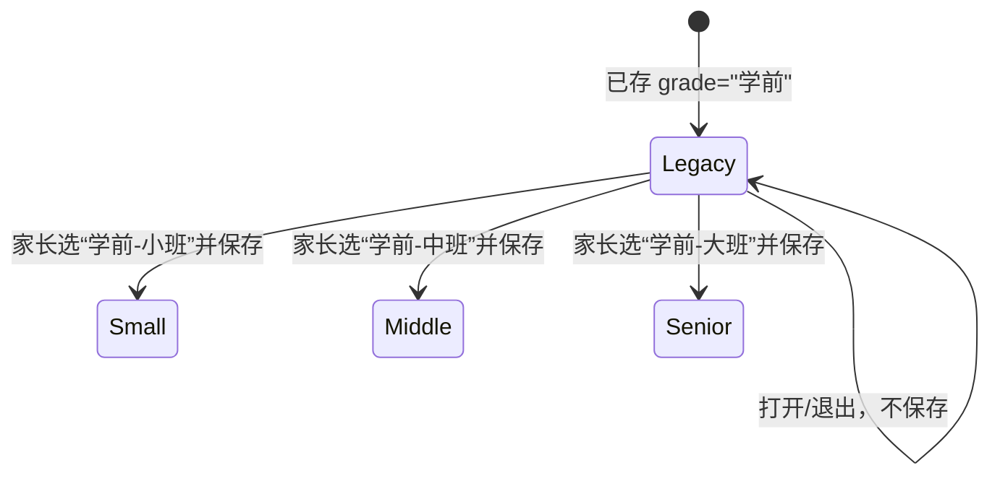
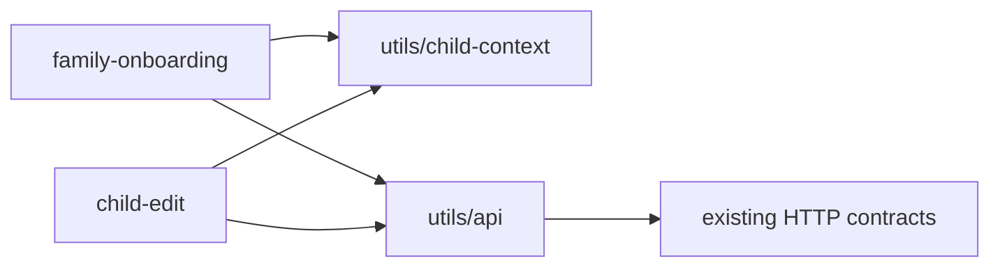
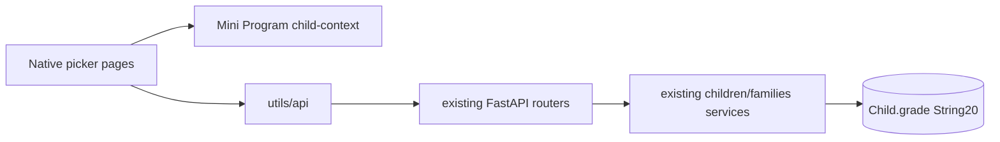

# FEAT-005 — 学前班级细分

- Status: `DONE`（学前小班/中班/大班选项与兼容展示已实现并合并）
- Completed: 2026-09-12；未运行的原生 picker/视口验收不视为已通过。
- Risk: `R1`
- Spec owner: 产品负责人（用户 王宇）
- Implementer: `TBD after approval`
- Reviewer: `TBD independent read-only review`
- Verifier: `TBD`
- Created: 2026-09-06
- Last updated: 2026-09-06
- Target release: 下一次包含小程序的发布；具体版本 `TBD`
- Spec revision: `SPEC-20260906-PRESCHOOL-01`
- User confirmation: `APPROVED — 用户于 2026-09-06 明确回复“批准 SPEC-20260906-PRESCHOOL-01、DREV-20260906-PRESCHOOL-01 及 scoped Figma waiver，开始实现”`
- Additional R2/R3 approval: `N/A — R1、无 Schema/权限/跨模块边界变化`
- Affected Feature IDs: `FEAT-005（现有 Feature 的档案字段扩展，不新建重复 Feature ID）`
- Feature current-state documents: `docs/domain/features/FEAT-005-multi-child-profiles.md`
- Feature baseline revision: `FEAT-STATE-20260906-01-MULTI-CHILD`
- Feature merge owner: 实施 Agent；完成前基于最新 revision 语义合并

## Frontend Design Impact and Figma Approval

- Frontend impact: `yes — 原生年级 picker 的可见选项与历史值展示变化`
- Frontend impact reason: 将单一“学前”拆为“学前-小班 / 学前-中班 / 学前-大班”，同时安全展示历史未细分值；不改变布局、导航、控件类型或视觉 token
- Frontend engineering impact: `yes — 两个表单必须共用同一选项合同，且不得把未知/历史值静默回落为另一年级`
- Frontend engineering impact reason: 影响表单状态初始化、picker 值映射、请求 payload 与兼容测试
- Affected UI IDs: `UI-015-child-profile`；`UI-010-family-access` 仅在 `FEAT-006` 尚未先移除 onboarding 孩子字段时受影响
- UI current-state documents: `docs/design/frontend/ui/UI-015-child-profile.md`；`UI-010-family-access.md`
- Frontend baseline revision: `FDB-20260906-02（APPROVED）`
- Frontend engineering constraint revision: `FEC-20260906-04（APPROVED）`
- Affected frontend quality dimensions: `component/state/form/responsive/a11y/i18n/browser/security/privacy`
- Frontend quality budgets/requirements: 原生 picker；正文 ≥14px、触控目标 ≥44px；320×568 / 390×844 / 430×932；恢复性失败保留表单；普通文本绑定；无新增依赖、图片、日志或本地存储
- Frontend quality verification plan: `npm test`、`npm run lint:miniapp`、`uv run python tools/validate_miniprogram.py`；三视口 picker 当前值/展开选项人工证据；iOS/Android 真机 smoke；历史“学前”档案编辑与不保存退出测试
- Approved frontend engineering deviations: `none`
- Current Design Revision(s): `DREV-20260906-CHILD-01（UI-015，FIGMA_WAIVED）`、`DREV-20260906-PKDS-01（onboarding 基线）`
- Figma project/file URL: https://www.figma.com/design/FAyfmjNrA3btWztwyxI6Zj
- Figma node URL(s): `N/A — 当前无可用 node-specific 原型；实施需批准下述 waiver`
- Proposed Design Revision: `DREV-20260906-PRESCHOOL-01`
- Required viewport/state exports: `320×568 / 390×844 / 430×932；新建默认、三个学前选项、历史“学前（未细分）”、长文本不裁切`
- Prototype status: `AWAITING_APPROVAL_WITH_WAIVER`
- Approved Task Spec revision: `SPEC-20260906-PRESCHOOL-01`
- Approved Design Revision: `DREV-20260906-PRESCHOOL-01`
- Design approval evidence: `产品负责人（用户 王宇）/ 2026-09-06 / 本任务明确批准消息`
- Snapshot manifest path: `docs/design/frontend/snapshots/UI-015/DREV-20260906-PRESCHOOL-01/APPROVAL.md（实施验证时创建）`
- Permitted implementation deviations: `none`
- UI current-state merge owner: 实施 Agent
- UI current-state merge evidence: `pending — UI-015 与 UI-010 Change Reference`
- Frontend visual/a11y/resolution verification: `pending — 原生 picker 无法由静态 HTML 截图代替`
- Frontend engineering verification evidence: `pending — 见 TP-001..TP-007`
- Figma waiver: `APPROVED 2026-09-06 — 仅覆盖现有两个原生 picker 的选项文案，不覆盖布局、交互模型、组件或新增页面；原因是当前没有可用 node-specific Figma 原型；风险是长标签或原生 picker 展开态可能未被设计稿提前发现；Owner 王宇；在任何公开生产发布前到期；补救为补齐 Figma 节点、approval snapshot 和三视口原生证据`

## 0. Executive summary

### Problem

当前学习档案只提供一个笼统的“学前”选项，不能区分幼儿园小班、中班和大班；家庭开通表单甚至没有学前选项，且其小学年级文案与档案编辑页不一致。

### Intended outcome

家长在创建家庭首个孩子或新建/编辑学习档案时，可以明确选择“学前-小班”“学前-中班”“学前-大班”。已有值为“学前”的档案继续准确显示为未细分历史值，不被系统猜测或静默改写。

### Why now

年龄/学段会作为 AI 整理上下文与档案识别标签；笼统值降低上下文准确度，而错误自动迁移会制造更严重的事实错误。

## 1. Facts, decisions, assumptions, questions

### Confirmed facts

| ID | Fact | Evidence |
|---|---|---|
| `F-001` | `grade` 是可空、最长 20 字符的文本合同，不是数据库枚举 | `children/schemas.py`、`persistence/models.py` |
| `F-002` | `child-context.js` 当前包含一个“学前”，并被 `pages/child-edit` 复用 | `apps/miniprogram/utils/child-context.js`、`pages/child-edit/index.js` |
| `F-003` | family onboarding 维护另一套 `GRADES`，只有一年级至六年级和其他 | `apps/miniprogram/pages/family-onboarding/index.js` |
| `F-004` | 未识别的现有 grade 在 child-edit 中会回落到“暂不填写” | `gradeIndex()` 当前实现 |
| `F-005` | grade 会进入分析上下文，但 AI 仍只生成可编辑建议 | `BHV-014`、`agent_processing` 现有合同 |
| `F-006` | 本 Spec 起草时，`SPEC-20260906-DATA-CLEANUP-01` 计划把创建家庭与建孩子解耦，并从 onboarding 删除孩子/年级字段；该变更后来已完成 | `specs/completed/FEAT-006-DATA-CLEANUP-AND-FAMILY-RESET.md` |

### Decisions

| ID | Decision | Owner/date | Rationale |
|---|---|---|---|
| `D-001` | 归属现有 `FEAT-005`，不创建新的长期 Feature ID | 待用户批准 / 2026-09-06 | 数据、表单和生命周期 Owner 都是孩子档案；独立 ID 会造成重复事实源 |
| `D-002` | canonical 新值为 `学前-小班`、`学前-中班`、`学前-大班` | 待用户批准 / 2026-09-06 | 完整匹配用户要求，长度满足现有合同 |
| `D-003` | 新建流程不再提供笼统“学前” | 待用户批准 / 2026-09-06 | 新数据应从源头细分 |
| `D-004` | 既有精确值“学前”不做批量迁移；编辑时临时显示“学前（未细分）”，保存前只有家长主动改选才更新 | 待用户批准 / 2026-09-06 | 无法从“学前”可靠推断小/中/大班 |
| `D-005` | 两个创建/编辑入口共用 `child-context.js` 的年级选项与兼容映射 | 待用户批准 / 2026-09-06 | 消除两套列表漂移，Owner 与现有 Mini Program child context 一致 |
| `D-006` | 后端继续接受可空、最长 20 字符文本，不新增枚举或 Schema 迁移 | 待用户批准 / 2026-09-06 | 保持旧客户端和已有自定义/历史值兼容 |
| `D-007` | 实现前以最新工作树重算 onboarding 范围：若 FEAT-006 已移除孩子字段，本 Spec 不重加该字段，只修改 child-edit | 待用户批准 / 2026-09-06 | 避免两个 active Specs 互相覆盖或复活被批准删除的流程 |

### Assumptions

| ID | Assumption | Risk if wrong | Validation | Owner/due |
|---|---|---|---|---|
| `A-001` | 用户说的“年龄：学前”指学习档案与开通表单中的年级/学段字段 | 可能遗漏另一处真实入口 | 用户审批本 Spec；实现前再全仓搜索 | 产品负责人 / approval |
| `A-002` | 分隔符按用户原文使用半角连字符 `-` | 产品文案不一致 | 用户审批 `DREV-20260906-PRESCHOOL-01` | 产品负责人 / approval |

### Open questions

| ID | Question | Why it matters | Recommended answer | Owner | Blocking? |
|---|---|---|---|---|---|
| `Q-001` | 历史“学前”是否自动映射到某个班 | 自动映射会改写事实 | 已批准：不自动映射，按 D-004 兼容 | 产品负责人 | no — 2026-09-06 resolved |
| `Q-002` | 是否批准本次 text-only Figma waiver | 无 node-specific URL 时前端门禁阻止实现 | 已批准本 Spec 中的窄范围、到期明确 waiver | 产品负责人 | no — 2026-09-06 resolved |

## 2. Current behavior and evidence

### Current flow

family onboarding 使用另一套列表，不包含学前且小学值缺少“小学”前缀。

### Current evidence

- Code: `apps/miniprogram/utils/child-context.js`、`pages/child-edit/index.js`、`pages/family-onboarding/index.js`
- Tests: `tests/frontend/child-profiles.test.js`；onboarding 尚无年级选项合同测试
- Behavior IDs: `BHV-001`、`BHV-014`、`BHV-024`
- API/event/schema: `ChildCreate.grade` / `ChildUpdate.grade` / `ChildView.grade` 为 `string|null, maxLength=20`
- Runtime evidence: `NOT_RUN — discovery 只读检查，无小程序运行时`
- Related ADRs/incidents: `N/A — 无长期架构决策或事故`

## 3. Target behavior

### Primary sequence diagram

### Behavior matrix

| Case | Preconditions/actor | Input/action | Expected result | State/side effects | Forbidden result |
|---|---|---|---|---|---|
| 新建学前档案 | 有写权限 | 选择小/中/大班并提交 | API 收到对应 canonical value | 仅按现有事务创建/更新 Child | 仍写入笼统“学前” |
| 历史未细分值 | Child.grade=`学前` | 打开编辑页 | 显示“学前（未细分）”且未自动变更 | 零写入 | 回落为“暂不填写”或冒充小班 |
| 历史值主动细分 | 同上 | 家长选择小/中/大班并保存 | 更新为所选 canonical value | 一次现有 PATCH | 自动替家长选择 |
| 未知旧值 | grade 不在列表 | 打开编辑页 | 原值作为兼容选项可见，保存前不丢失 | 零写入 | 静默置空/改为首项 |
| 重复提交/失败 | 现有保存流程 | 重复点击或网络失败 | 沿用 pending guard；失败保留选择 | 无额外副作用 | 重复写入或丢表单 |

## 4. Scope

### In scope

- 用三个学前班级替代新建选项中的单一“学前”。
- family onboarding 与 child-edit 使用同一 canonical 列表。
- 上一条仅适用于 family onboarding 孩子字段仍存在的实现顺序；若 `FEAT-006` 先落地，则该入口为 `N/A`。
- 安全显示并保留历史“学前”及其他未知但合法的 grade 文本。
- 补齐选项、payload、历史兼容与入口一致性测试。

### Out of scope / non-goals

- 不新增出生日期、年龄数字、入学年份或班级名称字段。
- 不根据当前日期自动升班，不预测孩子应学内容。
- 不批量迁移历史“学前”，不修改已确认学习记录或 Review 日期。
- 不收紧后端为枚举，不改变 API 路径、权限或数据库 Schema。
- 不重设计表单布局、视觉 token 或导航。

### Invariants / must not change

- AI 输出仍只是可编辑建议；家长确认才形成正式记录。
- Review 日期仍由确定性策略生成。
- 所有请求继续由服务端做 family scope 校验。
- `grade=null` 与“暂不填写”保持可用；保存失败保留输入。
- 旧客户端传 `学前` 或其他 ≤20 字符值继续兼容。

### Affected users, modules, and consumers

| Area/consumer | Current dependency | Change | Compatibility action |
|---|---|---|---|
| family onboarding | 本地 `GRADES` | 若入口仍存在则改用共享 canonical 列表；若 FEAT-006 已落地则不重加 | 实现前按最新 Feature/Spec baseline 决定 |
| child-edit | `childContext.GRADE_OPTIONS` | 展开学前三项并支持 legacy option | 不认识的已存值动态注入，仅对当前编辑会话可见 |
| child switcher/AI context | `Child.grade` 原样展示/传递 | 自动获得细分文本 | 不改变消费者接口 |
| Children API | 任意合法短文本 | 无合同变化 | 继续接受旧值 |

### Feature current-state impact

- Existing Feature sections affected: Current behavior、Current behavior matrix、Current contracts、Frontend UI mapping、Quality、Limitations、Change References
- New Feature document target: `N/A — 归属现有 FEAT-005`
- Final facts to merge after verification: canonical 学前值、历史兼容、共享列表、验证证据
- Superseded Feature statements to replace/remove: UI-015 “年级”未定义选项的笼统描述；“无扩展字段”仍保留
- Related Feature IDs: `FEAT-001（AI 上下文消费者，不改变其行为）`

### Link/call graph

## 5. Domain and data design

### Terms

| Term | Meaning | Do not confuse with |
|---|---|---|
| 学前班级 | 幼儿园小班/中班/大班之一 | 数字年龄、学校行政班 |
| legacy 未细分值 | 历史精确存储值 `学前` | `null` 或家长已选择的小班 |
| canonical value | API/数据库保存的三个新字符串之一 | 仅用于 UI 的兼容标签 |

### Entities/aggregates

| Entity | Owner | Identity | Lifecycle | Sensitive fields | Invariants |
|---|---|---|---|---|---|
| Child | children | child id + family scope | 现有 active/archived | 名字与年级属于孩子资料 | grade 可空、≤20；本次不改生命周期 |

### State transitions

字段值无独立生命周期；只存在显式编辑转换：

### Schema/data changes

- Schema: `none`
- Backfill: `none`
- Existing data compatibility: 原值保留；客户端动态呈现 legacy/unknown option
- Read/write deployment order: 后端无变化；仅发布新小程序即可
- Retention/deletion: `none`
- Restore/rollback: 回滚小程序代码后，新值仍是合法字符串并可由 API 返回；旧 UI 可能显示为“暂不填写”，因此回滚仅作短时应急并需尽快前滚

## 6. Interfaces and errors

### API/event/job contract

| ID | Caller/producer | Input | Output | Auth | Idempotency | Errors | Compatibility |
|---|---|---|---|---|---|---|---|
| `API-GRADE-001` | Mini Program | 现有 `grade: string|null` | 原样进入 `ChildView.grade` | 现有 family/member 规则 | 沿用现有 create/update | 现有 403/404/409/422 | 路径与 schema 不变；旧值继续接受 |

- absent/null/empty: 表单“暂不填写”发送 `null`；本次不新增 empty-string 语义。
- ordering: picker 顺序为暂不填写（仅 child-edit）→ 学前小/中/大班 → 小学 → 初中 → 其他。
- validation: 继续最大 20 字符；新值均满足。
- versioning: 不升 API 版本；这是客户端推荐值扩展。

## 7. Authorization, security, and privacy

- Authenticated actor/resource check: 沿用现有 verified family 与 child scope；无权限变化。
- Input trust boundary: 服务端继续校验长度，不信任客户端选项列表。
- Sensitive data: 不新增字段、日志、本地存储或 analytics。
- Audit events: `N/A — 普通资料更新沿用现有行为，不新增事件合同。`
- Abuse/rate controls: `N/A — 请求数量和入口不变。`

| Threat/failure | Entry | Impact | Mitigation | Evidence |
|---|---|---|---|---|
| 客户端伪造超长 grade | API | 脏数据 | Pydantic max_length=20 | contract regression |
| 历史值被静默覆盖 | child-edit load/save | 孩子资料事实错误 | 动态兼容选项 + 零写入打开退出测试 | frontend state test |
| grade 出现在日志 | client/API | 儿童资料泄露 | 不新增日志/analytics；人工检查改动 | diff/privacy review |

## 8. Architecture and implementation boundaries

### Chosen approach

在现有 Mini Program child context 中维护单一 canonical picker 合同和“为已存值构造兼容选项”的纯函数；两个表单复用它。后端保留开放文本合同。

### Modules and dependency direction

| Module | Responsibility in this change | Public contract | Must not own/do |
|---|---|---|---|
| `utils/child-context.js` | canonical options、legacy/unknown 显示映射 | 导出的选项/构造函数 | 权限、数据库迁移、自动升班 |
| `family-onboarding` | 选择并提交首个孩子 grade | 页面 form state | 复制第二套列表 |
| `child-edit` | 创建/编辑并保留历史值 | 页面 form state | 猜测 legacy 值所属班级 |
| `children` backend | 校验并保存文本 | 现有 schemas/service | 为本次引入枚举或 UI 文案 |

### Purpose/domain and file decomposition

- Module/domain owners: grade 是 Child 档案属性；推荐选项是小程序展示合同。
- File responsibilities: 纯选项/映射留在 `child-context.js`；页面仅选择、渲染、提交。
- Kept together: 选项与兼容映射共享同一语义和变化轴。
- God-file split trigger: 若未来加入按地区/学制配置，再拆为独立 `grade-options.js`；本次消费者只有两个，不提前扩展。

### Dependency DAG

- Circular dependency enforcement: `tools/check_architecture.py` + CommonJS import review
- Forbidden edges: shared context importing Page/app instance or backend policy；后端 importing frontend values
- Legacy cycle removal: `N/A — 当前无循环；删除 onboarding 本地 GRADES 常量`

### Shared abstractions

| Concept | Owner | Consumers | Shared semantics/change axis | Contract | Why extract/not extract | Contract tests |
|---|---|---|---|---|---|---|
| grade picker contract | Mini Program child context | onboarding、child-edit | 同一 Child.grade 推荐值与兼容显示 | canonical values + legacy-preserving option builder | 已有稳定共享文件，避免第二套列表 | frontend tests |

### Architecture diagram

### Trade-offs and alternatives rejected

| Alternative | Benefit | Why rejected | Revisit condition |
|---|---|---|---|
| 把 `学前` 全量迁移为 `学前-小班` | 数据看似统一 | 无证据，会伪造孩子资料 | 拥有可靠外部班级来源与家长授权 |
| 后端改为 enum | 强约束 | 破坏旧客户端/自定义历史值，需要迁移且收益不足 | grade 参与服务端确定性政策时 |
| 两个页面各改自己的数组 | 改动最少 | 已经发生漂移，会再次不一致 | 不重审 |
| 新增年龄数字字段 | 更精确 | 超出用户请求且引入生日/时间变化语义 | 独立 Feature Spec |

### Extensibility policy

| Variation axis | Status | Mechanism/contract | Extension requirements | Reopen/revisit condition |
|---|---|---|---|---|
| 固定简体中文学段列表 | `closed` | 共享静态 canonical values | 修改需新 Spec、兼容测试 | 国内学制变化 |
| 历史/未知文本读取 | `open` | 本地动态兼容选项，只读后原样保存 | ≤20、普通文本绑定、无日志、contract test、移除前先迁移 | 后端枚举化 |
| 自动按年龄/日期升班 | `deferred` | none | 需数据来源、时区、家长确认、审计与测试 | 用户提出独立需求 |

### Architecture confirmation

- Recommended technical design: 前端共享推荐值 + 历史值保真；后端合同不变。
- Alternatives and trade-offs: 见上表。
- Long-term maintainability rationale: 单一 UI 选项 Owner，避免跨端强枚举和不可逆错误迁移。
- Architecture revision: `ARCH-PRESCHOOL-20260906-01（无模块边界变化）`
- User/architecture-owner confirmation: `APPROVED with SPEC-20260906-PRESCHOOL-01 on 2026-09-06`

### ADR required?

- No
- ADR link: `N/A`
- Reason: 不改变模块、数据模型、依赖方向或长期平台策略。

## 9. Expected file changes, replacement, and deletion plan

| File/path | Action | Expected change | Replacement/authority | Why | Removal timing/evidence |
|---|---|---|---|---|---|
| `apps/miniprogram/utils/child-context.js` | modify | 三个 canonical 学前值 + legacy/unknown 映射 | picker 单一权威 | 共享合同 | 同一 change |
| `apps/miniprogram/pages/child-edit/index.js` | modify | 使用兼容 options，提交真实值 | child-context | 防静默丢值 | 同一 change |
| `apps/miniprogram/pages/family-onboarding/index.js` | modify or retain | 若孩子字段仍存在则删除本地 `GRADES` 并复用共享列表；若 FEAT-006 已移除则保持删除后的流程 | 最新批准的 FEAT-006/child-context | 避免并行 Spec 冲突 | 实现前重读 baseline |
| `tests/frontend/child-profiles.test.js` | modify | 细分值、legacy/unknown、payload 测试 | automated evidence | AC-001/002/003 | completion |
| `tests/frontend/family-onboarding.test.js` | modify | 共享列表与 payload 测试 | automated evidence | AC-004 | completion |
| `docs/domain/features/FEAT-005-multi-child-profiles.md` | modify after verification | 语义合并最终事实/证据 | Feature current state | 关闭门禁 | completion |
| `docs/design/frontend/ui/UI-015-child-profile.md` | modify after verification | 更新 picker 合同/证据 | UI current state | 关闭门禁 | completion |
| `docs/design/frontend/ui/UI-010-family-access.md` | modify after verification | 更新 onboarding picker 合同/证据 | UI current state | 关闭门禁 | completion |
| `docs/domain/BEHAVIOR-CATALOG.md` | modify after verification | 扩展 BHV-024 或新增精确行为 | Behavior source | 可检索事实 | completion |

### Temporary coexistence

- Authoritative path: `child-context.js` canonical list
- Legacy consumers: 已发布旧小程序仍可能写入 `学前`
- Traffic/data migration: 无；API 双向兼容
- Metrics: 无新增 analytics；发布 smoke 检查 payload
- Removal condition: 公开生产前确认无代码路径新写入笼统值；历史数据仍可长期读取
- Owner and deadline: 产品负责人 / 公开生产发布前
- Guard/test preventing new legacy usage: source assertion + payload tests

## 10. Non-functional requirements

| ID | Requirement | Target/budget | Measurement | Failure response |
|---|---|---|---|---|
| `NFR-001` | 兼容可靠性 | 打开历史/未知值零静默变更 | frontend state test | 阻止发布 |
| `NFR-002` | 资源 | 无新增依赖/媒体；包体不得增长超过源码小幅文本差异 | validator + diff | 回退多余实现 |
| `NFR-003` | 可用性 | 三视口标签不裁切，原生 picker 可选择 | DevTools/真机证据 | 修正后重验 |
| `NFR-004` | 隐私 | 不新增 grade 日志/analytics/storage | diff + manual inspection | 阻止发布 |

## 11. Acceptance criteria

### AC-001 — 三个学前班级可选且原值提交

- Given: 家长打开 family onboarding 或 child-edit。
- When: 选择任一 `学前-小班 / 学前-中班 / 学前-大班` 并提交。
- Then: 请求的 `grade` 与所选 canonical value 完全一致。
- And: 孩子切换标签和重新编辑显示同一值。
- And not: 发送笼统“学前”或错误班级。
- Evidence: frontend page tests + API integration regression。

### AC-002 — 历史“学前”不被猜测

- Given: 已有 Child.grade 精确等于 `学前`。
- When: 家长打开编辑页并退出，或只修改其他字段。
- Then: 页面显示“学前（未细分）”，payload 保留底层值 `学前`，除非家长主动改选。
- State must remain: 数据库 grade 不发生隐式转换。
- Evidence: frontend state/payload test。

### AC-003 — 未知合法值不丢失

- Given: API 返回列表外但 ≤20 字符的 grade。
- When: 打开并保存未改 grade 的档案。
- Then: 原值仍可见且原样提交。
- State must remain: 不变为 `null` 或 picker 第一项。
- Evidence: frontend state/payload test。

### AC-004 — 两入口同一合同

- Given: onboarding 与 child-edit 都在创建 Child。
- When: 检查其 grade options。
- Then: canonical 顺序和保存值一致。
- And not: 页面内残留第二套 `GRADES` 常量。
- Evidence: source/behavior tests。

## 12. Verification plan

| Test point | Acceptance/risk | Test level | Case/command | Fixture/environment | Expected evidence | Owner |
|---|---|---|---|---|---|---|
| `TP-001` | AC-001/004 | frontend unit/state | `npm test` | Node test harness | 三个值、两个入口 payload 通过；pre-change 必失败 | implementer |
| `TP-002` | AC-002 | frontend state | legacy `学前` load + unchanged save | mocked API/page | 展示兼容标签，payload=`学前` | implementer |
| `TP-003` | AC-003 | frontend state | unknown grade load + unchanged save | mocked API/page | 原值保真 | implementer |
| `TP-004` | API regression | contract/integration | `uv run pytest tests/unit tests/integration tests/contract -q` | local SQLite | 既有 schema/AI context/permissions 全绿 | implementer |
| `TP-005` | static/architecture | lint/validator | `npm run lint:miniapp && uv run python tools/check_architecture.py && uv run python tools/validate_miniprogram.py` | local | 无重复列表违规、架构/页面有效 | implementer |
| `TP-006` | formatting/types | repo gates | `uv run ruff check . && uv run ruff format --check . && uv run mypy apps/api/src` | local | 全绿 | implementer |
| `TP-007` | NFR-003/004 | manual native/privacy | DevTools 三视口 + iOS/Android smoke + bundle/log/storage inspection | 微信环境 | 保留截图/说明；无泄露 | verifier |

- Pre-change failure: `TP-001` 的三个学前值与 onboarding 一致性、`TP-002/003` 兼容测试。
- Regression: 全量 `npm test` 与 API tests。
- Forbidden side effect: `TP-002/003` 证明零静默转换；无写入打开退出需页面 harness 断言。
- Real wiring: API integration + DevTools/真机；不能只依赖 mock。
- Not automatable here: 原生 picker 展开态、三视口和真机行为；没有微信开发者工具时必须记为 `NOT_RUN`，不能以静态 validator 代替。

## 13. Rollout, migration, rollback

### Rollout

1. 先执行自动化与原生矩阵证据。
2. 后端无需部署；按 `docs/deploy/` 上传新小程序并依次经过 uploaded → experience → review → production 人工门禁。
3. 公开生产前补齐/终止 Figma waiver 所要求的节点、snapshot 与三视口证据。

### Compatibility window

- Mixed versions: 新旧小程序都可调用现有 API；新值对后端合法。
- Old clients: 可继续写 `学前`；新客户端必须保真读取。
- Feature flags: `none`。
- Data backfill: `none`。

### Observability and release gates

| Signal | Baseline | Success threshold | Abort threshold | Observation window |
|---|---|---|---|---|
| create/update grade payload | 旧 UI 单一学前 | 体验版三个值各 smoke 成功 | 任一值丢失/变值 | 体验版验收 |
| legacy edit | 未知值会回落 | 打开/保存保真 | 任何静默置空/误映射 | 自动化 + 体验版 |
| privacy | 无 grade analytics | diff/log/storage 无新增 | 出现儿童资料日志/analytics | review + smoke |

### Rollback / restore

- Reversible code: 恢复旧小程序选项列表。
- Reversible data: 无自动迁移，无需恢复。
- Irreversible steps: 家长主动保存的新细分值是有效事实，不应回滚。
- Restore procedure: 重新发布修复版客户端；不要批量改写 grade。
- Owner: 发布负责人。

## 14. Implementation plan

### Step 1 — 单一年级合同与兼容映射

- Intent: 让共享模块同时覆盖 canonical 新值和历史值保真。
- Files/boundaries: `child-context.js` + frontend tests。
- Modify: options/exported pure helper。
- Delete/replace: 删除新建路径可选择的单一“学前”。
- Tests: TP-001/002/003。
- Validation: `npm test`。
- Stop/rollback condition: 无法在不改变存储值的情况下表示 legacy 项。

### Step 2 — 两个表单接入并完成全量验证

- Intent: child-edit 正确提交；仅当 onboarding 孩子字段仍存在时让其使用同一合同。
- Files/boundaries: 两页面、测试、最终 current-state docs。
- Modify: form state/index/payload。
- Delete/replace: onboarding 本地 `GRADES`，或在 FEAT-006 已删除该表单时不触碰/不复活。
- Tests: TP-001..TP-007。
- Validation: 全量 repo gates + native matrix。
- Stop/rollback condition: 出现 API 兼容、表单输入丢失或视觉裁切。

## 15. Review plan

- Required reviewers: 独立只读代码 Reviewer；产品负责人验收文案/顺序。
- Domain questions: 是否仅为展示建议值；是否误引入年龄推断。
- Security/data questions: 历史值是否保真；是否新增儿童资料日志。
- Compatibility questions: 旧客户端、新客户端、legacy/unknown grade。
- Test validity questions: 测试是否真实驱动两个 Page 并检查 payload，而非只断言常量。
- Independent reviewer session/person: 实现完成后单独执行，报告每个修改文件的必要性、放置位置与冗余。

## 16. Implementation and verification record

### Changed behavior

- `PENDING IMPLEMENTATION`

### Deleted/replaced behavior

- `PENDING IMPLEMENTATION`

### Files changed

- 当前仅新增本 Spec；生产文件未修改。

### Evidence

| Command/case | Environment/version | Result | Evidence | Notes |
|---|---|---|---|---|
| discovery `rg`/source inspection | local workspace / 2026-09-06 | pass | 本 Spec F-001..F-005 | 只读，不证明运行时 |
| implementation checks | N/A | not run | pending approval | 未获批准，不运行实现验收 |

### Review

- Review report: `pending after implementation`
- Blocker/Major status: `N/A before review`
- Re-review: `pending`

### Deviations from approved Spec

- `N/A — Spec 尚未批准。`

### Residual risks and follow-up

| Risk/debt | Impact | Owner | Due/removal condition | Tracking |
|---|---|---|---|---|
| Figma node 缺失 | 原生 picker 长文案设计证据不足 | 王宇 | 公开生产发布前 | 本 Spec waiver |
| 旧客户端仍可写 `学前` | legacy 值会继续出现 | 产品负责人 | 决定停止支持旧客户端时重审 | compatibility window |

## 17. Completion gate

- [ ] 用户明确批准 `SPEC-20260906-PRESCHOOL-01`。
- [ ] 用户明确批准 `DREV-20260906-PRESCHOOL-01` 与 scoped Figma waiver。
- [ ] No blocking question remains.
- [ ] Scope and non-goals were preserved.
- [x] Link/call graph、sequence、state machine、architecture diagram、trade-offs 已完整。
- [ ] Expected changed/deleted files were reviewed.
- [ ] AC-001..AC-004 pass；TP-001..TP-007 均执行或明确记录 NOT_RUN 风险。
- [ ] Existing behavior regression evidence exists.
- [ ] Independent Review 无 Blocker/Major。
- [ ] FEAT-005、UI-015、UI-010 与 Behavior Catalog 已语义合并最终事实。
- [ ] Release 遵循 `docs/deploy/`，公开生产前 waiver 已补救并终止。
- [ ] Final diff contains no unrelated changes.

Final status: `READY_FOR_REVIEW — implementation blocked pending explicit approval`

## 18. Revision history

| Date | Change | Reason | Approved by |
|---|---|---|---|
| 2026-09-06 | Initial `SPEC-20260906-PRESCHOOL-01` | 将学前细分为小/中/大班并保护历史值 | N/A |
