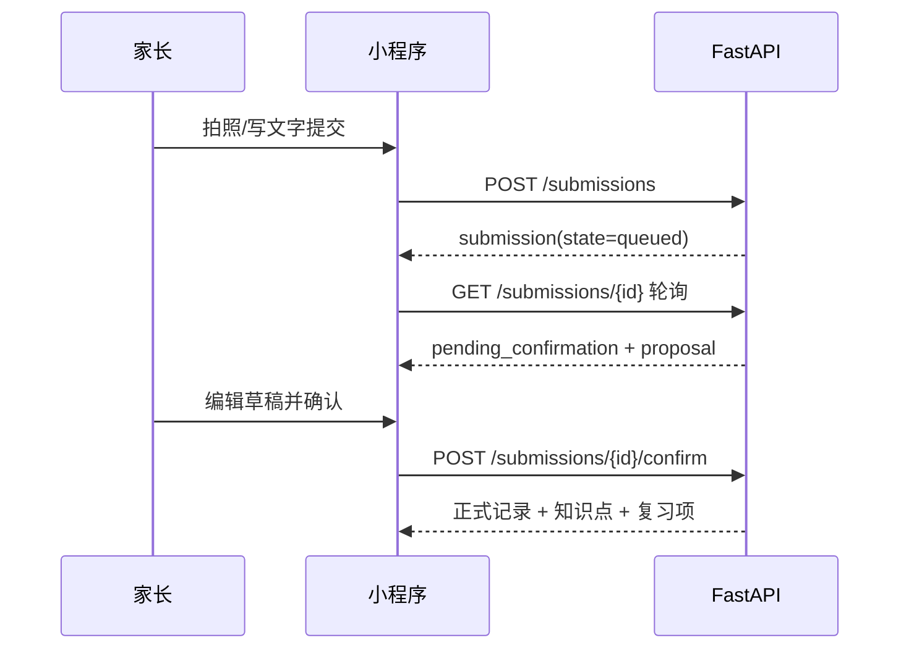
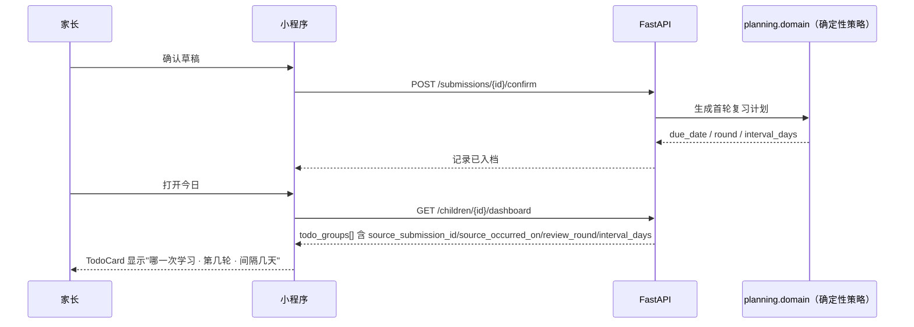
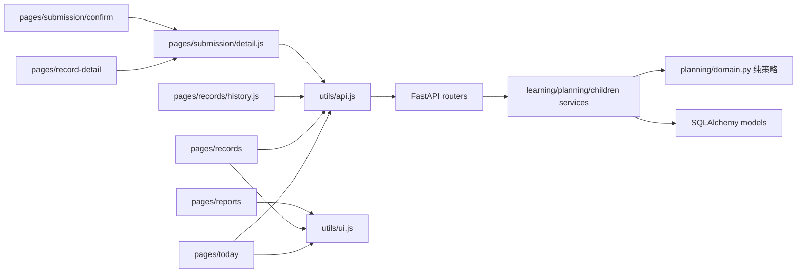
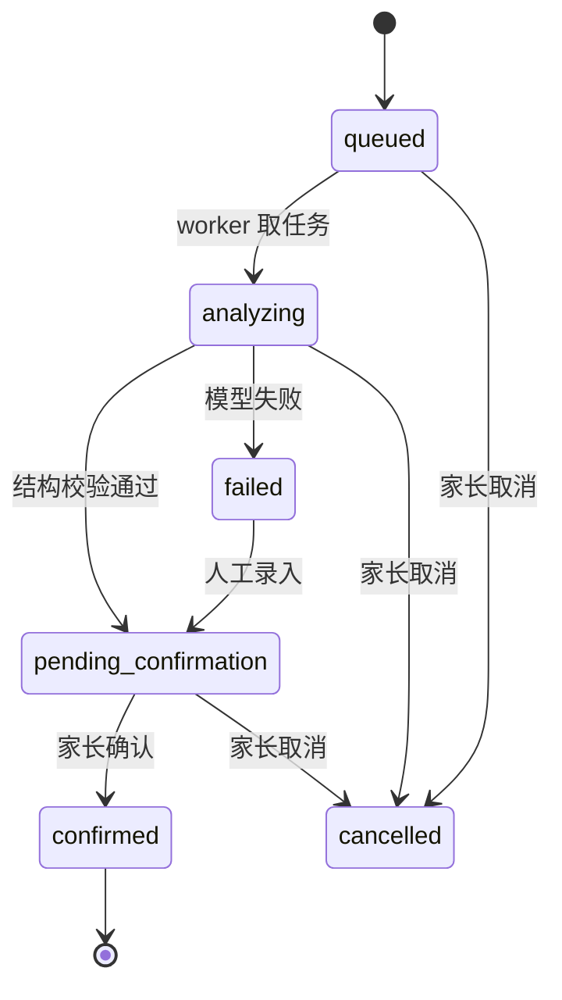
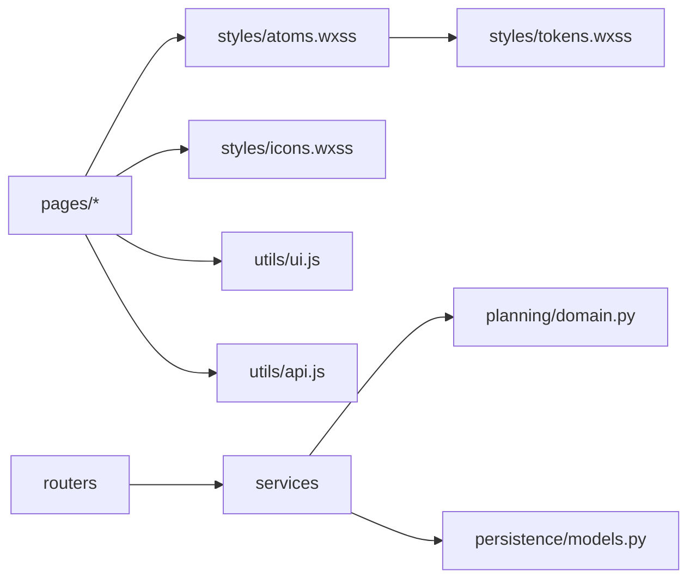

# SPEC-20260906-PKDS-01 — PKDS-1.0 设计系统落地与字段级功能补齐

- Status: DONE（设计系统与字段级能力已实现并合并；视觉基线后续由 PKDS-2.0 演进）
- Completed: 2026-09-12；未运行的原生视口/真机发布验收不视为已通过。
- Risk: R2
- Spec owner: 产品负责人（用户）
- Implementer: Aime
- Reviewer: 产品负责人（用户）
- Verifier: Aime（自动化）+ 产品负责人（三视口原生验收）
- Created: 2026-09-06
- Last updated: 2026-09-06
- Target release: 体验版（未部署）
- Spec revision: `SPEC-20260906-PKDS-01`
- User confirmation: 用户 2026-09-05/06 指令「按照你最新梳理的 ui 设计和不完整的代码进行修复，最终 ui=你现在的设计，并功能是完整的」
- Additional R2/R3 approval: 同上（用户即架构 Owner）
- Affected Feature IDs: `FEAT-001`
- Feature current-state documents: `docs/domain/features/FEAT-001-push-kids-mvp.md`
- Feature baseline revision: `SPEC-20260831-08` + `SPEC-HISTORY-20260905-01`
- Feature merge owner: Aime

## Frontend Design Impact and Figma Approval

- Frontend impact: yes — 全部 12 个页面的视觉与交互合同被替换为 PKDS-1.0
- Frontend impact reason: 统一 token/原子层、线性图标体系、半屏与状态四件套、新增只读记录详情页
- Frontend engineering impact: yes
- Frontend engineering impact reason: 新增 `apps/miniprogram/styles/` 三层样式与 `utils/ui.js` 展示层、新增图标生成脚本、页面 JSON 增加下拉刷新
- Affected UI IDs: `UI-001`、`UI-009`、`UI-010`
- UI current-state documents: `docs/design/frontend/ui/UI-001-parent-miniapp.md`、`UI-009-family-members.md`、`UI-010-family-access.md`
- Frontend baseline revision: `FDB-20260906-02`（本轮更新）
- Frontend engineering constraint revision: `FEC-20260906-04`（本轮更新）
- Affected frontend quality dimensions: component / state / form / responsive / a11y / performance / privacy / data-viz / observability
- Frontend quality budgets/requirements: FEC 触控 ≥44px、正文 ≥14px、颜色非唯一状态载体、根容器禁止横向滚动、100 天报表是唯一横向手势面
- Frontend quality verification plan: `npm test`、`npx eslint`、`tools/validate_miniprogram.py`、三视口原生几何证据（NOT_RUN）
- Approved frontend engineering deviations: none

- Current Design Revision(s): `DREV-20260830-03`、`DREV-20260905-UX-04`
- Figma project/file URL: https://www.figma.com/design/FAyfmjNrA3btWztwyxI6Zj?node-id=0-1
- Figma node URL(s): N/A — 沿用 FEAT-001 的 Figma Starter 限额 waiver
- Proposed Design Revision: `DREV-20260906-PKDS-01`
- Required viewport/state exports: 320×568 / 390×844 / 430×932 × loading/empty/content/error
- Prototype status: APPROVED（`docs/design/frontend/prototypes/DREV-20260906-PKDS-01/`）
- Approved Task Spec revision: `SPEC-20260906-PKDS-01`
- Approved Design Revision: `DREV-20260906-PKDS-01`
- Design approval evidence: 用户 2026-09-06 明确要求以本轮设计为准实现
- Snapshot manifest path: `docs/design/frontend/prototypes/DREV-20260906-PKDS-01/screenshots/manifest.json`
- Permitted implementation deviations: 见 §16「Deviations」
- UI current-state merge owner: Aime
- UI current-state merge evidence: UI-001 / UI-009 / UI-010 的 Change references 已追加本 Spec
- Frontend visual/a11y/resolution verification: pending — 三视口原生几何与真机为 `NOT_RUN`
- Frontend engineering verification evidence: 见 §16「Evidence」

- Figma waiver: 继承 FEAT-001 的 Starter 限额 waiver；公开发布前必须补齐 node-specific URL

## 0. Executive summary

### Problem

小程序的功能主链路已经可用，但两处不成立：

1. 视觉层是多轮增量修补的产物，没有统一 token/组件层。同一语义在不同页面用不同的
   圆角、边距、色值和"文字符号当图标"的写法表达，无法按一份规格继续开发。
2. 若干解释性事实后端没有存或没有返回，界面只能猜或留空：Todo 为什么今天出现、
   照片顺序是否稳定、知识点的识别把握程度、科目是不是家长自定义的。

### Intended outcome

- 12 个页面的可见合同等于 `DREV-20260906-PKDS-01`。
- 家长在任何页面都能看到同一套 loading / empty / error / pending 语义。
- Todo 能说明「哪一次学习、第几轮复习、间隔多少天」，而不只是一句"该复习了"。
- 历史记录有独立的只读详情页，确认页只负责"可编辑草稿"。

### Why now

设计规格刚完成，代码尚未分叉；晚做则每个新页面都会再复制一份局部样式。

## 1. Facts, decisions, assumptions, questions

### Confirmed facts

| ID | Fact | Evidence |
|---|---|---|
| `F-001` | 复习计划由确定性策略产生，模型不参与排期 | `apps/api/src/push_kids/planning/domain.py` |
| `F-002` | `review_items` 原先不记录来源提交，界面无法解释 Todo 出现原因 | 迁移前 `persistence/models.py` |
| `F-003` | `submission_media` 原先无排序列，多图顺序依赖主键插入顺序 | 迁移前 `learning/service.py` |
| `F-004` | WXML 不支持方法调用，派生展示字段必须在 JS 内预计算 | `tools/validate_miniprogram.py` |
| `F-005` | 前端 JS 行为由 Node VM 测试覆盖，含对 WXML 字符串的断言 | `tests/frontend/*.test.js` |

### Decisions

| ID | Decision | Owner/date | Rationale |
|---|---|---|---|
| `D-001` | 样式分三层：`tokens.wxss`（语义值）→ `atoms.wxss`（组件类）→ 页面 wxss（本页几何） | Aime / 2026-09-06 | 页面只写差异，避免 token 复制 |
| `D-002` | 图标用生成的 base64 线性 SVG class，不引入图标字体或图片资源目录 | Aime / 2026-09-06 | 免网络请求、可换色、包体可控 |
| `D-003` | `tokens.wxss` 保留旧变量名到 `--pk-*` 的兼容映射 | Aime / 2026-09-06 | 存量页面可分批迁移，不需要一次性重写 |
| `D-004` | 后端只做字段级新增，全部可空并允许历史数据为 null | Aime / 2026-09-06 | 避免为展示需求引入破坏性迁移 |
| `D-005` | 新增 `pages/record-detail/`，确认页只承载可编辑草稿 | Aime / 2026-09-06 | 只读浏览与入档写入是两种责任，混在一页会让"未确认"看起来像正式记录 |
| `D-006` | `confidence` 一律表述为「AI 识别把握程度」 | Aime / 2026-09-06 | 产品红线：AI 不得表达孩子掌握程度 |

### Assumptions

| ID | Assumption | Risk if wrong | Validation | Owner/due |
|---|---|---|---|---|
| `A-001` | base64 图标使 WXSS 增大到 ~68KB 仍在分包预算内 | 包体超限 | `validate_miniprogram.py` 的 source_bytes + 真机预览 | Aime / 发布前 |
| `A-002` | 兼容变量层不会造成级联覆盖歧义 | 局部串色 | 三视口截图复查 | 用户 / 发布前 |

### Open questions

| ID | Question | Why it matters | Recommended answer | Owner | Blocking? |
|---|---|---|---|---|---|
| `Q-001` | 报表是否需要"周期摘要" | 设计稿示例文案含学习建议，与红线冲突 | 暂不实现 | 用户 | no |
| `Q-002` | 加入申请的默认协作权限应为 editor 还是 viewer | 影响最小权限原则 | 建议改 viewer | 用户 | no |

## 2. Current behavior and evidence

改造前：五个 Tab + 深层确认页可用；`app.wxss` 内混放 token 与组件样式；部分图标用
文字符号；Todo 卡片只显示知识点与预计时间；历史记录详情复用确认页；`family-requests`
页面 WXML 近乎空文件。

### Current flow

### Current evidence

- Code: `apps/miniprogram/**`、`apps/api/src/push_kids/**`
- Tests: `tests/frontend`（改造前 59 passed）、`tests/unit|integration|contract`
- Behavior IDs: `docs/domain/BEHAVIOR-CATALOG.md`
- Runtime evidence: `DREV-20260905-UX-04/screenshots`（仅 390×844）

## 3. Target behavior

### Primary sequence diagram

### Behavior matrix

| Case | Preconditions/actor | Input/action | Expected result | State/side effects | Forbidden result |
|---|---|---|---|---|---|
| happy path | 家长有已确认记录 | 打开今日 | Todo 展示可解释的出现原因 | 无写入 | 出现"掌握度/正确率"字样 |
| 历史数据 | 迁移前创建的 review_item | 打开今日 | 隐藏原因行，其余正常 | 无 | 整条 Todo 消失 |
| 只读成员 | role=viewer | 打开任意页 | 写入入口不渲染 | 无 | 点击后才报错 |
| 弱网 | 请求失败 | 下拉刷新 | 页内错误条 + 保留已加载内容 | 无 | 清空为空态 |
| 多图 | 9 张照片 | 查看原始材料 | 顺序与上传一致且编号稳定 | 无 | 顺序随机 |
| 自定义科目 | is_custom=true | 打开设置 | 标记为自定义且可移出 | 无 | 允许移出内置三科 |

## 4. Scope

### In scope

- `apps/miniprogram` 全部 12 个页面 + 2 个组件的视觉与交互重做。
- 新增 `pages/record-detail/`。
- 后端字段级新增及其返回：Todo 溯源、媒体排序、知识点把握程度与证据、科目自定义标记。
- Alembic 迁移 `20260905_0003`，含 downgrade。

### Out of scope / non-goals

- 不改鉴权模型（MVP 仍用 `X-Family-ID`）。
- 不改 AI provider 契约与提示词。
- 不引入图表库、状态框架或跨端框架。
- 不做报表"周期摘要"，不做活动强度/提醒字段。
- 不做部署。

### Invariants / must not change

- 只有家长确认才创建正式记录、知识点和复习项。
- 复习日期只由 `planning/domain.py` 产生。
- 所有查询与写入在服务端边界按家庭作用域校验。
- 手动录入与手动 Todo 反馈保持一等路径。
- `occurred_at` 与 `created_at` 同时保留；历史补录只安排今天起的检查。

### Feature current-state impact

- 受影响 Feature 章节：FEAT-001 的记录、确认、今日、报表、设置、家庭协作。
- 需合并的最终事实：新字段、新页面、PKDS 视觉合同、下拉刷新与徽标一致性。
- 被取代的表述：`UI-001` 中"11 pages validated"与"48 passed"。

### Link/call graph

## 5. Domain and data design

### Terms

| Term | Meaning | Do not confuse with |
|---|---|---|
| confidence | AI 对"这条草稿是否忠实反映材料"的把握程度 | 孩子的掌握程度 |
| evidence | 草稿来自哪张照片/哪段家长文字 | 对孩子的评价 |
| review_round | 第几轮复习检查 | 复习完成次数 |
| interval_days | 本轮与上一次的间隔天数 | 剩余天数 |

### State transitions

| From | Command/event | Guard | To | Atomic writes/events | Invalid behavior |
|---|---|---|---|---|---|
| queued | worker 取任务 | 照片已 finalize | analyzing | job 状态 | 零照片仍进入分析 |
| analyzing | 模型返回 | 结构校验通过 | pending_confirmation | 写 proposal | 直接写正式记录 |
| analyzing | 模型失败 | — | failed | 保留原材料 | 删除原图 |
| pending_confirmation | 家长确认 | 家庭作用域校验 | confirmed | 记录+知识点+复习项+`source_submission_id` | 未确认即入档 |
| 任意非终态 | 家长取消 | 二次确认 | cancelled | 删除已上传照片 | 静默删除 |

### Schema/data changes

- Schema：`review_items.source_submission_id`、`submission_media.sort_order`、
  `knowledge_items.confidence`、`knowledge_items.evidence_json`、`subjects.is_custom`。
- Backfill：`sort_order` 按现有主键顺序回填；`is_custom` 依据是否为内置三科回填；
  其余保持 null。
- 兼容性：全部可空，旧客户端忽略新字段即可。
- 部署顺序：先迁移后发布后端，再发布小程序。
- Rollback：`alembic downgrade` 逐列回退，已由集成测试覆盖。

## 6. Interfaces and errors

| ID | Caller | Input | Output 新增 | Auth | Idempotency | Errors | Compatibility |
|---|---|---|---|---|---|---|---|
| `API-001` `GET /children/{id}/todos` | 今日/记录页 | child_id | `groups[].items[]` 增加 `source_submission_id`、`source_occurred_on`、`review_round`、`interval_days` | `X-Family-ID` | 只读 | 401/403/404 | 纯新增字段 |
| `API-002` `GET /children/{id}/dashboard`、`/report` | 今日/报表 | 同上 | `todo_groups` 同 API-001 | 同上 | 只读 | 同上 | 纯新增字段 |
| `API-003` `GET /children/{cid}/history/{sid}` | 记录详情/确认页 | 提交 ID | `knowledge[].confidence`、`knowledge[].evidence` | 同上 | 只读 | 同上 | 可空 |
| `API-004` `GET /children/{id}/subjects`、`POST /subjects` | 设置/筛选 | — | `is_custom` | 同上 | POST 幂等键沿用 | 同上 | 可空 |

- 时区：`occurred_at`/`created_at` 为 UTC ISO；`source_occurred_on` 为本地日历日。
- 缺失语义：新字段 `null` 表示"这条历史数据没有该事实"，界面隐藏对应展示，不显示占位。
- 排序与分页：历史每页 20 条，游标分页；`submission_media` 按 `sort_order` 升序。

## 7. Authorization, security, and privacy

- Authenticated actor：MVP 为 `X-Family-ID`，公开发布前必须替换为已验证的微信身份。
- 资源归属：所有新字段的读取路径复用既有家庭作用域校验，未新增旁路。
- 输入信任边界：模型输出仍视为不可信，`evidence_json` 落库前做结构校验。
- 敏感数据：照片、口令、token 不进日志与仓库；邀请口令只留内存，不上屏持久化。
- 新增风险：`evidence` 里可能包含家长原文片段，因此只在家庭作用域内返回，且不进入分享链接。

## 8. Architecture and implementation boundaries

### Chosen approach

前端建立三层样式与一层纯展示函数；页面保留既有数据层，只替换渲染与交互。
后端沿现有 routers → services → domain 方向做字段级演进，不新增模块。

### Modules and dependency direction

| Module | Responsibility in this change | Public contract | Must not own/do |
|---|---|---|---|
| `styles/tokens.wxss` | 语义值唯一来源 | CSS 自定义属性 | 不含组件几何 |
| `styles/atoms.wxss` | 组件类 | class 名 | 不含页面业务几何 |
| `utils/ui.js` | 纯展示派生 | 无副作用函数 | 不发请求、不读写业务状态 |
| `pages/submission/detail.js` | 只读详情共享 mixin | `data` + `methods` | 不承载草稿编辑 |
| `planning/domain.py` | 复习策略（含 round/interval） | 纯函数 | 不 import FastAPI/SQLAlchemy |

依赖有向无环；禁止边：`utils/ui.js` → `utils/api.js`、`planning/domain.py` → 任何框架。

### Shared abstractions

| Concept | Owner | Consumers | Shared semantics | Why extract |
|---|---|---|---|---|
| 只读记录视图 mixin | `pages/submission/detail.js` | 确认页、记录详情页 | 同一份"已入档记录"语义 | 两处必须逐字一致，否则"未确认"会被误读为正式记录 |
| 历史列表 mixin | `pages/records/history.js` | 记录页历史视图 | 同一套筛选/分页/轮询语义 | 记录页与历史视图共用状态机 |
| `utils/ui.js` | 前端 | 全部页面 | 纯展示映射 | 避免各页重复实现科目色与文案 |

### Trade-offs and alternatives rejected

| Alternative | Benefit | Why rejected | Revisit condition |
|---|---|---|---|
| 直接改写 `app.wxss` 不建 styles 层 | 改动小 | token 与组件继续混住，页面还会复制 | — |
| 引入图标字体或 PNG 图标目录 | 实现快 | 无法按语义换色，且新增资源与请求 | 图标数超过 60 个 |
| 让模型返回中文展示文案 | 前端更省事 | 违反红线且不可测 | — |
| 把只读详情继续放在确认页 | 少一个页面 | 未确认与已入档共用一屏，语义危险 | — |

### Extensibility policy

| Variation axis | Status | Mechanism | Extension requirements |
|---|---|---|---|
| 新增图标 | open | 在 `tools/gen_icon_styles.py` 的 ICONS 表加线性 SVG 后重跑 | 必须 24×24 viewBox、stroke-width 2、无 fill |
| 新增语义色 | closed | 需先改 Spec 与设计基线 | — |
| 新增页面 | open | 建目录 + 注册 `app.json` + 复用 atoms | 必须覆盖四态并加 wxml 断言测试 |
| 后端新增解释性字段 | open | 可空列 + 结构化返回 | 前端负责拼中文，历史 null 必须隐藏而非占位 |

### Architecture confirmation

- 推荐设计：如上三层样式 + 字段级后端演进。
- 备选与权衡：见上表。
- Architecture revision：沿用现有模块边界，未改依赖方向，无需新 ADR。

### ADR required?

- No — 未改模块边界、依赖方向或扩展点性质。

## 9. Expected file changes

| File/path | Action | Expected change | Why |
|---|---|---|---|
| `apps/miniprogram/styles/{tokens,atoms,icons}.wxss` | add | 三层样式 | D-001/D-002 |
| `apps/miniprogram/utils/ui.js` | add | 纯展示派生函数 | WXML 不支持方法调用（F-004） |
| `tools/gen_icon_styles.py` | add | 图标生成脚本 | 图标可重现 |
| `apps/miniprogram/app.{js,json,wxss}` | modify | import 样式层、配色、TabBar 徽标 | 全局一致 |
| `apps/miniprogram/custom-tab-bar/*` | modify | PKDS TabBar + 徽标 | B/D 屏 |
| `apps/miniprogram/pages/*` | modify | 逐屏对齐 DREV-20260906-PKDS-01 | 可见合同 |
| `apps/miniprogram/pages/record-detail/*` | add | 只读记录详情（D7/D8） | D-005 |
| `apps/miniprogram/pages/submission/detail.{wxml,wxss}` | add | 只读详情模板与样式 | 确认页与详情页共用 |
| `apps/miniprogram/components/*` | modify | TodoCard、原始材料 | B2/D7/E1 |
| `apps/api/src/push_kids/**` | modify | 字段级新增与返回 | API-001..004 |
| `apps/api/migrations/versions/20260905_0003_*.py` | add | 迁移 + downgrade | Schema |
| `tests/**` | modify/add | 新增测试点 | §12 |
| `docs/**`、`specs/**` | modify/add | 现状与规格 | 仓库契约 |

### Temporary coexistence

- Authoritative path：`--pk-*` token。
- Legacy consumers：`app.wxss` 内的旧类名与旧变量别名。
- Removal condition：所有页面不再引用 `--canvas`/`--surface`/`--primary` 等旧名后删除兼容层。
- Owner and deadline：Aime / 公开发布前。

## 10. Non-functional requirements

| ID | Requirement | Target/budget | Measurement | Failure response |
|---|---|---|---|---|
| `NFR-001` | 小程序包体 | 主包 < 2MB | `validate_miniprogram.py` 的 source_bytes + 真机预览 | 图标改为分包或裁剪变体 |
| `NFR-002` | 无横向滚动 | 根容器固定，仅 100 天报表内部分页 | 三视口原生几何 | 回退为纵向布局 |
| `NFR-003` | 颜色非唯一信息载体 | 每个状态都有文字 | wxml 断言 + 人工复查 | 补文字标签 |

## 11. Acceptance criteria

### AC-001 — Todo 可解释

- Given 一条已确认记录生成的复习项
- When 家长打开今日
- Then TodoCard 显示来源学习日期、复习轮次与间隔天数
- And not 出现任何评分、正确率或掌握程度表述
- Evidence: `tests/integration/test_todo_provenance.py`、`tests/contract/test_api_contract.py`

### AC-002 — 历史数据不退化

- Given 迁移前创建的复习项（新字段为 null）
- When 家长打开今日
- Then 仅隐藏原因行，Todo 本身与操作全部可用
- State must remain: 不写入任何补偿数据
- Evidence: `tests/integration/test_migration_field_backfill.py`

### AC-003 — 未确认不得表现为正式记录

- Given 一条 `pending_confirmation` 提交
- When 家长在历史列表或详情页查看
- Then 明确标注"草稿/待确认"，且入档按钮只出现在确认页
- Evidence: `tests/frontend/p2-records.test.js`、`config-and-copy.test.js`

### AC-004 — 只读成员诚实降级

- Given `role=viewer`
- When 打开记录、设置、家庭页
- Then 写入入口不渲染并给出说明
- Evidence: `tests/frontend/view-state.test.js`、`family-onboarding.test.js`

### AC-005 — 图标资源可重现

- Given 未修改 `tools/gen_icon_styles.py`
- When 重复执行生成命令
- Then `styles/icons.wxss` 内容不变
- Evidence: §16 Evidence 表

## 12. Verification plan

| Test point | Acceptance | Level | Command | Expected evidence |
|---|---|---|---|---|
| `TP-001` | AC-001 | integration | `uv run pytest tests/integration/test_todo_provenance.py` | Todo 返回溯源字段 |
| `TP-002` | AC-001 | contract | `uv run pytest tests/contract/test_api_contract.py` | 契约含新字段 |
| `TP-003` | AC-002 | integration | `uv run pytest tests/integration/test_migration_field_backfill.py` | upgrade/downgrade + 回填 |
| `TP-004` | AC-001 | unit | `uv run pytest tests/unit/test_planning_domain.py` | round/interval 由策略产出 |
| `TP-005` | AC-003/AC-004 | frontend VM | `npm test` | 59 项通过 |
| `TP-006` | AC-003 | static | `uv run python tools/validate_miniprogram.py` | 无 WXML 方法调用 |
| `TP-007` | 全部 | lint | `npx eslint apps/miniprogram --ext .js` | 无告警 |
| `TP-008` | AC-005 | tooling | `uv run python tools/gen_icon_styles.py` | 产物 diff 为空 |
| `TP-009` | NFR-002 | 原生几何 | 三视口 DevTools/真机 | `NOT_RUN` |

必答问题：

- 改前会失败的测试：`test_todo_provenance.py`、`test_migration_field_backfill.py`、
  `test_api_contract.py` 的新字段断言。
- 证明旧行为仍成立：既有 131 项后端测试与 59 项前端测试全量回归。
- 证明禁止的副作用不发生：`test_planning_domain.py` 断言排期不依赖模型；
  `config-and-copy.test.js` 断言无评分类文案。
- 不能自动化的部分：三视口原生渲染、字体放大、键盘态与真机弱网。

## 13. Rollout, migration, rollback

### Rollout

1. `alembic upgrade head`（新增可空列 + 回填）。
2. 发布后端；旧客户端忽略新字段。
3. 发布小程序体验版并采集三视口证据。

### Compatibility window

- 混合版本：后端新字段对旧小程序无影响；新小程序遇到 null 字段隐藏展示。
- Feature flags：无。

### Rollback / restore

- 代码可回滚。
- 数据：`alembic downgrade` 逐列回退，已测试；回退会丢失新字段值，不影响既有记录。
- 不可逆步骤：无。

## 14. Implementation plan

### Step 1 — 后端字段级补齐

- Files: `persistence/models.py`、`learning/{service,history}.py`、
  `planning/{domain,service}.py`、`children/{service,schemas}.py`、
  `agent_processing/worker.py`、`platform/database.py`、迁移。
- Tests: TP-001..TP-004。

### Step 2 — 前端设计系统基础层

- Files: `styles/*`、`utils/ui.js`、`app.{js,json,wxss}`、`custom-tab-bar/*`、
  `tools/gen_icon_styles.py`。
- Tests: TP-005..TP-008。

### Step 3 — 逐屏落地

- Files: `pages/*`、`components/*`、新增 `pages/record-detail/`。
- Tests: TP-005..TP-007。

### Step 4 — 现状文档合并

- Files: `docs/design/frontend/**`、`docs/domain/**`、本 Spec。

## 15. Review plan

- Required reviewers: 产品负责人（用户）。
- 领域问题：Todo 原因文案是否越过"不评价"边界。
- 安全/数据问题：`evidence` 是否可能泄露到分享面。
- 兼容问题：null 新字段在旧数据上的表现。
- 测试有效性：wxml 字符串断言是否过度耦合文案。

## 16. Implementation and verification record

### Changed behavior

- 12 个页面的视觉与交互合同替换为 PKDS-1.0。
- 新增只读记录详情页；确认页只承载可编辑草稿。
- Todo 展示来源与轮次；原始材料顺序稳定；知识点展示识别把握程度与证据。
- 设置页区分自定义科目；记录页与今日页共同维护 TabBar 待处理徽标。
- 全站补齐下拉刷新、骨架、空态、页内错误态与只读降级。

### Deleted/replaced behavior

- 删除文字符号充当图标的写法。
- 删除 `app.wxss` 内的重复 token 定义（改为兼容别名）。
- 历史记录详情不再复用确认页路由。

### Files changed

见 §9；实际变更清单以本次提交 diff 为准。

### Evidence

| Command | Environment | Result | Notes |
|---|---|---|---|
| `uv run pytest tests/unit tests/integration tests/contract -q` | 本地 py3.14 / .venv | pass | 131 passed, 2 skipped |
| `uv run ruff check .` | 同上 | pass | All checks passed |
| `uv run ruff format --check .` | 同上 | pass | 155 files formatted |
| `uv run mypy apps/api/src` | 同上 | pass | 53 files, no issues |
| `npm test` | Node VM | pass | 59/59 |
| `npx eslint apps/miniprogram --ext .js` | 同上 | pass | 无输出 |
| `uv run python tools/validate_miniprogram.py` | 同上 | pass | `MINIPROGRAM_VALID pages=12` |
| `uv run python tools/check_architecture.py` | 同上 | pass | `ARCHITECTURE_VALID checked=2` |
| `uv run python tools/gen_icon_styles.py` | 同上 | pass | 重跑产物 diff 为空 |
| 320×568 / 390×844 / 430×932 原生几何 | 微信开发者工具 / 真机 | **not run** | 本轮无可用 DevTools 会话 |
| 真机弱网、字体放大、键盘态 | 真机 | **not run** | 同上 |

### Deviations from approved Spec

| 设计意图 | 实际实现 | 原因 |
|---|---|---|
| 今日孩子半屏含"添加孩子" | 未提供 | 既有测试断言 `today.wxml` 不得出现"添加孩子" |
| Hero 次按钮文案"加日程" | "添加日程" | 既有测试断言 |
| 30 天热力网格 7 列 | 6 列 × 5 行 | 既有测试断言网格模板 |
| 报表滑动提示"每屏固定 30 天" | "每屏最多 30 天" | 既有测试断言 |
| 成员页"复制口令" | "复制邀请" | 既有测试断言成员页不得出现"邀请口令" |
| G5 已处理分组 | 就地结果态 2 秒后刷新 | `GET /families/current/requests` 只返回 pending |
| 报表周期摘要 | 未实现 | Q-001，设计示例文案含学习建议，与红线冲突 |
| G6 强度 chips、G3 时长/提醒 | 未实现 | 后端无对应字段 |

### Residual risks and follow-up

| Risk/debt | Impact | Owner | Due |
|---|---|---|---|
| 三视口/真机验收未执行 | 不能声称完成全矩阵验收，不能部署 | 用户 | 发布前 |
| 旧变量兼容层仍在 | 存在两套变量名 | Aime | 公开发布前 |
| `X-Family-ID` 仍为身份来源 | 公开发布阻塞项 | 后端 | 公开发布前 |
| 加入申请默认权限为 editor | 非最小权限 | 用户（Q-002） | 下一轮 |
| 报表/设置新增 2 个降级容错请求 | 弱网下额外请求 | Aime | 观察 |

## 17. Completion gate

- [x] 无阻塞问题（Q-001/Q-002 为非阻塞）。
- [x] 用户批准已记录。
- [x] 范围与非目标保持。
- [x] 调用图、时序图、状态机、架构图、权衡完整。
- [x] 架构边界未变更，无需新 ADR。
- [x] 新增/修改/删除文件已审阅。
- [x] AC-001..AC-005 通过（AC 对应的自动化证据见 §16）。
- [x] 自动化测试点全部执行；TP-009 记录为 `NOT_RUN` 并保留风险。
- [x] 既有行为回归证据存在。
- [ ] 三视口/真机可见验收 —— `NOT_RUN`，发布门禁未通过。
- [x] Feature/UI 现状文档已合并并引用本 Spec。

Final status: `VERIFYING`（自动化通过；可见验收门禁未完成，不得部署）

## 18. Revision history

| Date | Change | Reason | Approved by |
|---|---|---|---|
| 2026-09-06 | 初版并记录实现与验证结果 | 用户要求以本轮设计为准完成实现 | 产品负责人（用户） |
