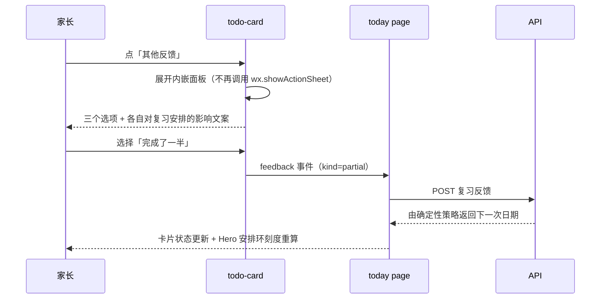

# SPEC-20260906-PKDS-03 — PKDS-2.0「纸 · 芽」视觉与交互落地

- Status: DONE（PKDS-2.0 可见实现、自动化验证与 UI current-state 已合并）
- Completed: 2026-09-12；未运行的完整原生视口/真机矩阵不视为已通过。
- Risk: R2
- Spec owner: 产品负责人（用户）
- Implementer: Aime
- Reviewer: 产品负责人（用户）
- Verifier: Aime（自动化 + 三视口近似渲染走查）+ 产品负责人（真机/开发者工具原生几何验收）
- Created: 2026-09-06
- Last updated: 2026-09-06
- Target release: 未部署（仅本地实现）
- Spec revision: `SPEC-20260906-PKDS-03`
- User confirmation: 用户 2026-09-06 指令「结合这个工程的定位和产品需求.设计 ui 交互，你不需要考虑工程中对于 ui 的要求，完全重新设计. 我只要最好的效果」+「按照这个方案 实现代码」+「继续」
- Additional R2 approval: 同上（用户即架构与设计 Owner）
- Affected Feature IDs: `FEAT-001`（可见层），`FEAT-002`（家庭协作界面沿用同一 token 层）
- Feature current-state documents: `docs/domain/features/FEAT-001-push-kids-mvp.md`
- Feature baseline revision: `SPEC-20260906-PKDS-01`
- Feature merge owner: Aime

## Frontend Design Impact and Figma Approval

- Frontend impact: yes — 12 个页面的视觉语言由 PKDS-1.0 替换为 PKDS-2.0「纸 · 芽」，并改写两处交互（Todo 反馈、确认页科目字段）
- Frontend impact reason: 全局 token / 原子层 / 图标 / TabBar / Todo 卡片 / 今日 Hero / 确认页草稿标识 / 报表文案
- Frontend engineering impact: yes
- Frontend engineering impact reason: 新增 `tools/gen_tabbar_icons.py` 与 `tools/preview/`（WXML→HTML 近似渲染 + 三视口截图），改动 `tools/gen_icon_styles.py` 图标调色与线宽
- Affected UI IDs: `UI-001`、`UI-009`、`UI-010`
- UI current-state documents: `docs/design/frontend/ui/UI-001-parent-miniapp.md`、`UI-009-family-members.md`、`UI-010-family-access.md`
- Frontend baseline revision: `FDB-20260906-03`（本 Spec 更新）
- Frontend engineering constraint revision: `FEC-20260906-04`（沿用，未修改约束）
- Affected frontend quality dimensions: component / state / form / responsive / a11y / performance / privacy / observability
- Frontend quality budgets/requirements: 触控 ≥88rpx、正文 ≥14px（辅助文字 ≥11px 仅用于标签）、颜色不是唯一状态载体、根容器禁止横向滚动、包体 ≤1.5 MiB
- Frontend quality verification plan: `npm test`、`npm run lint:miniapp`、`python3 tools/validate_miniprogram.py`、`node tools/preview/render.js` + `python3 tools/preview/shoot.py` 三视口走查、横向溢出扫描
- Approved frontend engineering deviations: none

- Current Design Revision(s): `DREV-20260906-PKDS-01`
- Figma project/file URL: https://www.figma.com/design/FAyfmjNrA3btWztwyxI6Zj?node-id=0-1
- Figma node URL(s): N/A — 沿用 FEAT-001 的 Figma Starter 限额 waiver；本轮设计稿以可运行 HTML 原型 `zhiya-ui` 与仓内三视口截图为准
- Proposed Design Revision: `DREV-20260906-PKDS-03`
- Required viewport/state exports: 320×568 / 390×844 / 430×932 × content/empty/sheet/draft 状态
- Prototype status: APPROVED（用户 2026-09-06 指令「按照这个方案 实现代码」）
- Approved Task Spec revision: `SPEC-20260906-PKDS-03`
- Approved Design Revision: `DREV-20260906-PKDS-03`
- Design approval evidence: 用户 2026-09-06 连续三条指令（重新设计 → 实现代码 → 继续）
- Snapshot manifest path: `dist/ui-preview/`（本地生成，未纳入 git；截图脚本可重放）
- Permitted implementation deviations: 见 §10
- UI current-state merge owner: Aime
- UI current-state merge evidence: `docs/design/frontend/ui/UI-001-parent-miniapp.md` 追加 PKDS-2.0 现状段与 Change reference
- Frontend visual/a11y/resolution verification: 三视口近似渲染截图 + 全页面横向溢出扫描 PASS；真机/开发者工具原生几何 NOT_RUN
- Frontend engineering verification evidence: 见 §9

- Figma waiver: 继承 FEAT-001 的 Starter 限额 waiver；公开发布前必须补 node-specific URL

## 1. Problem and outcome

- Problem：PKDS-1.0 视觉是"能用"的工程基线，但对"家长在孩子学习上的焦虑"这一核心场景不够克制：
  高对比描边、统一冷绿、Todo 反馈藏在系统 ActionSheet、AI 草稿与正式记录只靠一枚 pill 区分、
  报表标题带评价意味（"哪些内容最需要先复习"）。
- Intended observable outcome：
  1. 全局视觉换成「纸 · 芽」——暖白纸面、松绿主色、嫩芽成长色，阴影大而淡，卡片像纸叠在纸上；
  2. 今日页首屏用"安排环"表达今天到期的复习构成（必做 / 有余力），不表达完成率、不打分；
  3. Todo 反馈从系统 ActionSheet 改为卡片内嵌面板，每个选项旁写清"会怎样影响下次复习"；
  4. 确认页用"AI 草稿 · 待确认"骑缝印章持续标注草稿态；科目字段不再出现"选择器 + 同值输入框"的重复；
  5. 报表只陈述事实（"接下来的复习压力"），不出现能力评价词。
- Evidence/current behavior：改造前 `git show HEAD:apps/miniprogram/styles/tokens.wxss` 为 PKDS-1.0 冷绿 + `#F4F3EC`；
  `todo-card/index.js` 用 `wx.showActionSheet`；`confirm.wxml` 科目字段同时渲染 picker 与 input 且值相同。

## 2. Scope

### In scope

- `styles/tokens.wxss`、`styles/atoms.wxss`、`app.wxss` 三层样式重写为 PKDS-2.0。
- 线性图标调色/线宽（`tools/gen_icon_styles.py` → `styles/icons.wxss`）与 TabBar 位图重生成（`tools/gen_tabbar_icons.py`）。
- 自定义 TabBar：毛玻璃底栏 + 中央凸起"记录"主键。
- 今日页 Hero 安排环（新增 `ringTicks()` 展示层计算）。
- Todo 卡片内嵌反馈面板与后果文案。
- 确认页草稿印章、科目字段单一路径（新增 `subjectCustom` 视图状态）。
- 报表页 section 文案与视觉、日程页/报表页 `.chev.left` 错误旋转修复。
- 新增 `tools/preview/`：WXML→HTML 近似渲染 + Playwright 三视口截图 + 横向溢出扫描。

### Non-goals

- 不改后端契约、不改 `planning/domain.py` 的复习节奏策略。
- 不新增页面、不改路由与 Tab 顺序。
- 不引入图表库或第三方 UI 库。

### Must not change

- AI 输出仍是可编辑草稿，只有家长确认才产生正式记录与复习计划。
- 复习日期仍由确定性策略产生；界面文案只解释策略，不预测掌握度。
- 手动录入与手动 Todo 反馈仍是一等路径。
- 课外活动只记录、不进入复习曲线。
- 测试依赖的结构不变：`.page` / `.action-row` 规则、TabBar `<image class="tab-icon">` 与 `40rpx` 尺寸、报表 `swiper.day-swiper` + 6×5 grid + `[30,30,30,10]` 分页。

### Feature current-state impact

- Current Feature sections affected：FEAT-001 的"界面现状"与 UI-001 的视觉/交互现状段。
- Final facts to merge：PKDS-2.0 token 名单、Todo 反馈交互、确认页科目单一路径、报表文案。
- Superseded statements：PKDS-1.0 的色值/圆角/图标线宽描述、"Todo 更多反馈使用系统 ActionSheet"。
- Change Reference to add：`SPEC-20260906-PKDS-03`。

## 3. Impact map

- Entry/caller：小程序 5 个 Tab 页 + 确认页 / 记录详情 / 活动打点 / 家庭四页。
- Existing authoritative path to modify：`apps/miniprogram/styles/*`、`app.wxss`、`custom-tab-bar/*`、`components/todo-card/*`、`pages/today/*`、`pages/submission/confirm.*`、`pages/reports/*`。
- Dependencies/callees：`utils/ui.js`（科目 class / mark）保持不变；后端 dashboard / submissions / reports 契约不变。
- Existing tests：`tests/frontend/*.test.js`（59 项），`tools/validate_miniprogram.py`。
- Behavior/architecture docs：`docs/design/frontend/FRONTEND-DESIGN.md`、`docs/design/frontend/ui/UI-001-parent-miniapp.md`。

## 4. Required design views

### Link/call graph

```text
tokens.wxss（唯一 token 源）
  → atoms.wxss（原子组件层：pk-card / pk-hero / ring / stamp / pk-sheet / metrics …）
    → app.wxss（页面骨架 .page / .action-row / 空态 / 通知条）
      → pages/*.wxss（仅本页几何）
tools/gen_icon_styles.py → styles/icons.wxss（27 图标 × 6 变体）
tools/gen_tabbar_icons.py → assets/tab-*.png（TabBar 位图）
tools/preview/render.js + fixtures.js → dist/ui-preview/*.html → shoot.py → *.png（三视口走查）
```

### Sequence diagram



### State machine

Todo 卡片反馈面板：`collapsed → expanded → (submitting → collapsed)`；
提交失败回到 `expanded` 并保留已选项，不静默关闭。
确认页科目字段：`picker(默认，命中已在学科目) ⇄ input(新科目)`，
选中 picker 项会强制回到 picker 态；AI 提出的新科目名进入页面即为 input 态。

### Architecture diagram

N/A：本轮不改模块边界，样式仍是 tokens → atoms → app → page 的单向依赖。

### Trade-offs

| Option | Benefit | Cost/risk | Decision |
|---|---|---|---|
| Todo 反馈保留系统 ActionSheet | 零成本、系统一致 | 看不到"这样选会怎样"，家长凭猜测反馈 | rejected |
| Todo 反馈内嵌卡片面板 | 后果先行、可读、可撤销 | 卡片变高，需要额外 collapse 逻辑 | selected |
| 今日页用完成率进度环 | 直观 | 变成打分/进度压力，违反产品立场 | rejected |
| 今日页用"安排环"刻度（必做/有余力/未占用） | 表达构成而非评价 | 需要展示层计算 ticks | selected |
| 确认页科目保留 picker+input 双控件 | 改动小 | 同值重复，家长不知道该改哪个 | rejected |
| 科目单控件 + 「换成新科目」切换 | 单一决定点 | 新增一个视图状态 | selected |

## 5. Expected file changes and deletion plan

| File/path | Action | Intended change | Why required |
|---|---|---|---|
| `apps/miniprogram/styles/tokens.wxss` | modify | PKDS-2.0 纸面/松绿/嫩芽/赭石 token、圆角、阴影、衬线字体族 | 视觉语言唯一来源 |
| `apps/miniprogram/styles/atoms.wxss` | modify | 新增 `.pk-hero/.ring/.stamp/.fd-row/.lk/.pk-sheet` 等原子类 | 页面只写几何 |
| `apps/miniprogram/app.wxss` | modify | 纸面背景、按钮/输入/空态/通知条重写，保留 `.page`/`.action-row` 契约 | 全局骨架 |
| `apps/miniprogram/custom-tab-bar/{index.wxml,wxss,js}` | modify | 中央凸起「记录」主键 + 毛玻璃底栏 | 主操作可达性 |
| `apps/miniprogram/components/todo-card/*` | modify | 内嵌反馈面板 + 后果文案 | 交互目标 3 |
| `apps/miniprogram/pages/today/{index.wxml,wxss,js}` | modify | Hero 安排环 + `ringTicks()` | 交互目标 2 |
| `apps/miniprogram/pages/submission/confirm.{wxml,js}` | modify | 草稿印章、科目单一路径（`subjectCustom`） | 交互目标 4 |
| `apps/miniprogram/pages/reports/{index.wxml,wxss}` | modify | 「接下来的复习压力」文案与视觉 | 交互目标 5 |
| `apps/miniprogram/pages/calendar/index.wxss`、`pages/reports/index.wxss` | modify | 删除错误的 `.chev.left` 旋转覆盖 | 左箭头显示为上箭头的缺陷 |
| `apps/miniprogram/pages/family-onboarding/index.wxss` | modify | 品牌标题改衬线、渐变品牌块 | 首屏一致性 |
| `apps/miniprogram/pages/family-members/index.wxml` | modify | 半屏加 `.plain`（非 Tab 页不预留 TabBar 高度） | 原生 TabBar 是独立图层 |
| `tools/gen_icon_styles.py` | modify | PKDS-2.0 调色、stroke 1.8、球类图标重画 | 图标与 token 同源 |
| `tools/gen_tabbar_icons.py` | add | 用同一图标语法生成 TabBar PNG | 位图与线性图标同源 |
| `tools/preview/{render.js,fixtures.js,shoot.py}` | add | WXML→HTML 近似渲染与三视口截图 | 无微信 IDE 时的设计走查手段 |

Final authoritative path：`styles/tokens.wxss → styles/atoms.wxss → app.wxss → pages/*.wxss`。

Old path/logic to delete or retain：

- 删除 `todo-card` 的 `wx.showActionSheet` 路径（被内嵌面板取代，避免两套反馈入口）。
- 删除确认页科目的第二个输入控件（被 `subjectCustom` 切换取代）。
- 删除 `pages/calendar`、`pages/reports` 中重复且错误的 `.chev.left` 定义（统一由 atoms 提供）。

## 6. Acceptance criteria

### AC-001 — 视觉语言统一

- Given 任意一个页面；When 渲染；Then 颜色、圆角、阴影、字体只来自 `tokens.wxss`；And not 页面 wxss 出现新的硬编码主色或第二套圆角刻度。

### AC-002 — 今日页安排环只描述构成

- Given 今天有 4 项到期复习（3 必做 / 1 有余力）；When 打开今日页；Then 环显示 12 刻度中 req/opt/idle 三态与「4 项 今日到期」；And not 出现百分比、完成率、评价词。

### AC-003 — Todo 反馈说明后果

- Given 一条待复习 Todo；When 点「其他反馈」；Then 在卡片内展开三个选项，每个选项旁写明对下次复习的影响；And not 弹出系统 ActionSheet。

### AC-004 — 草稿态持续可见

- Given 一份 AI 草稿；When 停留在确认页任意位置；Then 顶部通知与卡片印章都说明"确认后才进入学习档案和复习计划"；And not 出现"已保存/已完成"的暗示。

### AC-005 — 科目输入只有一个决定点（已被 BUG-013 取代，本轮作废）

- 原文：Given AI 给出的科目已在学；When 打开确认页；Then 只显示 picker + 「换成新科目」链接。
- 取代说明：`BUG-013 / BUG-SPEC-20260906-16` 把科目下沉到每个知识点，并按科目分组成独立学习记录，
  页面级「单科目」字段已不存在，本 AC 在合并后不适用；草稿区的视觉合同（印章、滑杆配色）改由共享模板
  `pages/submission/draft.*` 承担，确认页与待确认页同时生效。

### AC-006 — 三视口无横向溢出

- Given 320 / 390 / 430 三档视口；When 渲染全部预览页面；Then `documentElement.scrollWidth <= viewport`，且没有元素越界；And not 关键操作被裁切。

## 7. Required test points

| Test point | AC | Level | Command | Required result |
|---|---|---|---|---|
| TP-001 | AC-001..004 | unit/static | `npm test` | all pass |
| TP-002 | AC-001 | static | `npm run lint:miniapp` | no error |
| TP-003 | AC-001/AC-004 | static | `uv run python tools/validate_miniprogram.py` | `MINIPROGRAM_VALID` |
| TP-004 | AC-002/003/004/005 | visual | `node tools/preview/render.js && python3 tools/preview/shoot.py` | 三视口截图人工走查通过 |
| TP-005 | AC-006 | visual | 预览页横向溢出扫描（Playwright） | 全部页面无溢出 |
| TP-006 | AC-001..006 | native | 微信开发者工具/真机三视口原生几何 | NOT_RUN（需人工） |

## 8. Plan

1. 重写 token/atoms/app 三层，跑 TP-001..003。
2. 重做 TabBar、Todo 卡片、今日 Hero、确认页、报表文案，逐轮跑 TP-001/TP-003。
3. 建 `tools/preview`，补 8 组 fixture，按 TP-004/TP-005 走查并修缺陷。
4. 合并文档现状（本 Spec + FRONTEND-DESIGN + UI-001）。

## 9. Verification

| Test point / command | Result | Evidence/notes |
|---|---|---|
| TP-001 `npm test` | pass | 合并 `BUG-013` 后 91 pass / 0 fail（合并前 59 pass） |
| TP-002 `npm run lint:miniapp` | pass | eslint 无输出 |
| TP-003 `uv run python tools/validate_miniprogram.py` | pass | `MINIPROGRAM_VALID pages=13 source_bytes=580105` |
| 后端回归 `uv run pytest tests/unit tests/integration tests/contract -q` | pass | 186 passed / 2 skipped |
| 静态检查 `ruff check` / `ruff format --check` / `mypy apps/api/src` | pass | 185 files formatted、55 files 无问题 |
| 架构检查 `uv run python tools/check_architecture.py` | pass | `ARCHITECTURE_VALID checked=2` |
| 图标生成器幂等 | pass | 连续两次 `gen_icon_styles.py` 产物一致，`icons=42 variants=6` |
| TP-004 三视口截图走查 | pass | `dist/ui-preview/`：today / today-guide / today-sheet / records / records-history / record-detail / confirm / reports / calendar / calendar-editor / settings / activity-edit / onboarding / onboarding-create / family-members × 320/390/430 |
| TP-005 横向溢出扫描 | pass | 15 组页面 × 3 视口 = 45 页，无越界元素 |
| TP-006 原生三视口几何 | not run | 需微信开发者工具/真机；预览为 HTML 近似渲染，不能替代原生节点几何 |

走查中发现并修复的缺陷：

1. `.chev.left` 在日程页/报表页被错误覆盖为 `rotate(-135deg)`，左箭头显示为上箭头。
2. 页面内 `fixed` 半屏无法遮住原生自定义 TabBar，`.pk-sheet` 底部未预留 TabBar 高度导致末条被遮。
3. 确认页科目字段同时显示 picker 与同值 input（该修复已被 `BUG-013` 的按知识点分组取代）。
4. 课外活动图标是"地球仪"观感（该修复已被 `BUG-013` 的按活动语义派生图标取代）。
5. `app.json`（导航栏/背景/TabBar 兜底色）与 `wx.showModal`、`switch` 等原生控件仍写死 PKDS-1.0 色值，
   与纸面底色不一致；已统一替换为 PKDS-2.0 值。

## 10. Completion

- Changed behavior：Todo 反馈改为卡片内嵌面板（含后果文案）；其余为纯视觉替换。
- Deleted/replaced behavior：`wx.showActionSheet` 反馈路径、两处错误的 `.chev.left` 覆盖、原生控件与 `app.json` 里的 PKDS-1.0 色值。
- Merge outcome：与 `origin/main` 的 `BUG-013`（多科目分组、共享草稿模块、按语义派生的活动图标、报表 2×2 可点指标、
  今日默认折叠）合并；冲突处一律保留上游功能语义，只把 PKDS-2.0 视觉层重新贴到新结构上；
  本轮的 `ico-ball` 与确认页单科目路径作废。
- Files changed：见 §5，另加合并后新增的 `pages/submission/draft.wxml`（印章与滑杆配色）与 `app.json` 色值。
- Permitted implementation deviations：`dist/ui-preview/` 是本地产物不入库；Figma node URL 仍缺，沿用 waiver。
- Residual risk：`backdrop-filter`、`@media (max-width: 350px)` 在部分低端机型/基础库上的表现未在真机验证；三视口原生几何 NOT_RUN。

- [x] Scope/non-goals preserved.
- [x] Acceptance criteria pass（AC-001..006，原生几何除外）。
- [x] Required commands ran（TP-001..005）。
- [x] No duplicate/legacy path remains.
- [x] Docs updated（FRONTEND-DESIGN `FDB-20260906-03`、UI-001 现状段）。
- [ ] 真机 / 开发者工具三视口验收（待人工）。
