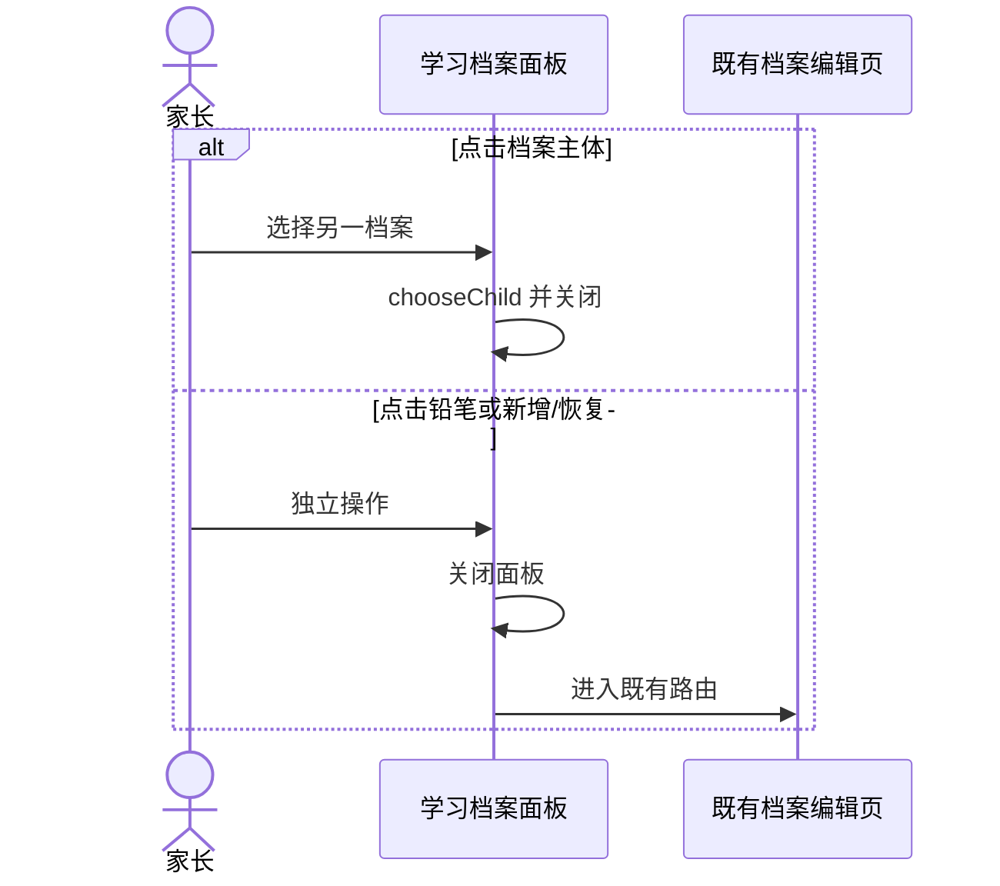
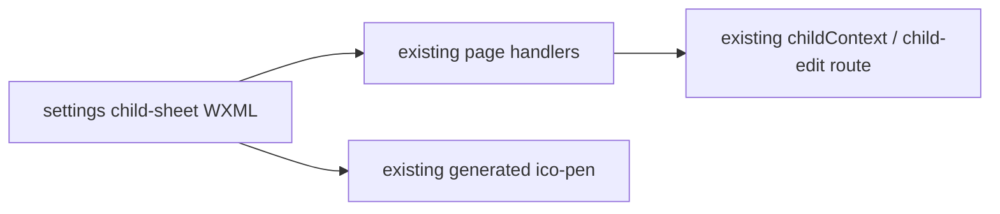

# FEAT-001 — 设置页学习档案面板视觉降噪（Spec Lite）

- Status: DONE（学习档案面板视觉降噪已实现、合并并写入 UI current-state）
- Completed: 2026-09-12；原生视口/真机矩阵仍是发布验收项，不视为已通过。
- Risk: R1
- Owner: 产品负责人（用户）
- Implementer: Codex
- Reviewer: 产品负责人（用户）
- Date: 2026-09-11
- Baseline commit: `3034f9674c8772e82abe2e73e3ab050924af19ac` + 当前未提交工作树
- Spec revision: `SPEC-20260911-SETTINGS-PROFILE-MANAGER-POLISH-01`
- User confirmation: 用户于 2026-09-11 回复“落地”，批准 `SPEC-20260911-SETTINGS-PROFILE-MANAGER-POLISH-01` 与 `DREV-20260911-SETTINGS-PROFILE-MANAGER-02`
- Affected Feature IDs: `FEAT-001`
- Feature current-state documents: `docs/domain/features/FEAT-001-push-kids-mvp.md`
- Feature baseline revision: `FEAT-STATE-20260911-SETTINGS-PROFILE-MANAGER-01-LOCAL`
- Feature merge owner: Codex（验证后）

## Frontend Design Impact and Figma Approval

- Frontend impact: yes — 档案面板的行内信息层级、编辑控件和新增入口视觉改变
- Frontend impact reason: 当前 88rpx 米色文字按钮形成连续大色块，挤压档案信息并错误提升次要操作层级
- Frontend engineering impact: yes — WXML 层级与 settings 页局部 WXSS、结构测试和预览 fixture 变化
- Frontend engineering impact reason: 保留事件边界但重排 name/grade/current/edit/add 的原生节点几何
- Affected UI IDs: `UI-001`
- UI current-state documents: `docs/design/frontend/ui/UI-001-parent-miniapp.md`
- Frontend baseline revision: approved `FDB-20260906-03`
- Frontend engineering constraint revision: approved `FEC-20260906-04`
- Affected frontend quality dimensions: component / responsive / accessibility / permission / browser-device
- Frontend quality budgets/requirements: 触控目标 ≥88rpx；正文 ≥14px；320×568、390×844、430×932 无横向溢出；状态不只靠颜色
- Frontend quality verification plan: 结构/状态测试、全量前端、ESLint、小程序静态/架构/图标幂等、三视口 sheet 状态、DevTools preview
- Approved frontend engineering deviations: none
- Current Design Revision(s): `DREV-20260911-SETTINGS-PROFILE-MANAGER-01`
- Figma project/file URL: https://www.figma.com/design/FAyfmjNrA3btWztwyxI6Zj
- Figma node URL(s): https://www.figma.com/design/FAyfmjNrA3btWztwyxI6Zj?node-id=0-1 （既有 FEAT-001 waiver anchor）
- Proposed Design Revision: `DREV-20260911-SETTINGS-PROFILE-MANAGER-02`
- Required viewport/state exports: 320×568、390×844、430×932 / active one、active many、viewer、limit、archived
- Prototype status: APPROVED
- Approved Task Spec revision: `SPEC-20260911-SETTINGS-PROFILE-MANAGER-POLISH-01`
- Approved Design Revision: `DREV-20260911-SETTINGS-PROFILE-MANAGER-02`
- Design approval evidence: 用户于 2026-09-11 回复“落地”
- Snapshot manifest path: `docs/design/frontend/snapshots/UI-001/DREV-20260911-SETTINGS-PROFILE-MANAGER-02/APPROVAL.md`
- Permitted implementation deviations: none
- UI current-state merge owner/evidence: Codex / 已合并到 `UI-STATE-20260911-SETTINGS-PROFILE-MANAGER-02-LOCAL`
- Frontend visual/a11y/resolution verification: 320/390/430 的 sheet/viewer/limit HTML fixture 已生成；PNG 因本机缺少 Playwright Chromium executable 未运行；原生面板三视口、字体放大和代表性 iOS/Android 未运行
- Frontend engineering verification evidence: focused frontend 32 passed；全量 frontend 140 passed；ESLint、小程序静态（630368 bytes）、架构（checked=3）、图标幂等与 diff check 通过；真实 AppID local preview 575988 bytes
- Figma waiver: 请求沿用 FEAT-001 scoped waiver；仅覆盖本面板视觉降噪，Owner 为 repository owner，公开生产发布前到期

## 1. Problem and outcome

- Problem: 面板中每行“编辑”使用米色大圆角块，连续堆叠后成为最强视觉元素；名称与年级挤在一行，当前状态、档案信息和次要操作争抢同一水平空间；大虚线新增框进一步增加控件噪音。
- Intended observable outcome: 用户先读到孩子与年级，再识别当前档案；编辑表现为低强调的铅笔图标但仍有 44px 点击区；新增成为列表末尾的普通动作行。
- Evidence/current behavior: 用户 2026-09-11 原生截图及反馈“这个UI效果太差了”，红框明确指向连续的块状编辑按钮。

## 2. Scope

### In scope

- 档案行把 `name` 与 `grade` 分成主次两行，不再拼成一个粗重标签。
- 当前档案在次级行显示“当前使用”文字标识，不在右侧占一个 pill。
- “编辑”改为透明 88rpx 点击区中的既有 `ico-pen` 线性图标；无底色、无边框、无额外文案块，保留独立 accessible name。
- 新增入口并入第一组列表末尾，采用“加号图标 + 新建学习档案 + chevron”的普通动作行，删除大虚线框。
- 归档区保持独立分组和恢复入口；viewer 与达到上限状态保持现有权限/说明。

### Non-goals

- 不改切换、编辑、恢复、添加的事件、路由或数据；不新增手势、Action Sheet、页面或图标资产。
- 不改面板标题、关闭方式、主页面、child-edit、后端 API、权限、上限或生命周期。

### Must not change

- 点击档案主体继续切换；点击铅笔只编辑且不冒泡切换。
- 编辑/恢复/新增前继续关闭面板；viewer 无写入口；达到上限显示 `childLimitHint`。
- 所有可操作目标至少 88rpx，长姓名/年级在 320px 宽度内不遮挡操作。

### Feature current-state impact

- Current Feature sections affected: 设置页档案管理面板视觉合同。
- Final facts to merge after verification: 档案信息两级排版；编辑为透明图标操作；新增为列表动作行。
- Superseded Feature statements to replace/remove: DREV-01 中可见的块状文字“编辑”和独立虚线新增框。
- Change Reference to add: 本 Spec / `DREV-20260911-SETTINGS-PROFILE-MANAGER-02`。

## 3. Impact map

- Entry/caller: `pages/settings/index.wxml` child sheet
- Existing authoritative path to modify: child-sheet markup + page-local geometry
- Dependencies/callees: existing `chooseChild` / `editChild` / `addChild` handlers and generated `ico-pen`
- Existing tests: `tests/frontend/child-profiles.test.js`
- Behavior/architecture docs: `BHV-001`、`FEAT-001`、`UI-001`

## 4. Required design views

### Link/call graph

```text
档案主体 → chooseChild（不变）
透明铅笔点击区 → catchtap editChild（不变）
列表末尾新增行 → addChild（不变）
归档行 → editChild / restore state（不变）
```

### Sequence diagram



### State machine

```text
writable + below limit → active rows + icon edit + add row
writable + at limit → active rows + icon edit + limit hint
writable + archived → archived section + restore rows
viewer → active rows only
current row → secondary text includes “当前使用”
```

非法状态：图标点击冒泡触发切换；长文本挤出 320px；viewer 出现铅笔/新增；小图标实际点击区小于 88rpx。

### Architecture diagram



仅修改原生视图层；模块边界、依赖方向与服务端合同不变。

### Trade-offs

| Option | Benefit | Cost/risk | Decision |
|---|---|---|---|
| 透明铅笔图标 + 88rpx 隐形点击区 | 视觉最轻；语义熟悉；功能一步可达 | 需保留明确 accessible name | selected |
| 透明文字“编辑” | 比现状轻，发现性强 | 重复文字仍形成右侧视觉列 | rejected |
| 右上角“管理”模式后再编辑 | 默认列表最干净 | 多一步且引入新模式状态 | rejected |
| 滑动露出编辑 | 截图最简洁 | 发现性、无障碍与平台一致性较差 | rejected |

## 5. Expected file changes and deletion plan

| File/path | Action | Intended change | Why required |
|---|---|---|---|
| `apps/miniprogram/pages/settings/index.wxml` | modify | 两级信息、铅笔图标操作、新增列表行 | 可见层级与语义 |
| `apps/miniprogram/pages/settings/index.wxss` | modify | 删除块状按钮样式，增加透明点击区/元信息/动作行几何 | 三视口与触控 |
| `tests/frontend/child-profiles.test.js` | modify | 锁定图标、事件隔离、无旧块状/虚线入口 | 回归 |
| `tools/preview/fixtures.js` | retain/modify if needed | 复用现有 sheet/viewer/limit 状态 | 预览矩阵 |
| Feature/UI/Behavior current state | modify after verification | 合并最终事实 | current state |

Final authoritative path: `pages/settings/index` 的 child sheet。

Old path/logic to delete or retain:

- Delete: `.profile-manage-btn` 的米色块状文字按钮样式；child sheet 中独立 `.add-entry` 大虚线框。
- Retain: `chooseChild`、`editChild`、`addChild`、权限/上限条件和归档分组。

## 6. Acceptance criteria

### AC-001 — 信息优先、操作降噪

- Given: 可写成员打开含一个或多个在用档案的面板。
- When: 面板完成渲染。
- Then: 每行先显示姓名、年级，当前行带“当前使用”；编辑只显示线性铅笔图标，无米色矩形背景。
- And not: 把编辑隐藏到二次菜单或牺牲 88rpx 点击区。

### AC-002 — 新增入口与边界状态

- Given: 可写/只读、未达/达到上限、含/不含归档档案。
- When: 相应面板状态渲染并执行点击。
- Then: 新增在可写且未达上限时作为列表末尾动作行；达到上限显示原因；viewer 无写入口；归档恢复保持可达。
- State remains: 路由、切换、关闭面板、权限和后端数据不变。

## 7. Required test points

| Test point | Acceptance criterion | Test level | Command/case | Required result |
|---|---|---|---|---|
| `TP-001` | AC-001 | structural/page state | `child-profiles.test.js` | name/grade/current 分层；`ico-pen` + `catchtap=editChild`；无块状文字编辑 |
| `TP-002` | AC-002 | structural/page state | same | 新增行、viewer、limit、archived 条件保持 |
| `TP-003` | all | regression/gates | focused + `npm test` + lint/static/architecture/icon/diff | all pass |
| `TP-004` | all | visual/native | sheet/viewer/limit 320/390/430 + representative iOS/Android | 无溢出；触控/滚动可达；原生证据单列 |

## 8. Plan

1. 获得本 Spec 与 DREV-02 明确批准后，仅重排 child sheet 原生节点与本页几何，并更新结构测试。
2. 生成三视口各状态，执行适用全量门禁和 DevTools preview；验证后更新 Feature/UI/Behavior 当前事实。

## 9. Verification

| Evidence | Result |
|---|---|
| `node --test tests/frontend/child-profiles.test.js tests/frontend/config-and-copy.test.js` | PASS — 32 passed |
| `npm test` | PASS — 140 passed |
| `npm run lint:miniapp` | PASS |
| `uv run python tools/validate_miniprogram.py` | PASS — `MINIPROGRAM_VALID pages=15 source_bytes=630368` |
| `uv run python tools/check_architecture.py` | PASS — `ARCHITECTURE_VALID checked=3` |
| icon generator + generated CSS diff | PASS — 42 icons × 6 variants；diff empty |
| `git diff --check` | PASS |
| `node tools/preview/render.js settings-sheet settings-sheet-viewer settings-sheet-limit` | PASS — 320/390/430 共 9 个 HTML fixture |
| preview PNG | NOT_RUN — Playwright Chromium executable 未安装；未安装新浏览器或用非原生替代物冒充验收 |
| WeChat DevTools registered AppID preview | PASS — local preview package 575988 bytes；未上传 |
| modified native sheet / iOS / Android | NOT_RUN — DevTools 当前模拟器未进入受影响面板；没有可验证的原生矩阵证据 |

## 10. Completion

- Changed behavior: 档案姓名/年级改为两级信息；当前状态并入次级文字；编辑改为透明铅笔点击区；新增并入列表动作行。
- Deleted/replaced behavior: 删除块状文字“编辑”、右侧“当前”pill 和 child sheet 独立大虚线新增框。
- Files changed: settings WXML/WXSS、结构测试及本 Spec/DREV/approval/Feature/UI/Behavior 当前状态文档；后端/API/Schema 未改。
- Review findings: viewer、limit、archived 和事件隔离条件均由结构/状态测试继续锁定。
- Residual risk: 原生 320/390/430、字体放大、键盘/滚动以及代表性 iOS/Android 触控证据仍需补齐。

- [x] Scope/non-goals defined.
- [x] User approved exact Spec/DREV/waiver.
- [x] Acceptance criteria pass at structural/page-state and local preview level.
- [x] Required local automation commands ran; native matrix is explicitly NOT_RUN.
- [x] Current-state docs merged.
