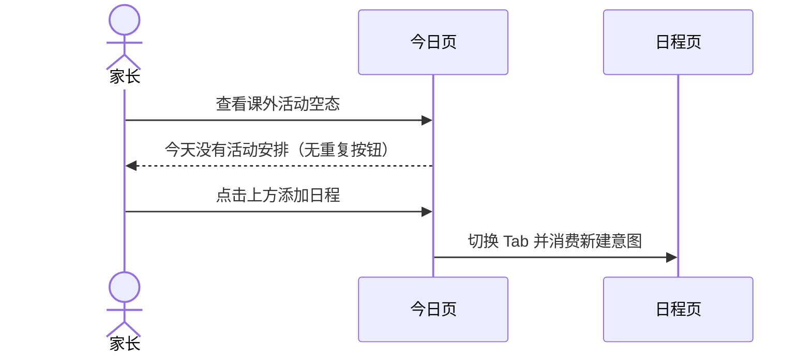
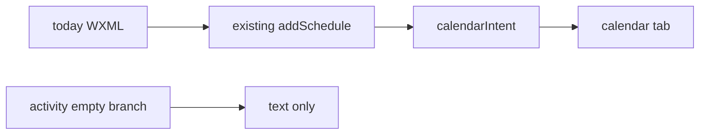

# FEAT-001 — 今日页删除重复的课外活动空态日程入口（Spec Lite）

- Status: DONE（重复空态 CTA 已删除，实现与 current-state 已合并）
- Completed: 2026-09-12；原生三视口发布验收仍未运行，不视为已通过。
- Risk: R1
- Owner: 产品负责人（用户）
- Implementer: Codex
- Reviewer: 产品负责人（用户）
- Date: 2026-09-11
- Spec revision: `SPEC-20260911-TODAY-ACTIVITY-EMPTY-CTA-01`
- User confirmation: 用户于 2026-09-11 回复“落地”，批准 `SPEC-20260911-TODAY-ACTIVITY-EMPTY-CTA-01` 与 `DREV-20260911-TODAY-ACTIVITY-EMPTY-CTA-01`
- Affected Feature IDs: `FEAT-001`
- Feature current-state documents: `docs/domain/features/FEAT-001-push-kids-mvp.md`
- Feature baseline revision: `FEAT-STATE-20260911-RECORD-PHOTO-ADD-SOURCE-02-LOCAL`
- Feature merge owner: Codex（验证后）

## Frontend Design Impact and Figma Approval

- Frontend impact: yes — 今日页课外活动空态少一个重复按钮
- Frontend impact reason: 同一屏上方主卡与下方课外活动空态同时提供“添加日程”，删除下方入口以收敛行动层级
- Frontend engineering impact: yes — WXML 可见结构与结构回归测试变化
- Frontend engineering impact reason: 删除一个绑定 `addSchedule` 的节点，不改变页面状态或数据流
- Affected UI IDs: `UI-001`
- UI current-state documents: `docs/design/frontend/ui/UI-001-parent-miniapp.md`
- Frontend baseline revision: approved `FDB-20260906-03`
- Frontend engineering constraint revision: approved `FEC-20260906-04`
- Affected frontend quality dimensions: component / state / responsive / accessibility
- Frontend quality budgets/requirements: 一屏一决定；触控目标规则不受影响；320×568、390×844、430×932 空态不溢出
- Frontend quality verification plan: 结构测试、全量前端测试、ESLint、小程序静态/架构检查、三视口今日空态预览
- Approved frontend engineering deviations: none
- Current Design Revision(s): `DREV-20260911-RECORD-PHOTO-ADD-SOURCE-02`；今日页沿用 `DREV-20260906-PKDS-03`
- Figma project/file URL: https://www.figma.com/design/FAyfmjNrA3btWztwyxI6Zj
- Figma node URL(s): https://www.figma.com/design/FAyfmjNrA3btWztwyxI6Zj?node-id=0-1 （既有 FEAT-001 waiver anchor）
- Proposed Design Revision: `DREV-20260911-TODAY-ACTIVITY-EMPTY-CTA-01`
- Required viewport/state exports: 320×568、390×844、430×932 / `dashboard + activity_count=0 + show_guide=false`
- Prototype status: APPROVED
- Approved Task Spec revision: `SPEC-20260911-TODAY-ACTIVITY-EMPTY-CTA-01`
- Approved Design Revision: `DREV-20260911-TODAY-ACTIVITY-EMPTY-CTA-01`
- Design approval evidence: 用户于 2026-09-11 回复“落地”
- Snapshot manifest path: `docs/design/frontend/snapshots/UI-001/DREV-20260911-TODAY-ACTIVITY-EMPTY-CTA-01/APPROVAL.md`
- Permitted implementation deviations: none
- UI current-state merge owner: Codex（验证后）
- UI current-state merge evidence: pending
- Frontend visual/a11y/resolution verification: pending
- Frontend engineering verification evidence: pending
- Figma waiver: 延用 FEAT-001 scoped waiver；Owner 为 repository owner，公开生产发布前到期；本修订不新增页面、组件、token 或交互模式

## 1. Problem and outcome

- Problem: 今日页上方复习主卡已有“添加日程”，下方课外活动为空时再次显示同名按钮，造成同屏重复操作。
- Intended observable outcome: 课外活动为空时只显示“今天没有活动安排”；添加日程继续由上方主卡入口承担。
- Evidence/current behavior: 用户 2026-09-11 截图；`pages/today/index.wxml` 的主卡与活动空态分别绑定 `addSchedule`。

## 2. Scope

### In scope

- 删除课外活动空态中“添加日程”按钮节点。
- 保留空态文字“今天没有活动安排”。
- 保留非引导态主卡“添加日程”和首次引导态“也可以先添加日程”。两者是互斥页面状态，每个渲染状态只保留一个日程入口。

### Non-goals

- 不删除或修改上方主卡入口。
- 不改日程页、新建日程流程、活动数据、折叠状态、加载/错误/权限状态或文案。
- 不新增样式、组件、API、埋点或后端改动；不上传、不部署。

### Must not change

- `addSchedule` 继续写入一次性 `calendarIntent={mode:"create"}` 并切换到日程 Tab。
- 有活动时继续展示时间线和活动练习入口。
- 首次引导态仍能进入添加日程。

### Feature current-state impact

- Current Feature sections affected: 今日页空态行动层级。
- Final facts to merge after verification: 课外活动单栏空态为只读说明，不重复提供添加入口。
- Superseded Feature statements to replace/remove: “三栏成功空结果显示居中空文案”保持；补充活动空态不带 CTA。
- Change Reference to add: 本 Spec / DREV 验证证据。

## 3. Impact map

- Entry/caller: `pages/today/index.wxml` 课外活动 `activity_count=0` 分支
- Existing authoritative path to modify: 删除该分支内绑定 `addSchedule` 的按钮节点
- Dependencies/callees: 无；`pages/today/index.js#addSchedule` 保留供主卡/引导态使用
- Existing tests: `tests/frontend/config-and-copy.test.js`
- Behavior/architecture docs: `BHV-008`（今日 Dashboard 展示合同）、`FEAT-001`、`UI-001`

## 4. Required design views

### Link/call graph

```text
上方主卡“添加日程” / 首次引导“也可以先添加日程” → addSchedule → 日程 Tab 新建意图（保留）
课外活动空态 → “今天没有活动安排”（删除 CTA，无调用）
```

### Sequence diagram



### State machine

```text
activity_count = 0 → 展开课外活动 → 仅空态文字
activity_count > 0 → 展开课外活动 → 时间线/建议列表
show_guide = false → 上方主卡保留“添加日程”
show_guide = true  → 首次引导保留“也可以先添加日程”
```

非法状态：同一个已渲染页面状态同时出现两个“添加日程”入口。

### Architecture diagram



仅删除 WXML 展示节点，不改变模块边界或依赖方向。

### Trade-offs

| Option | Benefit | Cost/risk | Decision |
|---|---|---|---|
| 删除下方活动空态按钮，保留上方入口 | 消除同屏重复；主行动位置稳定 | 空态区域不再就地提供 CTA | selected |
| 删除上方入口，保留下方按钮 | 活动语义更近 | 有活动时入口消失；破坏首屏行动层级 | rejected |
| 两个都保留 | 无代码改动 | 重复操作继续存在 | rejected |

## 5. Expected file changes and deletion plan

| File/path | Action | Intended change | Why required |
|---|---|---|---|
| `apps/miniprogram/pages/today/index.wxml` | modify | 删除活动空态 `.ea` 内的“添加日程”按钮 | 消除重复入口 |
| `tests/frontend/config-and-copy.test.js` | modify | 约束活动空态无 CTA、两个互斥上方分支仍保留日程入口 | 防止回归 |
| `tools/preview/fixtures.js` | modify only if needed | 确保今日空态 fixture 覆盖目标状态 | 三视口证据 |
| `docs/domain/features/FEAT-001-push-kids-mvp.md` | modify after verification | 合并最终行为与证据 | current state |
| `docs/design/frontend/ui/UI-001-parent-miniapp.md` | modify after verification | 合并最终 UI 状态与证据 | current state |
| `docs/domain/BEHAVIOR-CATALOG.md` | modify after verification | 更新今日空态行为验证 | behavior contract |

Final authoritative path: `pages/today/index.wxml` 的活动空态仅保留说明文字。

Old path/logic to delete or retain:

- Delete: 活动空态内 `.ea > .btn[bindtap="addSchedule"]`。
- Retain: `addSchedule` 方法及主卡/引导态两个互斥绑定。

## 6. Acceptance criteria

### AC-001 — 删除下方重复入口

- Given: 今日 Dashboard 已加载且 `activity_count=0`。
- When: 家长查看展开的课外活动区域。
- Then: 只显示“今天没有活动安排”，不显示按钮或可点击日程入口。
- And not: 删除上方主卡或首次引导态的日程入口。

### AC-002 — 非空活动与跳转保持

- Given: `activity_count>0`，或家长点击当前状态下唯一的上方日程入口。
- When: 页面渲染或用户点击。
- Then: 活动时间线保持原样；点击仍进入日程 Tab 的新建流程。
- State remains: Dashboard、折叠偏好及日程意图合同不变。

## 7. Required test points

| Test point | Acceptance criterion | Test level | Command/case | Required result |
|---|---|---|---|---|
| `TP-001` | AC-001 | structural | `node --test tests/frontend/config-and-copy.test.js` | 活动空态块无 `addSchedule`，仍有空态文字 |
| `TP-002` | AC-001/2 | structural | same | WXML 总计仅保留主卡与引导态两个互斥 `addSchedule` 绑定 |
| `TP-003` | AC-002 | frontend regression | `npm test` | 全量通过 |
| `TP-004` | AC-001/2 | gates | ESLint、静态小程序校验、架构检查、`git diff --check` | 全部通过 |
| `TP-005` | AC-001 | visual/native | 320×568、390×844、430×932 的今日活动空态 | 无重复按钮、无异常留白/溢出；原生证据单独标记 |

## 8. Plan

1. 用户批准本 Spec 与 DREV 后，仅删除 WXML 空态按钮并加结构回归。
2. 执行定向测试、全量前端门禁和三视口验证，随后合并 Feature/UI/Behavior 当前事实。

## 9. Verification

| Test point / command | Result | Evidence/notes |
|---|---|---|
| `TP-001/002 / node --test tests/frontend/config-and-copy.test.js` | PASS | 9 passed；活动空态保留文字且无 CTA，WXML 仅保留普通主卡/首次引导两个互斥绑定 |
| `TP-003 / npm test` | PASS | 当前工作树 138 passed / 0 failed |
| `TP-004 / npm run lint:miniapp` | PASS | ESLint 通过 |
| `TP-004 / validate_miniprogram.py` | PASS | `MINIPROGRAM_VALID pages=15 source_bytes=629154` |
| `TP-004 / check_architecture.py` | PASS | `ARCHITECTURE_VALID checked=3` |
| `TP-004 / icon generation + git diff --check` | PASS | 图标生成后产物无 diff；差异空白检查通过 |
| `TP-005 / HTML fixtures` | PARTIAL | 已生成 `today-activity-empty` 的 320/390/430 HTML；PNG 脚本因当前 Python 环境缺少 Playwright 未运行，不将 HTML 称为视觉通过 |
| `TP-005 / WeChat DevTools preview` | PASS (compile only) | 真实 AppID 本地 preview 编译成功，`574832` bytes（`561.4 KB`）；未上传 |
| `TP-005 / native viewport and device` | NOT_RUN | 三视口原生截图、字体放大与 iOS/Android 真机未执行 |

## 10. Completion

- Changed behavior: 今日页课外活动为 0 项时只显示“今天没有活动安排”。
- Deleted/replaced behavior: 删除活动空态下方重复的“添加日程”按钮。
- Files changed: WXML、结构回归、预览 fixture、Spec/DREV/批准快照及 Feature/UI/Behavior 当前事实。
- Review findings: 上方普通主卡和首次引导态各自保留一个互斥入口，`addSchedule` 数据流未修改。
- Residual risk: 原生三视口及代表性 iOS/Android 尚未验收；不影响静态结构结论。

- [x] Scope/non-goals preserved.
- [x] Acceptance criteria pass in automated structure/regression checks.
- [x] Required applicable commands ran；原生设备项明确记录为 NOT_RUN。
- [x] No duplicate activity-empty path remains.
- [x] Docs updated with verified facts.
- [x] Feature/UI current state links this revision.
- [x] No unrelated task diff intentionally modified.
